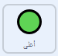

## التحكم بالكشّاف

<div style="display: flex; flex-wrap: wrap">
<div style="flex-basis: 200px; flex-grow: 1; margin-right: 15px;">
في هذه الخطوة، ستستخدم وحدة تحكم على الشاشة أو لوحة المفاتيح لتحريك كشافك لأعلى ولأسفل.
</div>
<div>
{:width="300px"}
</div>
</div>

--- task ---

افتح مشروع المبتدئ على الشبكة عبر [rpf.io/nature-rover-starter](https://rpf.io/nature-rover-starter){: target = "_ blank"}.

--- collapse ---
---
title: العمل دون اتصال
---

إذا كنت تعمل دون اتصال بالإنترنت، فيمكن العثور على مشروع البداية على [rpf.io/p/en/nature-rover-go](https://rpf.io/p/en/nature-rover-go)

--- /collapse ---


--- /task ---

يجب أن ترى مشهداً به روبوت كشّاف، خلفية تلال، و متحكم في أسفل الزاوية اليسرى.


ستستخدم وحدة التحكم أو عناصر التحكم في لوحة المفاتيح لجعل الكشاف يبدو كما لو كان يتحرك باتجاه أو عكس المشاهد.

--- task ---

انظر إلى علامة التبويب **كود** لكل من الأزرار. الكود سيبدو تقريبا كهذا:



```blocks3
when this sprite clicked
broadcast (up v)

when I receive [start v]
forever
go to [front v] layer
go to x:(-190) y: (-121)
end
```

هذا يحافظ على الأزرار في الموضع الصحيح، ويبث اتجاهاتهم عند نقرها.

--- /task ---

The **rover** needs to be visible at all times, by making sure it is on the **front** layer.

--- task ---

Add a `go to front layer`{:class='block3looks'} to a `green flag clicked`{:class='block3events'} block.


```blocks3
when flag clicked
+ go to [front v] layer
```

--- /task ---

سيتحكم **الكشّاف** بداية اللعبة لجميع الكائنات الأخرى ؛ لذلك عندما النقر فوق العلم الأخضر، يحتاج الكائن **الكشّاف** إلى بث رسالة `البداية`{: class = 'block3events'}.

--- task ---

Add a `broadcast`{:class='block3events'} block.


```blocks3
when flag clicked
go to [front v] layer
+ broadcast [start v]
```

--- /task ---

--- task ---

إذا كنت تعمل على حاسوب، فالأسهل استخدام لوحة المفاتيح، بدلاً من الأزرار. يمكن إضافة عناصر لوحة المفاتيح إلى **الكشّاف**.


```blocks3
when [up arrow v] key pressed
broadcast [up v]

when [down arrow v] key pressed
broadcast [down v]

when [right arrow v] key pressed
broadcast [right v]

when [left arrow v] key pressed
broadcast [left v]
```

إذا كنت لا تريد استخدام وحدة التحكم، فانقر فوق كل **أزرار** الكائنات و انقر على مجموعة `إخفاء`{: class = 'block3looks'} في قائمة `مظهر`{: class = 'block3looks'}.

```blocks3
hide
```

--- /task ---

عند الضغط على زر **أعلى** أو <kbd>السهم لأعلى</kbd>، يجب أن يغير **الكشّاف** موضعه الـ`y`{:class="block3motion"} بمقدار ضئيل. رفع الـ`y`{:class="block3motion"} سيجعل **الكشّاف** يتحرك للأعلى. خفض الـ`y`{:class="block3motion"} سيجعل **الكشّاف** يتحرك للأسفل.

--- task ---

أضف كوداً بحيث يجعل الزر **أعلى** ** الكشّاف** يتحرك لأعلى.


```blocks3
when I receive [up v]
change y by (10)

when I receive [down v]
change y by (-10)
```

--- /task ---

**لا داعي للقلق بشأن الحركة لليمين و اليسار بعد. ستتم إضافة الحركة لليمين واليسار في الخطوة التالية من المشروع.**

<p style="border-left: solid; border-width:10px; border-color: #0faeb0; background-color: aliceblue; padding: 10px;">
<span style="color: #0faeb0">** المنظور **</span> يُستخدم في رسومات الحاسوب لجعل المشهد أكثر واقعية. الأشياء البعيدة دائما تظهر أصغر و أعلى الشاشة. الأشياء القريبة دائما تظهر أكبر و أسفل الشاشة.
</p>

--- task ---

أضف **منظور** إلى **كشّافك** بجعله أصغر عندما يتحرك للأعلى، و أكبر عندما يتحرك للأسفل.


```blocks3
when I receive [up v]
change y by (10)
change size by (-1) //Smaller looks further away


when I receive [down v]
change y by (-10)
change size by (1) //Bigger looks closer
```

--- /task ---

--- task ---

ستحتاج لإعادة تعيين حجم ** الكشاف** في بداية اللعبة.

```blocks3
when I receive [start v]
set size to (50) %
```

--- /task ---


--- task ---

**أختبار:** انقر على زر **أعلى** و **أسفل** للتحقق من تحكمك في **كشّافك**، أو استعمل أزرار الأسهم.

--- /task ---

--- task ---

الآن أعد تعيين موضع **الكشّاف** كلما بدأت اللعبة.


```blocks3
when I receive [start v]
set size to (50) %
+ go to x: (0) y: (-90)
```

--- /task ---

--- task ---

في الوقت الحالي، **الكشاف** يجب أن يظهر أمام بقية الكائنات. حرك **الكشاف** إلى الطبقة الأمامية.


```blocks3
when I receive [start v]
set size to (50) %
go to x: (0) y: (-90)
+ go to [front v] layer
```

--- /task ---

--- task ---

**إختبار**: انقر على العلم الأخضر لاختبار أن إعادة تعيين لعبتك صحيح.

--- /task ---

--- save ---
