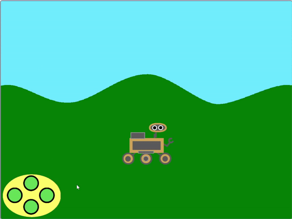
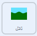
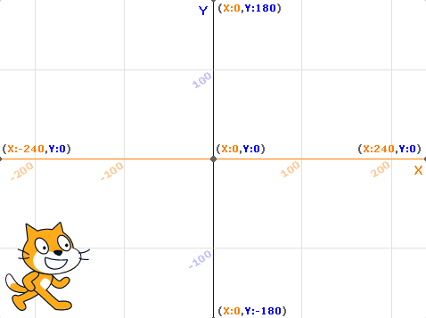

## تمرير الخلفية

<div style="display: flex; flex-wrap: wrap">
<div style="flex-basis: 200px; flex-grow: 1; margin-right: 15px;">
ليبدو الكشاف كأنه يتحرك لليسار و اليمين، بدلا من تحرك كائن **الكشاف**، كائن **الخلفية** يتحرك أو يمرر لليمين أو اليسار.
</div>
<div>
{:width="300px"}
</div>
</div>

--- task ---

عين كائن**التلال**. في بداية اللعبة، عليك التأكد أنه في الموضع الصحيح وعلى الطبقة الخلفية.



```blocks3
when I receive [إبدأ v]
go to [back v] layer
go to x: (0) y: (0)
```

--- /task ---

<p style="border-left: solid; border-width:10px; border-color: #0faeb0; background-color: aliceblue; padding: 10px;">
<span style="color: #0faeb0">**الطبقات**</span> هي كصفائح بلاستيكية شفافة مكدسة يمكن الرسم عليها. إذا كانت هناك صورة على الطبقة العلوية تحجب صورة أسفلها، فلن تستطيع رؤية الصورة السفلية جيداً. الصور الخلفية يجب أن تكون قرب الطبقة **الخلفية**. الصور الأقرب للمشاهد يجب أن تكون قريبة من الطبقة **العلوية**.
</p>

--- task ---

كائنات **التلال**يجب أن تنسخ نفسها. هذه تدعى `مستنسخات`{:class='block3control'}. بعدها، الكائن الأصلي يمكن نقله إلى أقصى الجانب الأيمن من الشاشة.


```blocks3
when I receive [إبدأ v]
go to [back v] layer
go to x: (0) y: (0)
+ create clone of [myself v] //قم بإنشاء نسخة من التلال
+ change x by (460) //انقل التلال الأصلية إلى يمين الشاشة
```

--- /task ---

عندما يتم استلام بث `اليسار`{:class='block3events'} و `اليمين`{:class='block3events'}، كائنات **التلال** يجب أن تتحرك. لإعطاء مظهر الحركة في الاتجاه الصحيح، الخلفية تتحرك **يسارا** عندما يتحرك **الكشاف** يمينا. اتجاه الحركة يجب أن يكون **عكس** `البث`{:class='block3events'}.

لذلك, إذا كان البث `يسارا`{:class="block3events"}، إذاً الموضع `x`{:class="block3motion"} سيزداد. لذلك، إذا كان البث `يمينا`{:class="block3events"}، إذا موضع **التلال** `x`{:class="block3motion"} سينخفض.



--- task ---

أضف مجموعة للتحكم في حركة كائن **التلال** ومستنسخاته.


```blocks3
when I receive [يسار v]
change x by (3)

when I receive [يمين v]
change x by (-3)
```

--- /task ---

--- task ---

**اختبار**: استخدم المتحكم أو أزرار <kbd>الأسهم</kbd> للتحرك في الأرجاء. يفترض أن يبدو الكشاف يتحرك يسارا أو يمينا.

--- /task ---

حاليا، هناك نسختان من كائن **التلال**: الأصلي و المستنسخ. عندما تصل لنهاية أي منهما، ستلاحظ أن الشاشة بيضاء فقط.

لإصلاح هذا، يجب تحريك الكائن و مستنسخه إلى جهة أخرى من الشاشة عندما يذهبان بعيدا.

--- task ---

أنشئ بث جديد يدعى `تمرير`{:class='block3events'} و أضفه إلى البرنامج النصي `بداية`{:class='block3events'}.


```blocks3
when I receive [إبدأ v]
go to [back v] layer
go to x: (0) y: (0)
create clone of [myself v]
change x by (460) 
+ broadcast [تمرير v]
```

--- /task ---

--- task ---

أضف تعليمة برمجية للكشف عما إذا كان كائن **التلال** أو استنساخه قد تحركت بعيدا جدا إلى اليسار أو اليمين ثم أعد تعيين مواقعهم على الجانب الآخر من الشاشة.


```blocks3
when I receive [تمرير v]
forever
if <(x position) > (460)> then //كائن التلال يوجد خارج الجانب الأيمن للشاشة
set x to (-460) //إعادة التعيين إلى الجانب الأيسر للشاشة
end
if <(x position) < (-460)> then //كائن التلال يوجد خارج الجانب الأيسر للشاشة
set x to (460) //إعادة التعيين إلى الجانب الأيمن للشاشة
end
```

--- /task ---

--- task ---

**اختبار**: استخدم المتحكم أو أزرار <kbd>الأسهم</kbd> للتحريك **الكشاف**. يجب أن تمرر الخلفية، و **الكشاف** يجب أن لا يصل النهاية أبداً.

--- /task ---

--- save ---
