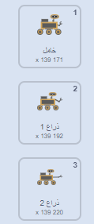

## جمع عيّنة

<div style="display: flex; flex-wrap: wrap">
<div style="flex-basis: 200px; flex-grow: 1; margin-right: 15px;">
في هذه الخطوة، ستغير مظهر كائن والكشاف لإظهار الكشاف يجمع عينات.
</div>
<div>
{:width="300px"}
</div>
</div>

--- task ---

أنظر إلى زي كائن **الكشاف**. هناك ستة رسوم متحركة متوفرة. **الكشاف** يستطيع:
- مد ذراعه



- خرق الأرض
- الحوم في الهواء
- تمديد لوحة شمسية
- التقاط صورة
- إلتقاط شيء ما

--- /task ---

عندما تريد تنظيم الكثير من الأكواد في سكراتش، مثل العديد من تغييرات الأزياء ، فمن المفيد استخدام `مجموعتي`{: class = "block3myblocks"}. هذا يسمح لك بإنشاء كتلك الجاهزة.

كائنك**الكشاف** سيملك `كتلتي`{:class="block3myblocks"} لكل رسمة متحركة.

--- task ---

في قائمة `كتلتي`{:class="block3myblocks"}، اضغط على **اجعل مجموعة**، و سم كتلتك الجديدة `عينة فاكهة`{:class="block3myblocks"}.

--- /task ---

يجب أن تظهر مجموعة جديدة في البرنامج النصي الخاص بك. ستبدو كهذه:


```blocks3
define sample fruit
```

--- task ---

تحت هذه المجموعة، اربط بعض كتل ` أزياء التبديل`{:class="block3looks"} و كتل `انتظر`{:class="block3control"}, لتحريك رسوم الروبوت.

**نصيحة:** من الأسرع إنشاء أول مجموعة `تبديل زي`{:class='block3looks'} و مجموعة `انتظر`{:class='block3control'}، ثم نسخهما، و تبديل الأزياء المستخدمة.


```blocks3
define sample fruit //Animates the robot to collect fruit
switch costume to (inactive v)
wait (0.3) seconds
switch costume to (arm 1 v)
wait (0.3) seconds
switch costume to (arm 2 v)
wait (0.3) seconds
switch costume to (arm 1 v)
wait (0.3) seconds
switch costume to (inactive v)
```

--- /task ---

--- task ---

Add a block so that the **rover** sprite plays a sound when it collects the fruit sample. You can find the **Collect** sound in the Sound gallery.


```blocks3
define sample fruit //Animates the robot to collect fruit
switch costume to (inactive v)
wait (0.3) seconds
switch costume to (arm 1 v)
wait (0.3) seconds
switch costume to (arm 2 v)
wait (0.3) seconds
+ start sound (Collect v)
switch costume to (arm 1 v)
wait (0.3) seconds
switch costume to (inactive v)
```

--- /task ---


--- task ---

يمكنك الضغط على مجموعة `عين عينة فاكهة`{:class="block3myblocks"} لرؤية الرسوم المتحركة. إذا كنت على شاشة صغيرة، قد تحتاج إلى النظر عن كثب.

لن يتم تشغيل الرسوم المتحركة عند نقرك على العلم الأخضر، لأنك لم تستخدم كتلك الجديد `عينة فاكهة`{:class='block3myblocks'} في مشروعك.

--- /task ---

--- task ---

لاستخدام مجموعتك الجديدة، يمكنك إرفاقها بمجموعة `حدث`{:class="block3events"}. في قائمة `مجموعاتي`{:class="block3myblocks"}، تفترض رؤيتك للمجموعة التي صنعتها. استخدمه في البرنامج النصي التالي.


```blocks3
when this sprite clicked
sample fruit ::custom //Run the animation
```

--- /task ---

--- task ---

اضغط على كائن ** الكشاف**، و يفترض أن ترى الرسوم المتحركة.

--- /task ---

الآن تحتاج جعل الكشاف يجمع عينة حقا. في هذا المثال، الكشاف سيجمع فاكهة من شجرة.

--- task ---

The **tree** sprite needs two costumes, one without fruit on (`tree without fruit`{:class="block3looks"}), and one with fruit (`tree with fruit`{:class="block3looks"}). Add another costume to the **tree**, change the names and draw some fruit on the **with fruit** one.


--- /task ---

--- task ---

On the **tree** sprite, add blocks to set the costume of the **tree** at the start of the project, and the costume it should switch to when it receives a `sample fruit`{:class="block3events"} broadcast.


```blocks3
when I receive [start v]
go to x:(-90) y:(-80)
+ switch costume to (tree with fruit v)
forever
if <(x position) > (290)> then
set x to (-280)
end
if <(x position) < (-290)> then
set x to (280)
end
end

+ when I receive [sample fruit v]
+ switch costume to (tree without fruit v)
```

--- /task ---

--- task ---

On the **rover** sprite, you can use the new `broadcast`{:class="block3events"} to trigger the costume change. Add this new `broadcast`{:class="block3events"} into your `define sample fruit`{:class="block3myblocks"} function.


```blocks3
define sample fruit
switch costume to (inactive v)
wait (0.3) seconds
switch costume to (arm 1 v)
wait (0.3) seconds
switch costume to (arm 2 v)
start sound (Collect v)
wait (0.3) seconds
+ broadcast (sample fruit v)
switch costume to (arm 1 v)
wait (0.3) seconds
switch costume to (inactive v)
```

--- /task ---

--- task ---

**Test:** To check that your code is working, click on the flag, and then click on your **rover** sprite. Its arm should extend, and the **tree** sprite should change costumes.

**Tip:** Switch to full screen mode and you will be able to see the animation more easily.

--- /task ---

The rover should only be able to collect the fruit, if it is touching it.

--- task ---

On the **rover** sprite, change the `when this sprite clicked`{:class="block3events"} set of blocks, so that the `sample fruit`{:class="block3myblocks"} function is only called if the **rover** sprite is touching the colour of your fruit.

**Tip:** Your costume change from testing might mean that the fruit is not visible. Just click on the costumes tab for the **tree** sprite, and switch to the costume with the visible fruit.


```blocks3
when this sprite clicked
if <touching color (#FFA500) ?> then //Colour of fruit
sample fruit ::custom
```

--- /task ---

--- task ---

Now that the **tree** sprite changes when a fruit is sampled, you need to reset the sprite to its first costume when it goes off the screen.


```blocks3
when I receive [start v]
go to x:(-90) y:(-80)
switch costume to (tree with fruit v)
forever
if <(x position) > (290)> then
set x to (-280)
+ switch costume to (tree with fruit v)
end
if <(x position) < (-290)> then
set x to (280)
+ switch costume to (tree with fruit v)
end
end
```

--- /task ---

--- task ---

**Test:** Move the **rover** sprite so that it is touching the fruit, then click on the **rover** sprite and watch it collect the fruit from the tree.

--- /task ---


--- save ---
