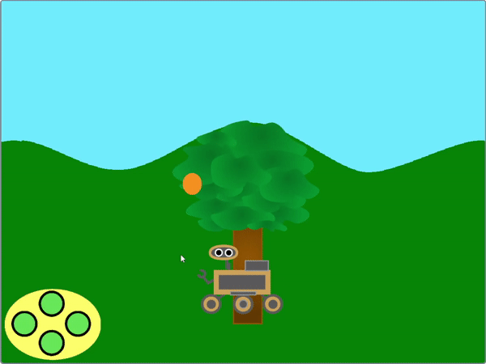
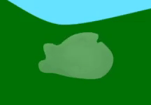
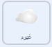
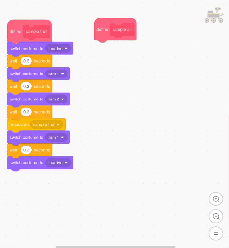

## جمع عيّنة هواء

<div style="display: flex; flex-wrap: wrap">
<div style="flex-basis: 200px; flex-grow: 1; margin-right: 15px;">
هناك طريقة أخرى لجعل الكشاف يبدو وكأنه يجمع العينات، وهي تغيير بعض خصائص الكائن، بدلاً من زيه.
</div>
<div>
{:width="300px"}
</div>
</div>

<p style="border-left: solid; border-width:10px; border-color: #0faeb0; background-color: aliceblue; padding: 10px;">
<span style="color: #0faeb0"> **تمرير المشهد** </span> هو عندما تتحرك صور الخلفية خلف الكاميرا ببطء أكثر من الصور الأمامية
</p>

--- task ---

أضف كائنًا سحابيًا إلى مشروعك من مكتبة النقوش المتحركة في Scratch، أو ارسم واحدًا بنفسك، ثم ضعه وقم بتغيير حجمه أسفل السماء حتى يتمكن المسبار من الوصول إليه.


--- /task ---

--- collapse ---
---
العنوان: أضف تأثيرات رسومية إلى السحابة
---

باستخدام بعض التأثيرات الرسومية، قم بتغيير مظهر كائن السحابة، بحيث يبدو ككرة دوامة من الغاز. يمكنك اللعب بتأثيرات رسومية مختلفة، ولكن المثال أدناه يجعل الكائن يبدو شفافًا بعض الشيء ويجعله يدور حوله.




```blocks3
when I receive [start v]
show
go to x: (190) y: (14)
clear graphic effects
set [ghost v] effect to (60)
set size to (50) %
forever
repeat (10)
change [whirl v] effect by (50)
end
repeat (20)
change [whirl v] effect by (-50)
end
repeat (10)
change [whirl v] effect by (50)
```

--- /collapse ---

لكي يتم تمرير السحابة، يجب أن تتحرك عندما تتلقى الرسائل `اليسرى`{: class = 'block3events'} و `على اليمين`{: class = 'block3events'} الرسائل. نظرًا لأن السحابة تكون بعيدة عن المشاهد أكثر من الشجرة، فيجب أن تتحرك مسافة أصغر في كل مرة، وتختفي من حافة الشاشة وتعاود الظهور على الجانب الآخر.

--- task ---

أضف التعليمات البرمجية لجعل السحابة تتحرك. قد تحتاج إلى ضبط الأرقام، اعتمادًا على حجم وموضع الكائن. نظرًا لأن السحابة يجب أن تظهر في الخلف، يجب أن تتحرك أقل من الشجرة.


```blocks3
when I receive [left v]
change x by (5)

when I receive [right v]
change x by (-5)

when I receive [start v]
+ forever
if <(x position) > (250)> then
set x to (-240)
end
if <(x position) < (-250)> then
set x to (240)
end
end
```

--- /task ---

احصل على الكشاف لجمع عينة الهواء.

--- task ---

قم بإعداد وظيفة الرسوم المتحركة للكائن الكشاف، بحيث يمكنه جمع عينة الهواء. يمكنك تكرار التعليمات البرمجية من دالة شجرة العينة للقيام بذلك.

--- collapse ---
---

title: تكرار الكود

---

إليك طريقة سهلة لتكرار التعليمات البرمجية لوظيفتك الجديدة.



--- /collapse ---


```blocks3
define sample air
switch costume to (inactive v)
wait (0.3) seconds
switch costume to (air 1 v)
wait (0.3) seconds
switch costume to (air 2 v)
wait (0.3) seconds
switch costume to (air 3 v)
wait (0.3) seconds
switch costume to (air 2 v)
wait (0.3) seconds
switch costume to (air 1 v)
wait (0.3) seconds
switch costume to (inactive v)
```

--- /task ---

اجعل الكشاف يبث رسالة إلى الكائن السحابي حتى يعرف متى يتحرك.

--- task ---

قم بإنشاء رسالة بث جديدة تسمى `عينة هواء`{:class='block3events'} ثم أضفها إلى دالة `عينة الهواء`{:class='block3custom'}.


```blocks3
حدد نموذج الهواء
تبديل المظهر إلى (غير نشط v)
انتظر (0.3) ثوان
غيّر المظهر إلى (الهواء 1 v)
انتظر (0). ) ثوان
غيّر المظهر إلى (الهواء 2 v)
انتظر (0.3) ثوان
غيّر المظهر إلى (الهواء 3 v)
انتظر (0). ) ثوان
+ بث (عينة الهواء v)
تبديل المظهر إلى (الهواء 2 v)
الانتظار (0. ) ثوان
تبديل المظهر إلى (الهواء 1 v)
الانتظار (0.3) ثوان
تبديل المظهر إلى (غير نشط v)
```

--- /task ---

يجب استدعاء التابع فقط إذا كان العربة الجوالة تلامس كائن السحابة.

--- task ---

أضف تعليمة برمجية بحيث يقوم الكشاف فقط بتجربة `عينات من الهواء`{:class='block3custom'} `إذا كانت`{:class='block3control'} فإنه `يلامس السحابة`{:class='block3sensing'}.


```blocks3
when this sprite clicked
if <touching color [Cloud v] ?> then
sample air ::custom
end
```

--- /task ---

احصل على عينة الهواء لتحريكها عندما يجمعها الكشاف. يمكنك أن تجعلها تفعل ما تريد ولكن في هذا المثال تختفي عندما يمتصها الكشاف.

--- task ---

أضف تأثيرًا متحركًا إلى السحابة يغير الحجم.


```blocks3
when I receive [sample air v]
repeat (5)
change size by (-10) //shrink the cloud
end
hide
set size to (50) %
```

--- /task ---

--- task ---

**اختبر مشروعك** بالنقر فوق العلم الأخضر ثم تحريك الكشاف الخاص بك حتى يلامس السحابة. انقر على الكشاف وسيظهر وكأنه يمتص السحابة.

--- /task ---

--- task ---

الآن قم بتغيير كود كائن السحابة الخاص بك بحيث يعيد تعيينه عندما يخرج من الشاشة.


```blocks3
when I receive [start v]
+ forever
if <(x position) > (250)> then
set x to (-240)
show
end
if <(x position) < (-250)> then
set x to (240)
show
end
end
```

--- /task ---


--- save ---
