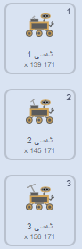

## قم بإنشاء عينة أخرى

<div style="display: flex; flex-wrap: wrap">
<div style="flex-basis: 200px; flex-grow: 1; margin-right: 15px;">
اختر ما يعينه الكشاف بعدها! هل يرى أنواع جديدة من النباتات، الحشرات، أو الحيوانات؟ هل يرى بعض الماء أو السوائل الغامضة؟ هل تريد أن تأخذ عينة من بعض التراب أو الصخور أو حتى الهواء؟ أو شيء آخر؟
</div>
<div>
{:width="300px"}
</div>
</div>

--- task ---

**اختر:** أضف كائن **عينة** للكشاف لجمعه. يمكنك إضافة هذا لمشروعك إما بتحديد واحد من المكتبة أو رسم واحد يخصك.

--- /task ---

احصل على كائن **عينتك** لتمرر. إذا كانت منخفضة أسفل الشاشة، يجب أن تتحرك أكثر(`بدل x بـ`{:class='block3motion'}يجب أن تكون أعلى من `5`)، و إذا كانت أعلى الشاشة يجب أن تتحرك أقل(`بدل x بـ`{:class='block3motion'} يجب أن تكون أقل من `5`).

--- task ---

أضف كودا بحيث يمرر كائنك.

--- /task ---

**اختر:** اعتمادا على ما تريد الكاشاف أن يعينه تاليا، يمكنك إما استخدام رسوم الكشاف المتحركة الموجودة هناك أصلا، أو خلق مزيد من متسلسلات الرسوم المتحركة بمضاعفتها و تعديل مظاهرها.

--- task ---

أضف مجموعة `مجموعاتي`{:class='block3myblocks'} إلى كائن **كشافك** لتحريك رسوم الكشاف عند جمعه لعينة جديدة. يمكنك نسخ و لصق الكود من أحد الـ `مجموعتي`{:class='block3myblocks'} الأخرى التي أنشأتها.

للذكر، هاهنا متسلسل مظهر لجمع الطاقة الشمسية:



لتحريك سلسلة المظاهر هذه يمكنك استخدام الكود التالي:

```blocks3
define إعادة شحن
switch costume to [خامل v]
wait (0.3) seconds
switch costume to [الطاقة الشمسية 1 v]
wait (0.3) seconds
switch costume to [الطاقة الشمسية 2 v]
wait (0.3) seconds
switch costume to [الطاقة الشمسية 3 v]
wait (0.3) seconds
switch costume to [الطاقة الشمسية 2 v]
wait (0.3) seconds
switch costume to [الطاقة الشمسية 1 v]
wait (0.3) seconds
switch costume to [خامل v]
wait (0.3) seconds
```

--- /task ---

--- task ---

التالي, `بث`{:class='block3events'} رسالة جديدة في مجموعة `مجموعتي`{:class='block3myblocks'} الجديدة التي ستسبب تغير `المظهر`{:class='block3looks'} أو `مؤثر الرسم`{:class='block3looks'} في كائن **العينة**.

--- /task ---

--- task ---

استعمل مجموعة `إذا`{:class='block3control'} للكشف إذا كان الكشاف يلامس الكائن أو لون على الكائن، بحيث تكون `مجموعتي`{:class='block3myblocks'} الوحيدة المستخدمة ذلك الآن.

--- /task ---

--- task ---

إذا كنت ترغب في ذلك، أضف رسوما متحركة إلى الكائن، بحيث يتغير مظهرها عندما يكون الكشاف قد جمع العينة.

--- /task ---

--- save ---
