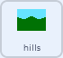

## Κύλιση του φόντου

<div style="display: flex; flex-wrap: wrap">
<div style="flex-basis: 200px; flex-grow: 1; margin-right: 15px;">
Για να φαίνεται το ρομποτικό όχημα ότι κινείται αριστερά και δεξιά, αντί να κινείται το αντικείμενο **rover**, κινείται ή μετακινείται το αντικείμενο **φόντο** προς τα αριστερά ή τα δεξιά.
</div>
<div>
{:width="300px"}
</div>
</div>

--- task ---

Επίλεξε το αντικείμενο **hills**. Στην αρχή του παιχνιδιού, πρέπει να βεβαιωθείς ότι είναι στη σωστή θέση και στο υπόβαθρο.



```blocks3
when I receive [start v]
go to [back v] layer
go to x: (0) y: (0)
```

--- /task ---

<p style="border-left: solid; border-width:10px; border-color: #0faeb0; background-color: aliceblue; padding: 10px;">
<span style="color: #0faeb0">**Τα επίπεδα**</span> είναι σαν στοιβαγμένα φύλλα από διαφανές πλαστικό στα οποία μπορείς να σχεδιάσεις εικόνες. Εάν μια εικόνα στο επάνω μέρος της στοίβας καλύπτει την εικόνα κάτω από αυτήν, δεν θα μπορείς να δεις σωστά την κάτω εικόνα. Οι εικόνες φόντου πρέπει να βρίσκονται κοντά στο **πίσω** επίπεδο. Οι εικόνες πιο κοντά στον θεατή θα πρέπει να βρίσκονται κοντά στο **μπροστινό** επίπεδο.
</p>

--- task ---

Το αντικείμενο **hills** πρέπει να δημιουργήσει ένα αντίγραφο του εαυτού του. Αυτά ονομάζονται `κλώνοι`{:class='block3control'}. Στη συνέχεια, το αρχικό αντικείμενο μπορεί να μετακινηθεί στη δεξιά πλευρά της οθόνης.


```blocks3
when I receive [start v]
go to [back v] layer
go to x: (0) y: (0)
+ create clone of [myself v] //Create a copy of the hills
+ change x by (460) //Move the original hills to the right of the screen
```

--- /task ---

Όταν ληφθούν οι μεταδόσεις `left`{:class='block3events'} και `right`{:class='block3events'}, το αντικείμενο **hills** θα πρέπει να μετακινηθεί. Για να φαίνεται ότι κινείται προς τη σωστή κατεύθυνση, το φόντο μετακινείται **αριστερά** όταν το **rover** κινείται δεξιά. Η κατεύθυνση της κίνησης πρέπει να είναι **αντίθετα** από τη `μετάδοση`{:class='block3events'}.

Έτσι, εάν η μετάδοση είναι `left`{:class="block3events"}, τότε η θέση `x`{:class="block3motion"} θα αυξηθεί. Εάν η μετάδοση είναι `right`{:class="block3events"}, τότε το `x`{:class="block3motion"} των **hills** θα μειωθεί.


--- task ---

Πρόσθεσε μπλοκ για να ελέγξεις την κίνηση του αντικειμένου **hills** και του κλώνου του.


```blocks3
when I receive [left v]
change x by (3)

when I receive [right v]
change x by (-3)
```

--- /task ---

--- task ---

**Δοκιμή**: Χρησιμοποίησε το χειριστήριο ή τα πλήκτρα <kbd>βελάκια</kbd> για να μετακινηθείς. Το rover θα πρέπει να φαίνεται ότι κινείται αριστερά και δεξιά.

--- /task ---

Προς το παρόν, υπάρχουν δύο αντίγραφα του αντιγράφου **hills**: το πρωτότυπο και ένας κλώνος. Όταν φτάσεις στο τέλος ενός από τα δύο, θα παρατηρήσεις ότι η οθόνη είναι απλώς λευκή.

Για να διορθωθεί αυτό, το αντικείμενο και ο κλώνος του πρέπει να μετακινηθούν στην άλλη πλευρά της οθόνης όταν πάνε πολύ μακριά.

--- task ---

Δημιούργησε μια νέα μετάδοση που ονομάζεται `scroll`{:class='block3events'} και πρόσθεσέ τη στο script `start`{:class='block3events'}.


```blocks3
when I receive [start v]
go to [back v] layer
go to x: (0) y: (0)
create clone of [myself v]
change x by (460) 
+ broadcast [scroll v]
```

--- /task ---

--- task ---

Πρόσθεσε κώδικα για να εντοπίσεις εάν το αντικείμενο **hills** ή ο κλώνος του έχουν μετακινηθεί πολύ αριστερά ή δεξιά και στη συνέχεια, επανάφερε τις θέσεις τους στην άλλη πλευρά της οθόνης.


```blocks3
when I receive [scroll v]
forever
if <(x position) > (460)> then //The hills sprite is off the right side of the screen
set x to (-460) //Reset to the left side of the screen
end
if <(x position) < (-460)> then //The hills sprite is off the left side of the screen
set x to (460) //Reset to the right side of the screen
end
```

--- /task ---

--- task ---

**Δοκιμή**: Κάνε κλικ στην πράσινη σημαία για να επαναφέρεις τη σκηνή και, στη συνέχεια, χρησιμοποίησε τον ελεγκτή ή τα πλήκτρα <kbd>βέλους</kbd> για να μετακινήσεις το **rover**. Το φόντο πρέπει να κυλήσει και το **rover** δεν πρέπει ποτέ να φτάσει στο τέλος.

--- /task ---

--- save ---
