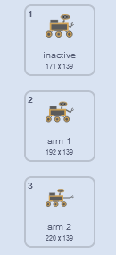
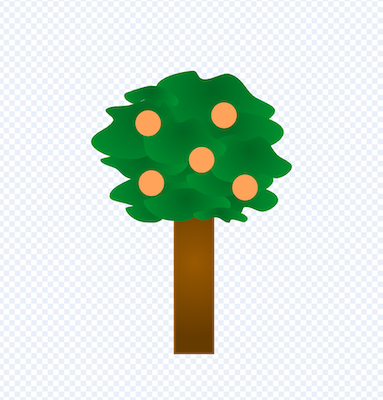

## Συλλογή δείγματος

<div style="display: flex; flex-wrap: wrap">
<div style="flex-basis: 200px; flex-grow: 1; margin-right: 15px;">
Σε αυτό το βήμα, θα αλλάξεις την εμφάνιση ενός αντικειμένου και του rover για να εμφανίσεις το ρομποτικό όχημα να συλλέγει δείγματα.
</div>
<div>
{:width="300px"}
</div>
</div>

--- task ---

Δες τις ενδυμασίες του αντικειμένου **rover**. Υπάρχουν έξι διαθέσιμα κινούμενα σχέδια. Το **rover** μπορεί:
- Να εκτείνει τον βραχίονα του



- Να τρυπήσει στο έδαφος
- Να ρουφήξει αέρα
- Να επεκτείνει ένα ηλιακό πάνελ
- Να τραβήξει μια φωτογραφία
- Να μαζέψει κάτι

--- /task ---

Όταν θέλεις να οργανώσεις πολύ κώδικα στο Scratch, όπως πολλές αλλαγές ενδυμασιών, είναι χρήσιμο να χρησιμοποιήσεις το μενού `Οι Εντολές μου`{:class="block3myblocks"}. Αυτό σου επιτρέπει να δημιουργήσεις τα δικά σου προσαρμοσμένα μπλοκ.

Το αντικείμενό σου **rover** θα έχει μια συνάρτηση στο μενού `Οι Εντολές μου`{:class="block3myblocks"} για κάθε κινούμενη εικόνα.

--- task ---

Κάνε κλικ στο μενού `Οι Εντολές μου`{: class = "block3myblocks"} και έπειτα στο **Δημιουργία Εντολής** και ονόμασε αυτό το νέο μπλοκ `δείγμα φρούτου`{: class = "block3myblocks"}.

--- /task ---

Ένα νέο μπλοκ θα εμφανιστεί στο script σου. Θα μοιάζει έτσι:


```blocks3
define sample fruit
```

--- task ---

Κάτω από αυτό το μπλοκ, επισύναψε μερικά μπλοκ `άλλαξε ενδυμασία`{:class="block3looks"} και μπλοκ `περίμενε`{:class="block3control"}, για να δώσεις κίνηση στο ρομπότ.

**Συμβουλή:** Είναι πιο γρήγορο να δημιουργήσεις το πρώτο μπλοκ `άλλαξε ενδυμασία`{:class='block3looks'} και μπλοκ `περίμενε`{:class='block3control'}, στη συνέχεια να τις αντιγράψεις και να αλλάξεις την ενδυμασία που χρησιμοποιείται.


```blocks3
define sample fruit //Animates the robot to collect fruit
switch costume to (inactive v)
wait (0.3) seconds
switch costume to (arm 1 v)
wait (0.3) seconds
switch costume to (arm 2 v)
wait (0.3) seconds
switch costume to (arm 1 v)
wait (0.3) seconds
switch costume to (inactive v)
```

--- /task ---

--- task ---

Πρόσθεσε ένα μπλοκ έτσι ώστε το αντικείμενο **rover** να παίζει έναν ήχο όταν συλλέγει το δείγμα καρπών. Μπορείς να βρεις τον ήχο **Collect** στη συλλογή Ήχων.


```blocks3
define sample fruit //Animates the robot to collect fruit
switch costume to (inactive v)
wait (0.3) seconds
switch costume to (arm 1 v)
wait (0.3) seconds
switch costume to (arm 2 v)
wait (0.3) seconds
+ start sound (Collect v)
switch costume to (arm 1 v)
wait (0.3) seconds
switch costume to (inactive v)
```

--- /task ---


--- task ---

Μπορείς να κάνεις κλικ στο μπλοκ `ορισμός δείγματος φρούτου`{:class="block3myblocks"} για να δεις την κινούμενη εικόνα. Εάν βρίσκεσαι σε μια μικρή οθόνη, ίσως χρειαστεί να κοιτάξεις προσεκτικά.

Ωστόσο, η κινούμενη εικόνα δεν θα εκτελείται όταν κάνεις κλικ στην πράσινη σημαία, καθώς δεν έχεις χρησιμοποιήσει ακόμη το νέο `μπλόκ δείγμα φρούτου`{:class='block3myblocks'} στο έργο σου.

--- /task ---

--- task ---

Για να χρησιμοποιήσεις το νέο σου μπλοκ, μπορείς να το επισυνάψεις σε ένα μπλοκ `συμβάντος`{:class="block3events"}. Στο μενού `Οι Εντολές μου`{:class="block3myblocks"}, θα πρέπει να δεις το μπλοκ που δημιούργησες. Χρησιμοποίησε το στο παρακάτω script.


```blocks3
when this sprite clicked
sample fruit ::custom //Run the animation
```

--- /task ---

--- task ---

Κάνε κλικ στο αντικείμενο **rover** και θα δεις το κινούμενο σχέδιο.

--- /task ---

Τώρα πρέπει να κάνεις το rover να συλλέξει πραγματικά ένα δείγμα. Σε αυτό το παράδειγμα, το rover θα συλλέξει έναν καρπό από ένα δέντρο.

--- task ---

Το αντικείμενο **tree** χρειάζεται δύο ενδυμασίες, μια χωρίς φρούτα (`tree without fruit`{:class="block3looks"}) και μια με φρούτα (`tree with fruit`{:class="block3looks"}). Πρόσθεσε μια άλλη ενδυμασία στο **δέντρο **, άλλαξε τα ονόματα και σχεδίασε μερικά φρούτα στο δέντρο **με τα φρούτα**.



--- /task ---

--- task ---

Στο αντικείμενο **tree**, πρόσθεσε μπλοκ για να ορίσεις την ενδυμασία του **tree** στην αρχή του έργου και την ενδυμασία στην οποία θα πρέπει να αλλάξει όταν λαμβάνει μια μετάδοση `δείγμα φρούτου`{:class="block3events"}.


```blocks3
when I receive [start v]
go to x:(-90) y:(-80)
+ switch costume to (tree with fruit v)
forever
if <(x position) > (290)> then
set x to (-280)
end
if <(x position) < (-290)> then
set x to (280)
end
end

+ when I receive [sample fruit v]
+ switch costume to (tree without fruit v)
```

--- /task ---

--- task ---

Στο αντικείμενο **rover** μπορείς να χρησιμοποιήσεις τη νέα `μετάδοση`{:class="block3events"} για να ενεργοποιήσεις την αλλαγή ενδυμασίας. Πρόσθεσε αυτήν τη νέα `μετάδοση`{:class="block3events"} στη συνάρτηση `ορισμός δείγματος φρούτου`{:class="block3myblocks"}.


```blocks3
define sample fruit
switch costume to (inactive v)
wait (0.3) seconds
switch costume to (arm 1 v)
wait (0.3) seconds
switch costume to (arm 2 v)
start sound (Collect v)
wait (0.3) seconds
+ broadcast (sample fruit v)
switch costume to (arm 1 v)
wait (0.3) seconds
switch costume to (inactive v)
```

--- /task ---

--- task ---

**Δοκιμή:** Για να ελέγξεις ότι ο κώδικάς σου λειτουργεί, κάνε κλικ στη σημαία και στη συνέχεια, κάνε κλικ στο αντικείμενο **rover**. Ο βραχίονάς του πρέπει να εκτείνεται και το αντικείμενο **tree** θα πρέπει να αλλάζει ενδυμασίες.

**Συμβουλή:** Άλλαξε σε λειτουργία πλήρους οθόνης και θα μπορείς να βλέπεις πιο εύκολα την κινούμενη εικόνα.

--- /task ---

Το rover θα πρέπει να μπορεί να συλλέξει τον καρπό μόνο εάν τον αγγίζει.

--- task ---

Στο αντικείμενο **rover** άλλαξε το σετ μπλοκ `όταν γίνει κλικ σε αυτό το αντικείμενο`{:class="block3events"}, έτσι ώστε η συνάρτηση `δείγμα φρούτου`{:class="block3myblocks"} να καλείται μόνο εάν το αντικείμενο **rover** αγγίζει το χρώμα των καρπών σου.

**Συμβουλή:** Η αλλαγή της ενδυμασίας σου από τη δοκιμή μπορεί να σημαίνει ότι ο καρπός δεν είναι ορατός. Απλώς κάνε κλικ στην καρτέλα ενδυμασίες για το αντικείμενο **tree** και άλλαξε στην ενδυμασία με τους ορατούς καρπούς.


```blocks3
when this sprite clicked
if <touching color (#FFA500) ?> then //Colour of fruit
sample fruit ::custom
```

--- /task ---

--- task ---

Τώρα που το αντικείμενο **tree** αλλάζει όταν γίνεται συλλογή ενός καρπού, πρέπει να επαναφέρεις το αντικείμενο στην αρχική του ενδυμασία όταν φύγει από την οθόνη.


```blocks3
when I receive [start v]
go to x:(-90) y:(-80)
switch costume to (tree with fruit v)
forever
if <(x position) > (290)> then
set x to (-280)
+ switch costume to (tree with fruit v)
end
if <(x position) < (-290)> then
set x to (280)
+ switch costume to (tree with fruit v)
end
end
```

--- /task ---

--- task ---

**Δοκιμή:** Μετακίνησε το αντικείμενο **rover** έτσι ώστε να αγγίζει τον καρπό, μετά κάνε κλικ στο αντικείμενο **rover** και παρακολούθησέ το να μαζεύει τους καρπούς από το δέντρο.

--- /task ---


--- save ---
