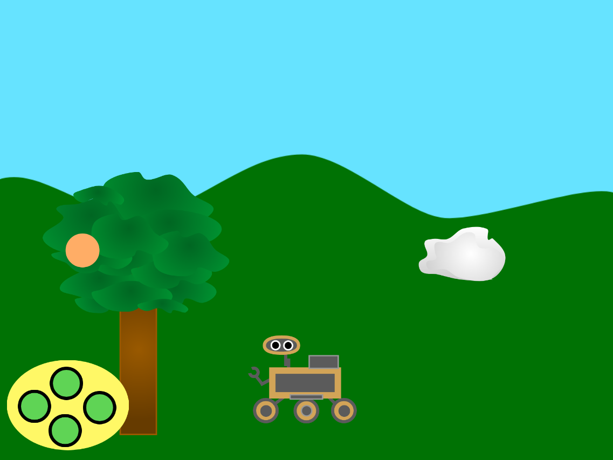
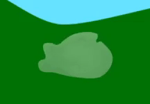
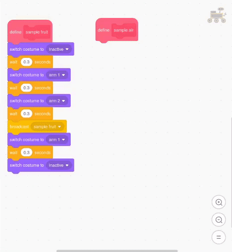

## Συλλογή δείγματος από τον αέρα

<div style="display: flex; flex-wrap: wrap">
<div style="flex-basis: 200px; flex-grow: 1; margin-right: 15px;">
Ένας άλλος τρόπος για να κάνεις το ρομποτικό όχημα να φαίνεται ότι συλλέγει δείγματα, είναι να αλλάξεις μερικές από τις ιδιότητες ενός αντικειμένου, παρά την ενδυμασία του.
</div>
<div>
{:width="300px"}
</div>
</div>

<p style="border-left: solid; border-width:10px; border-color: #0faeb0; background-color: aliceblue; padding: 10px;">
<span style="color: #0faeb0">**Κύλιση Parallax**</span> είναι όταν οι εικόνες στο φόντο περνούν από την κάμερα πιο αργά από τις εικόνες στο προσκήνιο
</p>

--- task ---

Πρόσθεσε ένα αντικείμενο cloud στο έργο σου από τη βιβλιοθήκη αντικειμένων στο Scratch, ή σχεδίασε ένα μόνος/η σου, και τοποθέτησε και άλλαξε το μέγεθός του κάτω από τον ουρανό, έτσι ώστε το ρομποτικό όχημα να μπορεί να το φτάσει.



--- /task ---

--- collapse ---
---
title: Προσθήκη εφέ γραφικών στο σύννεφο
---

Χρησιμοποιώντας μερικά εφέ γραφικών, άλλαξε την εμφάνιση του αντικειμένου cloud, έτσι ώστε να μοιάζει με μια μπάλα αερίου που στροβιλίζεται. Μπορείς να παίξεις με διαφορετικά εφέ γραφικών, αλλά το παρακάτω παράδειγμα κάνει το αντικείμενο να φαίνεται λίγο διαφανές και να το κάνει να στροβιλίζεται.




```blocks3
when I receive [start v]
show
go to x: (190) y: (14)
clear graphic effects
set [ghost v] effect to (60)
set size to (50) %
forever
repeat (10)
change [whirl v] effect by (50)
end
repeat (20)
change [whirl v] effect by (-50)
end
repeat (10)
change [whirl v] effect by (50)
```

--- /collapse ---

Για να κάνει κύλιση το σύννεφο, πρέπει να μετακινηθεί όταν λάβει τα μηνύματα `left`{:class='block3events'} και `right`{:class='block3events'}. Καθώς το σύννεφο είναι πιο μακριά από τον θεατή από ότι το δέντρο, θα πρέπει να μετακινείται κατά μικρότερη απόσταση κάθε φορά και να εξαφανίζεται από την άκρη της οθόνης και να εμφανίζεται ξανά στην άλλη πλευρά.

--- task ---

Πρόσθεσε κώδικα για να μετακινήσεις το σύννεφο. Ίσως χρειαστεί να προσαρμόσεις τους αριθμούς, ανάλογα με το μέγεθος και τη θέση του αντικειμένου. Καθώς το σύννεφο πρέπει να εμφανίζεται πιο πίσω, θα πρέπει να κινείται λιγότερο από ότι το δέντρο.


```blocks3
when I receive [left v]
change x by (5)

when I receive [right v]
change x by (-5)

when I receive [start v]
+ forever
if <(x position) > (250)> then
set x to (-240)
end
if <(x position) < (-250)> then
set x to (240)
end
end
```

--- /task ---

Κάνε το ρομποτικό όχημα να συλλέξει το δείγμα αέρα.

--- task ---

Όρισε μια συνάρτηση κινούμενης εικόνας για το αντικείμενο rover, ώστε να μπορεί να συλλέξει το δείγμα αέρα. Μπορείς να αντιγράψεις τον κώδικα από τη συνάρτηση sample tree για να το κάνεις αυτό.

--- collapse ---
---

τίτλος: Αντιγραφή κώδικα

---

Εδώ είναι ένας εύκολος τρόπος για να αντιγράψεις τον κώδικα για τη νέα σου συνάρτηση.



--- /collapse ---


```blocks3
define sample air
switch costume to (inactive v)
wait (0.3) seconds
switch costume to (air 1 v)
wait (0.3) seconds
switch costume to (air 2 v)
wait (0.3) seconds
switch costume to (air 3 v)
wait (0.3) seconds
switch costume to (air 2 v)
wait (0.3) seconds
switch costume to (air 1 v)
wait (0.3) seconds
switch costume to (inactive v)
```

--- /task ---

Ζήτα από το rover να μεταδώσει ένα μήνυμα στο αντικείμενο cloud, ώστε να γνωρίζει πότε να κάνει κίνηση.

--- task ---

Δημιούργησε μια νέα μετάδοση που ονομάζεται `sample air`{:class='block3events'} και πρόσθεσέ τη μέσα στη συνάρτηση `sample air`{:class='block3events'}.


```blocks3
define sample air
switch costume to (inactive v)
wait (0.3) seconds
switch costume to (air 1 v)
wait (0.3) seconds
switch costume to (air 2 v)
wait (0.3) seconds
switch costume to (air 3 v)
wait (0.3) seconds
+ broadcast (sample air v)
switch costume to (air 2 v)
wait (0.3) seconds
switch costume to (air 1 v)
wait (0.3) seconds
switch costume to (inactive v)
```

--- /task ---

Η συνάρτηση πρέπει να καλείται μόνο εάν το rover αγγίζει το αντικείμενο cloud.

--- task ---

Πρόσθεσε κώδικα ώστε το rover να `λαμβάνει δείγματα αέρα`{:class='block3custom'} μόνο `εάν`{:class='block3control'} `αγγίζει το σύννεφο`{:class='block3sensing'}.


```blocks3
when this sprite clicked
if <touching color [Cloud v] ?> then
sample air ::custom
end
```

--- /task ---

Κάνε το air sample κινούμενο σχέδιο όταν το συλλέξει το rover. Μπορείς να το αναγκάσεις να κάνει ό, τι θέλεις, αλλά σε αυτό το παράδειγμα εξαφανίζεται ενώ το απορροφά το rover.

--- task ---

Πρόσθεσε ένα εφέ κίνησης στο σύννεφο που αλλάζει το μέγεθος.


```blocks3
when I receive [sample air v]
repeat (5)
change size by (-10) //shrink the cloud
end
hide
set size to (50) %
```

--- /task ---

--- task ---

**Δοκίμασε** το έργο σου κάνοντας κλικ στην πράσινη σημαία και στη συνέχεια μετακινώντας το ρομποτικό σου όχημα μέχρι να αγγίξει το σύννεφο. Κάνε κλικ στο rover και θα πρέπει να φαίνεται ότι απορροφά το cloud.

--- /task ---

--- task ---

Τώρα άλλαξε τον κώδικα του αντικειμένου σου cloud, ώστε να το επαναφέρει όταν σβήσει από την οθόνη.


```blocks3
when I receive [start v]
+ forever
if <(x position) > (250)> then
set x to (-240)
show
end
if <(x position) < (-250)> then
set x to (240)
show
end
end
```

--- /task ---


--- save ---
