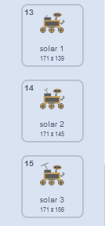

## Δημιουργία άλλου δείγματος

<div style="display: flex; flex-wrap: wrap">
<div style="flex-basis: 200px; flex-grow: 1; margin-right: 15px;">
Επίλεξε ποιο θα είναι το επόμενο δείγμα για το rover! Βλέπει ένα νέο είδος φυτού, ζωύφιου ή ζώου; Βλέπει λίγο νερό ή ένα μυστηριώδες υγρό; Θέλει να μαζέψει λίγο χώμα ή έναν βράχο ή ακόμα και τον αέρα; Ή κάτι άλλο;
</div>
<div>
{:width="300px"}
</div>
</div>

--- task ---

**Επίλεξε:** Πρόσθεσε ένα νέο αντικείμενο **sample** για να συλλέξει το rover. Μπορείς να το προσθέσεις στο έργο σου είτε επιλέγοντας ένα από τη βιβλιοθήκη είτε σχεδιάζοντας το δικό σου.

--- /task ---

Κάνε το αντικείμενό σου **sample** να μετακινηθεί. Εάν είναι χαμηλά στην οθόνη, θα πρέπει να κινείται περισσότερο (`άλλαξε x κατά`{:class='block3motion'} θα πρέπει να είναι μεγαλύτερο από `5`), και αν είναι ψηλά στην οθόνη θα πρέπει να κινείται λιγότερο (`άλλαξε x κατά`{:class='block3motion'} θα πρέπει να είναι μικρότερο από `5`).

--- task ---

Πρόσθεσε κώδικα ώστε το αντικείμενό σου να μετακινηθεί.

--- /task ---

**Επίλεξε:** Ανάλογα με το τι θέλεις να μαζέψει το rover στη συνέχεια, μπορείς είτε να χρησιμοποιήσεις τα κινούμενα σχέδια του rover που υπάρχουν ήδη, είτε να δημιουργήσεις περισσότερες ακολουθίες κινούμενων εικόνων κάνοντας αντιγραφή και επεξεργασία στις ενδυμασίες.

--- task ---

Πρόσθεσε ένα μπλοκ `Οι Εντολές μου`{:class='block3myblocks'} στο αντικείμενο **rover** για να κινήσει το rover όταν συλλέγει το νέο δείγμα. Μπορείς να αντιγράψεις και να επικολλήσεις τον κώδικα από μιά από τις άλλες `Οι Εντολές μου`{:class='block3myblocks'} που έχεις δημιουργήσει.

Για παράδειγμα, εδώ είναι μια ακολουθία ενδυμασιών για τη συλλογή ηλιακής ενέργειας:



Για να δημιουργήσεις κίνηση σε αυτήν τη σειρά ενδυμασιών, θα μπορούσες να χρησιμοποιήσεις τον ακόλουθο κώδικα:

```blocks3
define recharge
switch costume to [inactive v]
wait (0.3) seconds
switch costume to [solar 1 v]
wait (0.3) seconds
switch costume to [solar 2 v]
wait (0.3) seconds
switch costume to [solar 3 v]
wait (0.3) seconds
switch costume to [solar 2 v]
wait (0.3) seconds
switch costume to [solar 1 v]
wait (0.3) seconds
switch costume to [inactive v]
wait (0.3) seconds
```

--- /task ---

--- task ---

Στη συνέχεια, `μετάδωσε`{:class='block3events'} ένα νέο μήνυμα στο νέο σου μπλοκ `H Εντολή μου`{:class='block3myblocks'} που θα προκαλέσει μια αλλαγή στην `ενδυμασία`{:class='block3looks'} ή στα `εφέ γραφικών`{:class='block3looks'} στο αντικείμενο **sample**.

--- /task ---

--- task ---

Χρησιμοποίησε ένα μπλοκ `εάν`{:class='block3control'} για να ανιχνεύσεις αν το rover αγγίξει το αντικείμενο ή αγγίξει ένα χρώμα πάνω στο αντικείμενο, έτσι ώστε το νέο μπλοκ `Η Εντολή μου`{:class='block3myblocks'} να χρησιμοποιείται μόνο τότε.

--- /task ---

--- task ---

Αν θέλεις, πρόσθεσε ένα κινούμενο σχέδιο στο αντικείμενο, έτσι ώστε η εμφάνισή του να αλλάζει όταν το rover έχει συλλέξει το δείγμα.

--- /task ---

--- save ---
