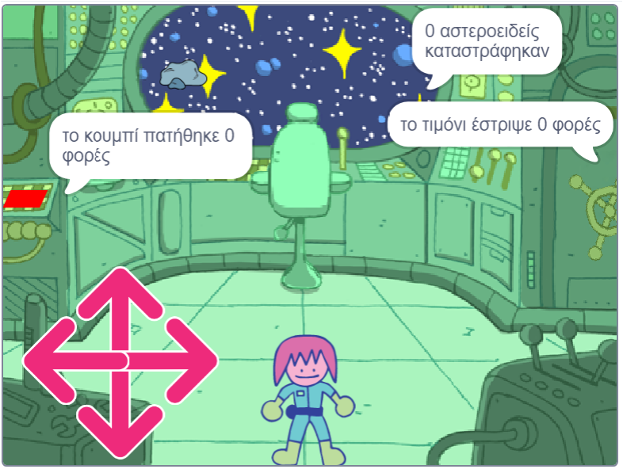

## Και τώρα;

Εάν ακολουθείς το μονοπάτι [Περισσότερη Scratch](https://projects.raspberrypi.org/en/pathways/further-scratch), μπορείς να προχωρήσεις στο έργο [Δωμάτιο με γρίφους](https://projects.raspberrypi.org/en/projects/puzzle-room). Σε αυτό το έργο, θα φτιάξεις ένα δωμάτιο γρίφων με έναν χαρακτήρα μέσα σε ένα διαστημόπλοιο που λύνει τους γρίφους.

--- print-only ---

--- /print-only ---

--- no-print ---

  <iframe allowtransparency="true" width="485" height="402" src="https://scratch.mit.edu/projects/embed/536877672/?autostart=false" frameborder="0"></iframe>

--- /no-print ---

Αν θέλεις να διασκεδάσεις περισσότερο εξερευνώντας την Scratch, τότε μπορείς να δοκιμάσεις οποιοδήποτε από [αυτά τα έργα](https://projects.raspberrypi.org/en/projects?software%5B%5D=scratch&curriculum%5B%5D=%201).
