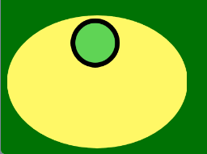
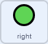

## Make the controller

<div style="display: flex; flex-wrap: wrap">
<div style="flex-basis: 200px; flex-grow: 1; margin-right: 15px;">
In this step, you will create an on-screen controller that can be used to move your rover up and down.
</div>
<div>
{:width="300px"}
</div>
</div>

--- task ---

Open the starter project online at [rpf.io/nature-rover-starter](https://rpf.io/nature-rover-starter).

--- collapse ---
---
title: Working offline
---

If you are working offline, the starter project can be found at [rpf.io/en/p/nature-rover](https://rpf.io/en/p/nature-rover)

--- /collapse ---


--- /task ---

You should see a scene with a robotic rover, a hilly background and a pile of soil.


--- task ---

You are going to create a controller using 5 different sprites. One should be the body of the controller, and the other four are direction buttons. Here's an example to show you what it might look like.


**Tip**: It's easier to create a single button first, add the code, and then duplicate the button and change the code for each one. So just create the **up** button and the body of the controller to start with.



--- collapse ---
---
title: Debugging layers
---

Sprites can sometimes become hidden behind other sprites. This is because all sprites sit on their own layer. We'll fix this later, but for now you can click on the `go to front layer`{:class='block3looks'} block, with the sprite selected, to make it visible.

```blocks3
go to [front v] layer
```

--- /collapse ---

--- /task ---

The rover needs to move when the direction buttons are clicked.

--- task ---

Add code to your **up** button so that when it is clicked, it `broadcasts`{:class="block3events"} **up**. You will need to create a `New message`{:class="block3events"} for the button. This broadcast can be used to make the **rover** sprite move later on. Here is an example for the **up** button:


```blocks3
when this sprite clicked
broadcast (up v)
```

--- /task ---

When the **up** button is clicked, the rover should change its `y`{:class="block3motion"} position, by a small amount. Increasing `y`{:class="block3motion"} will make the rover move up. Decreasing `y`{:class="block3motion"} would make the rover move down.

--- task ---

Add code so the up buttons makes the rover move up.


```blocks3
when I receive [up v]
change y by (10)
```

--- /task ---

--- task ---
**Test:** your rover's control by clicking on the up button.

--- /task ---

The rover is going to control the start of the game for all the other sprites, so when the green flag is clicked it needs to broadcast a `start`{:class='block3events'} message.

--- task ---

Create a new broadcast and add it to a `green flag clicked`{:class='block3events'} set of blocks.


```blocks3
when flag clicked
broadcast [start v]
``` 

--- /task ---

--- task ---

Now reset the position of the rover, each time the game starts


```blocks3
when I receive [start v]
go to x: (0) y: (-90)
```

--- /task ---

To finish off, you must make sure that the controller is always in front of all the other sprites, and then duplicate your button, and edit the code of the duplicates.

--- task ---

Add blocks so that the **up** button will `forever`{:class='block3control '}appear in the front layer, and at its current position


```blocks3
when I receive [start v]
forever
go to [front v] layer
go to x:(-190) y: (-121)
end
```

--- /task ---

--- task ---

Duplicate your **up** button sprite three times. Rename the duplicates **down**, **right**, and **left**. Add the broadcasts for each button, and set its layer and position. Here is an example for the **right** button


```blocks3
when this sprite clicked
broadcast (right v)

when I receive [start v]
forever
go to [front v] layer
go to x: (-164) y:-141
```

Your controller should look something like this, when the game starts.


--- /task ---

--- task ---

For the down button's broadcast, it should make the rover move down. This means that `y`{:class='block3motions'} should get smaller.


```blocks3
when I receive [down v]
change y by (-10)
```

--- /task ---

**You don't need to worry about the left and right motion yet. Left and right motion will be added in the next step of the project.**

--- task ---

Now send the controller's background to the front layer, and then back four, so it appears behind the buttons.

\
```blocks3
when I receive [start v]
go to [front v] layer
go [backward v] (4) layers
```

--- /task ---

--- task ---

The **rover** should always appear in front of the other sprites


```blocks3
when I receive [start v]
go to x: (0) y: (-90)
+ go to [front v] layer
```
--- /task ---


--- collapse ---
---
title: Add keyboard controls
---

If you are working on a computer, it might be easier to have keyboard controls, rather than using the buttons. Keyboard controls can easily be added to the **rover** sprite.

```blocks3
when [up arrow v] key pressed
broadcast [right v]

when [down arrow v] key pressed
broadcast [down v]

when [right arrow v] key pressed
broadcast [right v]

when [left arrow v] key pressed
broadcast [left v]
```

--- /collapse ---

--- task ---

**Test**: that your controller works, and moves the rover up and down. Also test that your buttons move back to the correct position if they are accidentally dragged around.

--- /task ---

--- save ---
