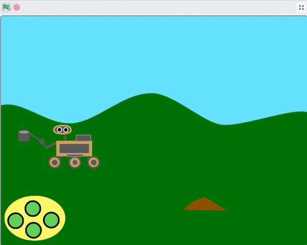
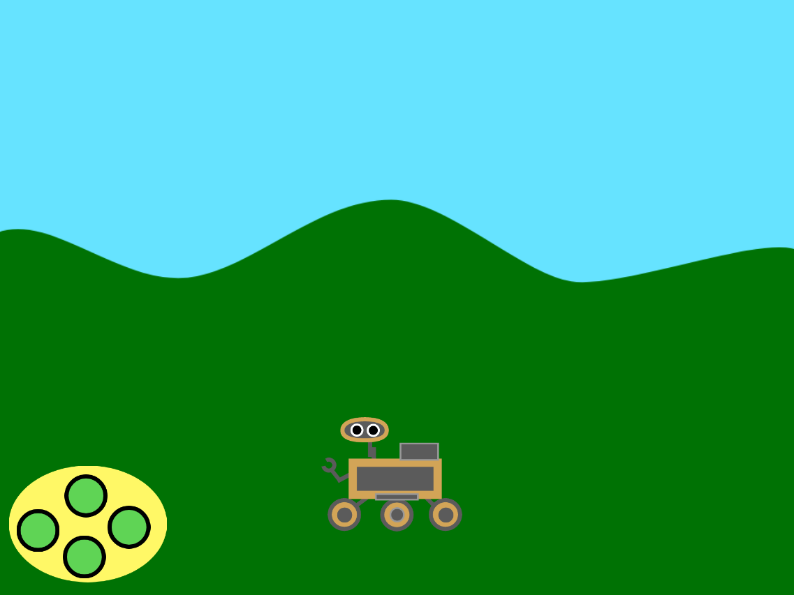
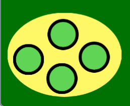
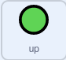
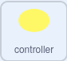

## Make the controller

<div style="display: flex; flex-wrap: wrap">
<div style="flex-basis: 200px; flex-grow: 1; margin-right: 15px;">
In this step, you will create an on-screen controller that can be used to move your rover up and down.
</div>
<div>
{:width="300px"}
</div>
</div>

--- task ---

Open the starter project online at [rpf.io/nature-rover-starter](https://rpf.io/nature-rover-starter) or if you are working offline, the starter project can be found at [rpf.io/en/p/nature-rover](https://rpf.io/en/p/nature-rover)

--- /task ---

You should see a scene with a robotic rover and a hilly background. 



--- task ---

Create a controller using 5 different sprites. One should be the body of the controller, and the other four are direction buttons. Here's an example to help you.



--- /task ---

The rover needs to move when the direction buttons are clicked.

--- task ---

Add code to each button so that when they are clicked, they `broadcast`{:class="block3events"} their own name. You will need to create a `New message`{:class="block3events"} for each sprite. Here is an example for the **up** button:


```blocks3
when this sprite clicked
broadcast (up v)
```

--- /task ---

When the `up` and `down` buttons are clicked, the rover should change its `y`{:class="block3motion"} position, by a small amount. Increasing `y`{:class="block3motion"} will make the rover move up. Decreasing `y`{:class="block3motion"} will make the rover move down.

--- task ---

Add code so the buttons make the rover move up and down.


```blocks3
when I receive [up v]
change y by (10)

when I receive [down v]
change y by (-10)
```

--- /task ---

--- task ---

**Test:** your rover's controls by clicking on the up and down buttons.

--- /task ---

The rover is going to control the start of the game for all the other sprites, so when the green flag is clicked it needs to broadcast a `start`{:class='block3events'} message.

--- task ---

Create a new broadcast and add it to a `green flag clicked`{:class='block3events'} set of blocks.


```blocks3
when flag clicked
broadcast [start v]
``` 

--- /task ---

--- task ---

Now reset the position of the rover, each time the game starts


```blocks3
when I receive [start v]
go to x: (0) y: (-90)
```

--- /task ---

You do not need to add code to move the rover left and right yet. In the next step, you will add left and right controls.

To finish off, you must make sure that the controller is always in the foreground.

--- task ---

Add blocks so that the buttons appear all appear in the foreground.


```blocks3
when I recieve [start v]
go to [front v] layer
```

--- /task ---

--- task ---

Now send the controller background to the front layer, and then back four, so it appears behind the buttons.

\
```blocks
when I recieve [start v]
go to [front v] layer
go [backward v] (4) layers
```

--- /task ---

--- save ---
