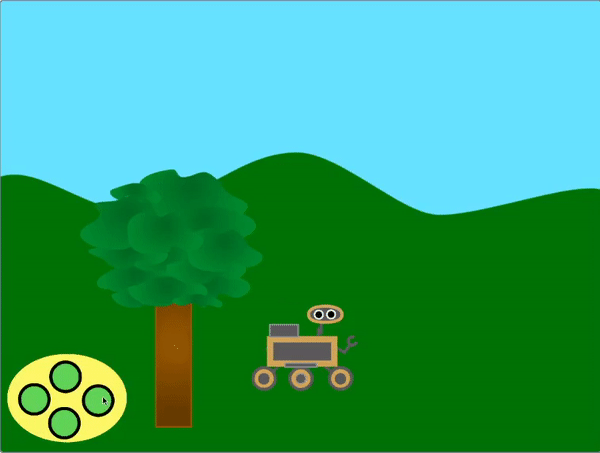
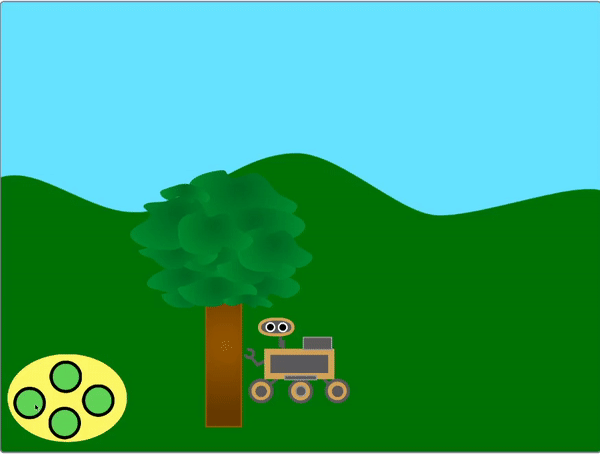

## Add scrolling

<div style="display: flex; flex-wrap: wrap">
<div style="flex-basis: 200px; flex-grow: 1; margin-right: 15px;">
For the rover to move left and right, instead of the rover sprite moving, the foreground and background sprites move or 'scroll' to the left and right.
</div>
<div>
{:width="300px"}
</div>
</div>

--- task ---

Select the **hills* sprite. At the start of the game, you need to make sure that it is in the correct position and on the back layer.


```blocks3
when I receive [start v]
go to [back v] layer
go to x: (0) y: (0)
```

--- /task ---

--- task ---

The **hills** sprite needs to make a copy of itself. These are called `clones`{:class='block3'control}. Then the original sprite can be moved to the far right hand side of the screen.


```blocks3
when I receive [start v]
go to [back v] layer
go to x: (0) y: (0)
+ create a clone of [myself v]
change x by (460)
```
--- /task ---

When the `left`{:class='block3events'} and `right`{:class='block3events'} broadcasts are received, the **hills** sprite should move. To give the appearance of moving in the correct direction, the background would move **left** when the **rover** is moving right. The direction of motion should be **opposite** to the `broadcast`{:class='block3events'}.

--- task ---

Add blocks to control the motion of the **hills** sprite and it's clone.


```blocks3
when I receive [left v]
change x by (3)

when I receive [right v]
change x by (-3)
```

--- /task ---

--- task ---

**Test**: Use the controller or the arrow keys to move around. The rover should appear to be moving left and right.

--- /task ---

At the moment, there are two copies of the **hills** sprite. The original and a clone. When you get to the end of either one, you'll notice that the screen is just white.

To fix this, the sprite and it's clone need to be moved to the other side of the screen, when they go too far.

--- task ---

Create a new broadcast called `scroll`{:class='block3events'} and add it to the `start`{:class='block3events'} script.


```blocks3
when I receive [start v]
go to [back v] layer
go to x: (0) y: (0)
create a clone of [myself v]
change x by (460)
broadcast [scroll v]
```

--- /task ---

--- task ---

Add code to detect if the **hills* sprite or it's clone have moved too far to the left or right, and then reset their positions to the other side of the screen.


```blocks3
when I receive [scroll v]
forever
if <(x position) > (460)> then
set x to (-460)
end
if <(x position) <> (-460)> then
set x to (460)
end
--- /task ---

--- task ---

**Test**: Try and use the controller or arrow keys to move the rover. The background should scroll, and the rover never reaches the end.

--- /task ---

Now you can add some more objects to your scene, and scroll them in a similar way.

--- task ---

Add a **Tree** sprite in to your project, and then set its starting position.


```blocks3
when I receive [start v]
go to x:(0) y:(-80)
```

--- /task ---

The tree sprite should also move in the **opposite** direction as the broadcast. So if the broadcast is `left`{:class="block3events"} then the `x`{:class="block3motion"} position will increase. If the broadcast is `right`{:class="block3events"} then the `x`{:class="block3motion"} of the tree will decrease.



--- task ---

To get this moving effect, change the x values when the `left`{:class="block3events"} and `right`{:class="block3events"} broadcasts are recieved.


```blocks3
when I receive [left v]
change x by (10)

when I receive [right v]
change x by (-10)
```

--- /task ---

--- task ---

**Test:** your left and right buttons now. The tree should move each time you click on the controller.

**Test:** What happens if you go as far away from the tree as you can?

--- /task ---

Did you notice that when the tree reaches the very edge of the screen, it stops moving? You can fix this by moving the tree to the other side of the screen, when its `x`{:class='block3motion'} coordinate is too high or too low.

--- task ---

Using a `forever`{:class='block3control'} loop, and `if`{:class='block3control'} blocks, check the x coordinate of the tree, and move it to the other side of the screen when x is higher than `290` or lower than `-290`


```blocks3
when I receive [start v]
go to x:(-90) y:(-80)
+ forever
if <(x position) > (290)> then //the tree is at the far right
set x to (-280) //move tree to far left
end
if <(x position) < (-290)> then //the tree is at the far left
set x to (280) //move tree to far right
end
end
```

--- /task ---

--- task ---

Now move your rover around the screen. When the tree reaches the edge, it should vanish off the edge of the screen and reappear on the other side.

--- /task ---

--- task ---

Lastly make the rover turn left and right so that if faces in the correct direction.


```blocks3
when flag clicked
broadcast [start v]
+ set rotation style [left-right v]

when I receive [left v]
point in direction (-90)

when I receive [right v]
point in direction (90)
```

--- /task ---

--- task ---

**Test**: Run your project and test it. Make sure the tree appears to fall of the edge of the screen and appear on the other side when the rover moves.

--- /task ---

--- save ---
