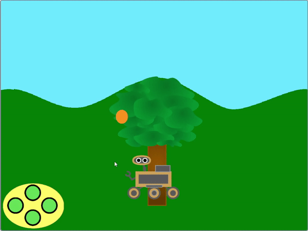

## Collect a sample

<div style="display: flex; flex-wrap: wrap">
<div style="flex-basis: 200px; flex-grow: 1; margin-right: 15px;">
In this step, you will change the appearance of a sprite and the rover when the rover collects samples.
</div>
<div>
{:width="300px"}
</div>
</div>

--- task ---

Look at the rover's costumes. There are six animations available. The **rover** can:
- Extend its arm


- Drill in the ground
- Suck in air
- Extend a solar panel
- Take a picture 
- Scoop something up 

--- /task ---

When we want to organise a lot of code, such as several costume changes, it is useful in Scratch to use `My Blocks`{:class="block3myblocks"}. This allows you to create your own custom blocks.

Your rover will have a `My Block`{:class="block3myblocks"} for each animation.

--- task ---

In the `My Blocks`{:class="block3myblocks"} menu, click on **Make a Block**, and name your new block `sample fruit`{:class="block3myblocks"}.

--- /task ---

A new block should appear in your script. It will look like this:


```blocks3
define sample fruit
```

--- task ---

Beneath this block, attach some `switch costume`{:class="block3looks"} blocks and `wait`{:class="block3control"} blocks, to animate the robot.

**Tip:** It is quicker to create your first `switch costume`{:class='block3looks'} block and `wait`{:class='block3control'} block, and then duplicate them, and change the costume being used.


```blocks3
define sample fruit //Animates the robot to collect fruit
switch costume to (inactive v)
wait (0.3) seconds
switch costume to (arm 1 v)
wait (0.3) seconds
switch costume to (arm 2 v)
wait (0.3) seconds
switch costume to (arm 1 v)
wait (0.3) seconds
switch costume to (inactive v)
```

--- /task ---

--- task ---

Add a block so that the rover plays a sound when it collects the fruit sample.


```blocks3
define sample fruit //Animates the robot to collect fruit
switch costume to (inactive v)
wait (0.3) seconds
switch costume to (arm 1 v)
wait (0.3) seconds
switch costume to (arm 2 v)
wait (0.3) seconds
+ start sound (Collect v)
switch costume to (arm 1 v)
wait (0.3) seconds
switch costume to (inactive v)
```

--- /task ---


--- task ---

You can click on the `define sample fruit`{:class="block3myblocks"} block to see the animation. If you are on a small screen, you might need to look closely.

It won't run when you click the green flag though, as you have not yet used your new `sample fruit block`{:class='block3myblocks'} in your project.

--- /task ---

--- task ---

To use your new block, you can attach it to an `event`{:class="block3events"} block. In the `My Blocks`{:class="block3myblocks"} menu, you should see the block you made. Use it in the following script.


```blocks3
when this sprite clicked
sample fruit ::custom //Run the animation
```

--- /task ---

--- task ---

Click on the **rover**, and you should see the rover animation.

--- /task ---

Now you need to make the rover actually collect a sample. In this example, the rover will collect a fruit from a tree.

--- task ---

The **tree** sprite should be edited to give it two different costumes. One with a fruit on (`tree with fruit`{:class="block3looks"}), and one without a fruit (`tree without fruit`{:class="block3looks"}). Edit one of your costumes, so that it has two different costumes.

--- /task ---

--- task ---

On the **tree** sprite, add blocks to set the costume of the tree at the start of the project, and the costume it should switch to when it receives a `sample fruit`{:class="block3events"} broadcast.


```blocks3
when I receive [start v]
go to x:(-90) y:(-80)
+ switch costume to (tree with fruit v)
forever
if <(x position) > (290)> then
set x to (-280)
end
if <(x position) < (-290)> then
set x to (280)
end
end

+ when I receive [sample fruit v]
+ switch costume to (tree without fruit v)
```

--- /task ---

--- task ---

Back on the **rover** sprite, you can use the new `broadcast`{:class="block3events"} to trigger the costume change. Add this new broadcast into your `define sample fruit`{:class="block3myblocks"} function.


```blocks3
define sample fruit
switch costume to (inactive v)
wait (0.3) seconds
switch costume to (arm 1 v)
wait (0.3) seconds
switch costume to (arm 2 v)
wait (0.3) seconds
+ broadcast (sample fruit v)
switch costume to (arm 1 v)
wait (0.3) seconds
switch costume to (inactive v)
```

--- /task ---

--- task ---

Test that your code is working by clicking on the flag, and then clicking on your rover. Its arm should extend, and the **tree** sprite should change costumes.

**Tip:** Switch to full screen mode and you will be able to see the animation more easily.

--- /task ---

The rover should only be able to collect the fruit, if it is touching it.

--- task ---

On the **rover** sprite, change the `when this sprite clicked`{:class="block3events"} set of blocks, so that the `sample fruit`{:class="block3myblocks"} function is only called if the **rover** is touching the colour of your fruit.

**Tip:** Your costume change from testing might mean that the fruit is not visible. Just click on the costumes tab for the **tree** sprite, and switch to the costume with the visible fruit.


```blocks3
when this sprite clicked
if <touching color (#FFA500) ?> then //Colour of fruit
sample fruit ::custom
```

--- /task ---

--- task ---

Now that the **tree** sprite changes when a fruit is sampled, you need to reset the sprite to its first costume when it goes off the screen.


```blocks3
when I receive [start v]
go to x:(-90) y:(-80)
switch costume to (tree with fruit v)
forever
if <(x position) > (290)> then
set x to (-280)
+ switch costume to (tree with fruit v)
end
if <(x position) < (-290)> then
set x to (280)
+ switch costume to (tree with fruit v)
end
end
```

--- /task ---

--- task ---

**Test:** Move the **rover** so that it is touching the fruit, then click on the **rover** and watch it collect the fruit from the tree.

--- /task ---


--- save ---
