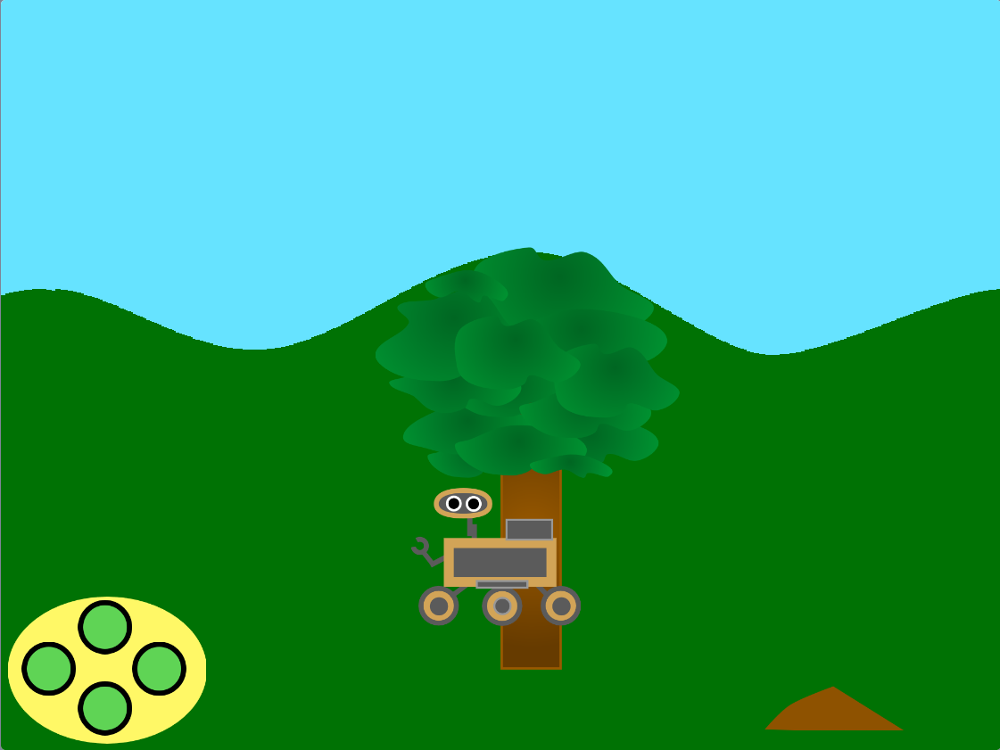

## You will make

Create a wilderness scene for a nature rover to explore.

Les **rovers** sont des robots. Ils peuvent être utilisés pour réaliser des expériences scientifiques dans des endroits éloignés, comme Mars !  Ils examinent leur environnement et peuvent être dirigés vers des éléments intéressants et prendre des échantillons. S'ils sont alimentés par le soleil, ils peuvent se placer dans une position ensoleillée pour recharger leurs batteries.

Tu vas devoir :
+ Déplacer les sprites en utilisant la perspective pour donner une impression de distance
+ Organiser des changements de costumes avec `mes blocs`{:class='block3myblocks'}
+ Créer une scène réaliste en utilisant le défilement

**Défilement** est lorsque des graphiques (ou des objets dans ta scène) se déplacent à gauche, à droite, vers le haut ou vers le bas sur un écran d'ordinateur. Le défilement rend les scènes plus réalistes.

--- no-print ---

### Play ▶️

--- task ---

  
Que se passe-t-il lorsque tu cliques sur les boutons pour déplacer le rover ? Comment décrirais-tu la façon dont l'arrière-plan/les sprites défilent (se déplacent) ?

Essaie de ramasser un échantillon en déplaçant le rover jusqu'à ce qu'il touche le fruit ou le sol, puis clique sur le rover.

  <iframe allowtransparency="true" width="485" height="402" src="https://scratch.mit.edu/projects/embed/551066826/?autostart=false" frameborder="0"></iframe>

--- /task --- --- /no-print ---

--- print-only ---

--- /print-only ---
