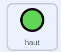

## Contrôler le rover

<div style="display: flex; flex-wrap: wrap">
<div style="flex-basis: 200px; flex-grow: 1; margin-right: 15px;">
Dans cette étape, tu utiliseras un contrôleur à l’écran ou le clavier pour déplacer ton rover de haut en bas.
</div>
<div>
{:width="300px"}
</div>
</div>

--- task ---

Ouvre le projet de démarrage en ligne à [scratch.mit.edu/projects/740706849](https://scratch.mit.edu/projects/740706849){:target="_blank"}.

--- collapse ---
---
title: Travailler hors ligne
---

Si tu travailles hors ligne, le projet de démarrage peut être trouvé à [rpf.io/p/fr-FR/nature-rover-go](https://rpf.io/p/fr-FR/nature-rover-go)

--- /collapse ---


--- /task ---

Tu devrais voir une scène avec un rover robotisé, un arrière-plan vallonné et un contrôleur dans le coin inférieur gauche.


Tu vas utiliser le contrôleur ou les commandes du clavier pour donner l'impression que le rover se rapproche ou s'éloigne du spectateur.

--- task ---

Regarde l'onglet **Code** pour chacun des boutons. Le code devrait ressembler à quelque chose comme ceci :



```blocks3
when this sprite clicked
broadcast (avant v)

when I receive [départ v]
forever
go to [front v] layer
go to x:(-190) y: (-121)
end
```

Cela garde les boutons dans la bonne position et diffuse leur direction quand on les clique.

--- /task ---

Le **rover** va contrôler le début du jeu pour tous les autres sprites ; ainsi, lorsque le drapeau vert est cliqué, le sprite **rover** doit diffuser un message `départ`{:class='block3events'}.

--- task ---

Ajoute la diffusion à un bloc `quand le drapeau vert est cliqué`{:class='block3events'}.


```blocks3
when flag clicked
broadcast [départ v]
```

--- /task ---

--- task ---

Si tu travailles sur un ordinateur, il peut être plus facile d'utiliser les commandes du clavier plutôt que d'utiliser les boutons. Des commandes au clavier peuvent être ajoutées au sprite **rover**.


```blocks3
when [up arrow v] key pressed
broadcast [avant v]

when [down arrow v] key pressed
broadcast [arrière v]

when [right arrow v] key pressed
broadcast [à droite v]

when [left arrow v] key pressed
broadcast [à gauche v]
```

Si tu ne veux pas utiliser le contrôleur, alors clique sur chacun des sprites **bouton** et clique sur le bloc `cacher`{:class='block3looks'} dans le menu `apparence`{:class='block3looks'}.

```blocks3
hide
```

--- /task ---

Lorsque le bouton **haut** est cliqué ou que la flèche <kbd>vers le haut</kbd> est enfoncée, le **rover** doit modifier légèrement sa position `y`{:class="block3motion"}. Augmenter `y`{:class="block3motion"} fera monter le **rover**. Diminuer `y`{:class="block3motion"} fera descendre le **rover**.

--- task ---

Ajoute du code pour que le bouton **haut** fasse monter le **rover**.


```blocks3
when I receive [avant v]
change y by (10)

when I receive [arrière v]
change y by (-10)
```

--- /task ---

**Tu n'as pas encore à te soucier du mouvement gauche et droit. Les mouvements gauche et droite seront ajoutés à la prochaine étape du projet.**

<p style="border-left: solid; border-width:10px; border-color: #0faeb0; background-color: aliceblue; padding: 10px;">
<span style="color: #0faeb0">**Perspective**</span> est utilisé en infographie pour rendre une scène plus réaliste. Les objets éloignés semblent normalement plus petits et plus haut sur l'écran. Les objets proches semblent être plus grands et plus bas sur l'écran.
</p>

--- task ---

Ajoute la **perspective** à ton **rover** en le rendant plus petit lorsqu'il se déplace vers le haut et plus grand lorsqu'il se déplace vers le bas.


```blocks3
when I receive [avant v]
change y by (10)
change size by (-1) //Plus petit semble plus loin


when I receive [arrière v]
change y by (-10)
change size by (1) //Plus grand semble plus proche
```

--- /task ---

--- task ---

Tu devras réinitialiser la taille du **rover** au début du jeu.

```blocks3
when I receive [départ v]
set size to (50) %
```

--- /task ---


--- task ---

**Test :** Clique sur les boutons **haut** et **bas** pour vérifier le contrôle de ton **rover**, ou utilise les touches fléchées.

--- /task ---

--- task ---

Maintenant, réinitialise la position du **rover** à chaque fois que le jeu démarre.


```blocks3
when I receive [départ v]
set size to (50) %
+ go to x: (0) y: (-90)
```

--- /task ---

--- task ---

Pour l'instant, le **rover** devrait apparaître devant les autres sprites. Déplace le **rover** à l'avant plan.


```blocks3
when I receive [départ v]
set size to (50) %
go to x: (0) y: (-90)
+ go to [front v] layer
```

--- /task ---

--- task ---

**Test**: Clique sur le drapeau vert pour tester que ton jeu se réinitialise correctement.

--- /task ---

--- save ---
