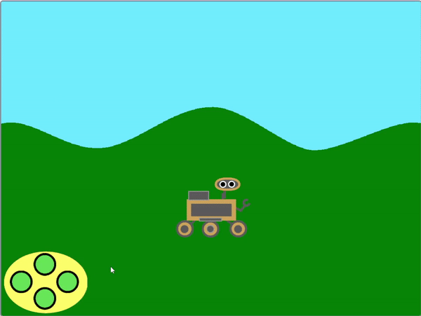

## Faire défiler l'arrière-plan

<div style="display: flex; flex-wrap: wrap">
<div style="flex-basis: 200px; flex-grow: 1; margin-right: 15px;">
Pour que le rover ait l'air de se déplacer à gauche et à droite, au lieu que le sprite **rover** se déplace, le sprite **arrière-plan** se déplace ou défile à gauche ou à droite.
</div>
<div>
{:width="300px"}
</div>
</div>

--- task ---

Sélectionne le sprite **collines**. Au début du jeu, tu dois t'assurer qu'il est dans la bonne position et à l'arrière plan.


```blocks3
when I receive [start v]
go to [back v] layer
go to x: (0) y: (0)
```

--- /task ---

<p style="border-left: solid; border-width:10px; border-color: #0faeb0; background-color: aliceblue; padding: 10px;">
<span style="color: #0faeb0">Les **calques**</span> sont comme des feuilles de plastique transparentes empilées sur lesquelles tu peux dessiner des images. Si une image en haut de la pile recouvre l'image en dessous, tu ne pourras pas voir correctement l'image du bas. Les images d'arrière-plan doivent être proches du calque **arrière**. Les images les plus proches du spectateur doivent se trouver près du calque **avant**.
</p>

--- task ---

Le sprite **collines** doit faire une copie de lui-même. Celles-ci s'appellent `clones`{:class='block3control'}. Ensuite, le sprite d'origine peut être déplacé vers l'extrême droite de l'écran.


```blocks3
when I receive [start v]
go to [back v] layer
go to x: (0) y: (0)
+ create clone of [myself v] //Create a copy of the hills
+ change x by (460) //Move the original hills to the right of the screen
```

--- /task ---

Quand les diffusions `à gauche`{:class='block3events'} et `à droite`{:class='block3events'} sont reçues, le sprite **collines** devrait se déplacer. Pour donner l'impression de bouger dans la bonne direction, l'arrière-plan bouge **à gauche** lorsque le **rover** se déplace à droite. La direction du mouvement doit être **opposée à** à la `diffusion`{:class='block3events'}.

Donc, si la diffusion est `à gauche`{:class="block3events"}, alors la position `x`{:class="block3motion"} augmentera. Si la diffusion est `à droite`{:class="block3events"}, alors le `x`{:class="block3motion"} des **collines** diminuera.


--- task ---

Ajoute des blocs pour contrôler le mouvement du sprite **collines** et de son clone.


```blocks3
when I receive [left v]
change x by (3)

when I receive [right v]
change x by (-3)
```

--- /task ---

--- task ---

**Test** : Utilise le contrôleur ou la <kbd>flèche</kbd> pour te déplacer. Le rover doit sembler se déplacer à gauche et à droite.

--- /task ---

Pour le moment, il y a deux copies du sprite **collines** : l'original et un clone. Quand tu arriveras à la fin de l'un ou l'autre, tu remarqueras que l'écran est juste blanc.

Pour résoudre ce problème, le sprite et son clone doivent être déplacés de l'autre côté de l'écran quand ils vont trop loin.

--- task ---

Crée une nouvelle diffusion appelée `défillement`{:class='block3events'} et ajoute-la au script `départ`{:class='block3events'}.


```blocks3
when I receive [start v]
go to [back v] layer
go to x: (0) y: (0)
create clone of [myself v]
change x by (460) 
+ broadcast [scroll v]
```

--- /task ---

--- task ---

Ajoute du code pour détecter si le sprite **collines** ou son clone se sont déplacés trop loin vers la gauche ou la droite, puis réinitialise leurs positions à l'autre côté de l'écran.


```blocks3
when I receive [scroll v]
forever
if <(x position) > (460)> then //The hills sprite is off the right side of the screen
set x to (-460) //Reset to the left side of the screen
end
if <(x position) < (-460)> then //The hills sprite is off the left side of the screen
set x to (460) //Reset to the right side of the screen
end
```

--- /task ---

--- task ---

**Test**: Click the green flag to reset the scene and then use the controller or <kbd>arrow</kbd> keys to move the **rover**. L'arrière-plan devrait défiler, et le **rover** ne devrait jamais atteindre la fin.

--- /task ---

--- save ---
