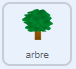

## Recueillir un échantillon

<div style="display: flex; flex-wrap: wrap">
<div style="flex-basis: 200px; flex-grow: 1; margin-right: 15px;">
Dans cette étape, tu vas modifier l'apparence d'un sprite et du rover pour montrer que le rover collecte des échantillons.
</div>
<div>
{:width="300px"}
</div>
</div>

--- task ---

Regarde les costumes du sprite **rover**. Il y a six animations disponibles. Le **rover** peut :
- Étendre son bras


- Forer le sol
- Aspirer l'air
- Étendre un panneau solaire
- Prendre une photo
- Ramasser quelque chose

--- /task ---

Quand tu veux organiser beaucoup de code dans Scratch, comme plusieurs changements de costumes, il est utile d'utiliser `Mes Blocs`{:class="block3myblocks"}. Cela te permet de créer tes propres blocs personnalisés.

Ton sprite **rover** aura un `Mon Bloc`{:class="block3myblocks"} pour chaque animation.

--- task ---

Dans le menu `Mes Blocs`{:class="block3myblocks"}, clique sur **Créer un bloc**, et nomme ton nouveau bloc `échantillon de fruits`{:class="block3myblocks"}.

--- /task ---

Un nouveau bloc devrait apparaître dans ton script. Ça ressemblera à ça :


```blocks3
define sample fruit
```

--- task ---

Sous ce bloc, attache quelques blocs `basculer sur le costume`{:class="block3looks"} et `attendre`{:class="block3control"}, pour animer le robot.

**Astuce :** Il est plus rapide de créer ton premier bloc `basculer sur le costume`{:class='block3looks'} et `attendre`{:class='block3control'}, puis duplique-les et change le costume utilisé.


```blocks3
define sample fruit //Animates the robot to collect fruit
switch costume to (inactive v)
wait (0.3) seconds
switch costume to (arm 1 v)
wait (0.3) seconds
switch costume to (arm 2 v)
wait (0.3) seconds
switch costume to (arm 1 v)
wait (0.3) seconds
switch costume to (inactive v)
```

--- /task ---

--- task ---

Ajoute un bloc pour que le sprite **rover** émette un son lorsqu'il récupère l'échantillon de fruit.


```blocks3
define sample fruit //Animates the robot to collect fruit
switch costume to (inactive v)
wait (0.3) seconds
switch costume to (arm 1 v)
wait (0.3) seconds
switch costume to (arm 2 v)
wait (0.3) seconds
+ start sound (Collect v)
switch costume to (arm 1 v)
wait (0.3) seconds
switch costume to (inactive v)
```

--- /task ---


--- task ---

Tu peux cliquer sur le bloc `définir échantillon de fruits`{:class="block3myblocks"} pour voir l'animation. Si tu es sur un petit écran, tu devras peut-être regarder attentivement.

L'animation ne s'exécutera pas quand tu cliques sur le drapeau vert, comme tu n'as pas encore utilisé ton nouveau `bloc échantillon de fruits`{:class='block3myblocks'} dans ton projet.

--- /task ---

--- task ---

Pour utiliser ton nouveau bloc, tu peux l'attacher à un bloc `événement`{:class="block3events"}. Dans le menu `Mes Blocs`{:class="block3myblocks"}, tu devrais voir le bloc que tu as créé. Utilise-le dans le script suivant.


```blocks3
when this sprite clicked
sample fruit ::custom //Run the animation
```

--- /task ---

--- task ---

Clique sur le sprite **rover** et tu devrais voir l'animation.

--- /task ---

Maintenant tu dois faire en sorte que le rover collecte un échantillon. Dans cet exemple, le rover ramassera un fruit d'un arbre.

--- task ---

Le sprite **arbre** doit être modifié pour lui donner deux costumes différents. Un avec un fruit (`arbre avec fruit`{:class="block3looks"}), et un sans fruit (`arbre sans fruit`{:class="block3looks"}). Modifie l'un des costumes, afin que **l'arbre** ait deux costumes différents.

--- /task ---

--- task ---

Sur le sprite **arbre**, ajoute des blocs pour définir le costume de **l'arbre** au début du projet, et le costume auquel il doit passer lorsqu'il reçoit une diffusion de `échantillon de fruits`{:class="block3events"}.



```blocks3
when I receive [start v]
go to x:(-90) y:(-80)
+ switch costume to (tree with fruit v)
forever
if <(x position) > (290)> then
set x to (-280)
end
if <(x position) < (-290)> then
set x to (280)
end
end

+ when I receive [sample fruit v]
+ switch costume to (tree without fruit v)
```

--- /task ---

--- task ---

Sur le sprite **rover**, tu peux utiliser le nouveau `envoyer à tous`{:class="block3events"} pour déclencher le changement de costume. Ajoute ce nouveau `envoyer à tous`{:class="block3events"} dans ta fonction `définir échantillon de fruits`{:class="block3myblocks"}.


```blocks3
define sample fruit
switch costume to (inactive v)
wait (0.3) seconds
switch costume to (arm 1 v)
wait (0.3) seconds
switch costume to (arm 2 v)
wait (0.3) seconds
+ broadcast (sample fruit v)
switch costume to (arm 1 v)
wait (0.3) seconds
switch costume to (inactive v)
```

--- /task ---

--- task ---

**Tests :** Pour vérifier que ton code fonctionne, clique sur le drapeau, puis clique sur ton sprite **rover**. Son bras devrait s'étendre, et le sprite **arbre** devrait changer de costumes.

**Astuce :** Passe en mode plein écran et tu pourras voir l'animation plus facilement.

--- /task ---

Le rover ne devrait pouvoir récolter le fruit que s'il le touche.

--- task ---

Sur le sprite **rover**, change l'ensemble de blocs `quand ce sprite est cliqué`{:class="block3events"}, de sorte que `échantillon de fruits`{:class="block3myblocks"} ne soit appelé que si le sprite **rover** touche la couleur de ton fruit.

**Astuce :** Ton changement de costume suite aux tests peut signifier que le fruit n'est pas visible. Il suffit de cliquer sur l'onglet costumes pour le sprite **arbre** et de basculer vers le costume avec le fruit visible.


```blocks3
when this sprite clicked
if <touching color (#FFA500) ?> then //Colour of fruit
sample fruit ::custom
```

--- /task ---

--- task ---

Maintenant que le sprite **arbre** change quand un fruit est échantillonné, tu dois réinitialiser le sprite à son premier costume quand il sort de l'écran.


```blocks3
when I receive [start v]
go to x:(-90) y:(-80)
switch costume to (tree with fruit v)
forever
if <(x position) > (290)> then
set x to (-280)
+ switch costume to (tree with fruit v)
end
if <(x position) < (-290)> then
set x to (280)
+ switch costume to (tree with fruit v)
end
end
```

--- /task ---

--- task ---

**Test :** Déplace le sprite **rover** jusqu'à ce qu'il touche le fruit, puis clique sur le sprite **rover** et regarde-le ramasser le fruit de l'arbre.

--- /task ---


--- save ---
