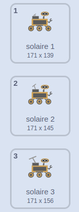

## Créer un autre échantillon

<div style="display: flex; flex-wrap: wrap">
<div style="flex-basis: 200px; flex-grow: 1; margin-right: 15px;">
Choisis ce que le rover échantillonne ensuite ! Voit-il une nouvelle espèce de plante, d'insecte ou d'animal ? Voit-il de l'eau ou un liquide mystérieux ? Veut-il échantillonner de la terre, un rocher ou même l'air ? Ou autre chose ?
</div>
<div>
{:width="300px"}
</div>
</div>

--- task ---

**Choisir :** Ajoute un nouveau sprite **échantillon** que le rover va collecter. Tu peux l'ajouter à ton projet en en sélectionnant un dans la bibliothèque ou en dessinant le tien.

--- /task ---

Fais défiler ton sprite **échantillon**. S'il est bas sur l'écran, il doit bouger plus (`ajouter à x`{:class='block3motion'} doit être supérieur à `5`), et s'il est haut sur l'écran, il doit bouger moins (`ajouter à x`{:class='block3motion'} doit être inférieur à `5`).

--- task ---

Ajoute du code pour que ton sprite défile.

--- /task ---

**Choisir :** En fonction de ce que tu veux que le rover échantillonne ensuite, tu peux soit utiliser les animations de rover qui existent déjà, soit créer plus de séquences d'animation en dupliquant et en modifiant les costumes.

--- task ---

Ajoute un bloc `Mes blocs`{:class='block3myblocks'} à ton sprite **rover** pour animer le rover quand il collecte le nouvel échantillon. Tu peux copier et coller le code de l'un des autres `Mes Blocs`{:class='block3myblocks'} que tu as créés.

Par exemple, voici une séquence de costumes pour la collecte de l'énergie solaire :



Pour animer cette série de costumes, tu peux utiliser le code suivant :

```blocks3
define recharge
switch costume to [inactif v]
wait (0.3) seconds
switch costume to [solaire 1 v]
wait (0.3) seconds
switch costume to [solaire 2 v]
wait (0.3) seconds
switch costume to [solaire 3 v]
wait (0.3) seconds
switch costume to [solaire 2 v]
wait (0.3) seconds
switch costume to [solaire 1 v]
wait (0.3) seconds
switch costume to [inactif v]
wait (0.3) seconds
```

--- /task ---

--- task ---

Ensuite, `envoyer à tous`{:class='block3events'} un nouveau message dans ton nouveau `Mes Bloc`{:class='block3myblocks'} qui provoquera un changement `de costume`{:class='block3looks'} ou `d'effet graphique`{:class='block3looks'} dans le sprite **échantillon**.

--- /task ---

--- task ---

Utilise un bloc `si`{:class='block3control'} pour détecter si le rover touche le sprite ou touche une couleur sur le sprite, afin que le nouveau `Mon Bloc`{:class='block3myblocks'} ne soit utilisé qu'à ce moment-là.

--- /task ---

--- task ---

Si tu le souhaites, ajoute une animation au sprite, afin que son apparence change lorsque le rover a collecté l'échantillon.

--- /task ---

--- save ---
