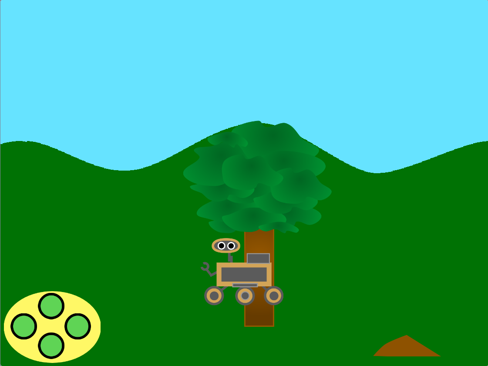

## परिचय

इस प्रॉजेक्ट में, आप नेचर रोवर के लिए घूमने और उसके बारे में पता लगाने के लिए जंगल का दृश्य बनाएँगे।

**रोवर्स* रोबोट हैं। इनका उपयोग मंगल जैसे दूरस्थ स्थानों में विज्ञान के प्रयोग करने के लिए किया जा सकता है!  वे अपने परिवेश की जांच करते हैं और उन्हें दिलचस्प विशेषताओं के लिए निर्देशित किया जा सकता है और नमूने ले सकते हैं। यदि वे सौर ऊर्जा से संचालित हैं, तो वे अपनी बैटरी को रिचार्ज करने के लिए खुद को धूप लगने की स्तिति में रख सकते हैं।

आप:
+ दूरी का आभास देने के लिए परिप्रेक्ष्य का उपयोग करके स्प्राइट्स को स्थानांतरित करेंगे
+ `my blocks`{:class='block3myblocks'} के साथ पोशाक परिवर्तन व्यवस्थित करेंगे
+ स्क्रॉलिंग का उपयोग करके एक यथार्थवादी दृश्य बनाएं

**स्क्रोलिंग** तब होती है जब ग्राफ़िक्स (या आपके दृश्य में मौजूद वतुएँ) कंप्यूटर स्क्रीन पर बाएँ, दाएँ, ऊपर या नीचे हिलते हैं। स्क्रोलिंग करने से दृश्य अधिक यथार्थवादी लगते हैं।

--- no-print ---

--- task ---

### इसे आजमाएँ!

  
क्या होता है जब आप रोवर को चलाने के लिए बटन क्लिक करते हैं? आप कैसे वर्णन करेंगे कि पृष्ठभूमि/स्प्राइट्स कैसे स्क्रॉल करते हैं (चारों ओर घूमते हैं)?

कोशिश करें और रोवर को तब तक चलते रहें जब तक कि वह फल या मिट्टी को न छू ले और फिर रोवर पर क्लिक करके एक नमूना एकत्र करें।

  <iframe allowtransparency="true" width="485" height="402" src="https://scratch.mit.edu/projects/embed/551066826/?autostart=false" frameborder="0"></iframe>

--- /task --- --- /no-print ---

--- print-only ---

--- /print-only ---
