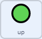

## रोवर को नियंत्रित करें

<div style="display: flex; flex-wrap: wrap">
<div style="flex-basis: 200px; flex-grow: 1; margin-right: 15px;">
इस चरण में, आप अपने रोवर को ऊपर और नीचे ले जाने के लिए ऑन-स्क्रीन कंट्रोलर (स्क्रीन नियंत्रक) या कीबोर्ड का उपयोग करेंगे।
</div>
<div>
{:width="300px"}
</div>
</div>

--- task ---

स्टार्टर प्रोजेक्ट को [rpf.io/nature-rover-starter](https://rpf.io/nature-rover-starter){:target="_blank"}पर ऑनलाइन खोलें।

--- collapse ---
---
title: ऑफ़लाइन काम करना
---

यदि आप ऑफ़लाइन काम कर रहे हैं, तो स्टार्टर प्रोजेक्ट आपको [rpf.io/p/en/nature-rover-go](https://rpf.io/p/en/nature-rover-go) आपको पर मिल सकता

--- /collapse ---


--- /task ---

आपको रोबोटिक रोवर, एक पहाड़ी पृष्ठभूमि, और नीचे, बाएं कोने में एक नियंत्रक वाला एक दृश्य देखना चाहिए।


आप रोवर को ऐसे दिखाने के लिए जैसे कि यह दर्शक की ओर या दूर जा रहा है नियंत्रक या कीबोर्ड नियंत्रण का उपयोग करने जा रहे हैं ।

--- task ---

प्रत्येक बटन के लिए **Code** टैब को देखें। आपका कोड कुछ इस तरह दिखना चाहिए:



```blocks3
when this sprite clicked
broadcast (up v)

when I receive [start v]
forever
go to [front v] layer
go to x:(-190) y: (-121)
end
```

यह बटनों को सही स्थिति में रखता है, और क्लिक करने पर उनकी दिशाओं को प्रसारित करता है।

--- /task ---

**rover** अन्य सभी स्प्राइट्स के लिए खेल की शुरुआत को नियंत्रित करने वाला है; इसलिए जब हरी झंडी पर क्लिक किया जाता है, तो **rover** स्प्राइट को `start`{:class='block3events'} संदेश प्रसारित करने की आवश्यकता होती है।

--- task ---

`green flag clicked`{:class='block3events'} ब्लॉक पर प्रसारण जोड़ें।


```blocks3
when flag clicked
broadcast [start v]
```

--- /task ---

--- task ---

यदि आप कंप्यूटर पर काम कर रहे हैं, तो हो सकता है कि बटनों का उपयोग करने के बजाय कीबोर्ड नियंत्रणों का उपयोग करना आसान हो। कीबोर्ड कंट्रोल को **rover** स्प्राइट में जोड़ा जा सकता है।


```blocks3
when [up arrow v] key pressed
broadcast [up v]

when [down arrow v] key pressed
broadcast [down v]

when [right arrow v] key pressed
broadcast [right v]

when [left arrow v] key pressed
broadcast [left v]
```

यदि आप नियंत्रक का उपयोग नहीं करना चाहते हैं, तो प्रत्येक **button** स्प्राइट पर क्लिक करें और `looks`{:class='block3looks'} मेनू में `hide`{:class='block3looks'} ब्लॉक पर क्लिक करें {:class='block3looks'}।

```blocks3
hide
```

--- /task ---

जब **up** बटन क्लिक किया जाता है या <kbd>up arrow</kbd> दबाया जाता है, तो **rover** को अपनी `y`{:class="block3motion"} स्थिति को एक छोटे मान से बदलना चाहिए। `y`{:class="block3motion"} को बढ़ाने से **rover** को ऊपर की ओर ले जाएगा। `y`{:class="block3motion"} को कम करने से **rover** नीचे चला जाएगा।

--- task ---

कोड जोड़ें ताकि **up** बटन **rover** को ऊपर ले जाए।


```blocks3
when I receive [up v]
change y by (10)

when I receive [down v]
change y by (-10)
```

--- /task ---

**आपको अभी बाएँ और दाएँ चलने के बारे में चिंता करने की आवश्यकता नहीं है। प्रॉजेक्ट के अगले चरण में बाएँ और दाएँ चलने के ढंग को जोड़ा जाएगा।**

<p style="border-left: solid; border-width:10px; border-color: #0faeb0; background-color: aliceblue; padding: 10px;">
<span style="color: #0faeb0">**परिप्रेक्ष्य**</span> का उपयोग कंप्यूटर ग्राफिक्स में किसी दृश्य को अधिक यथार्थवादी बनाने के लिए किया जाता है। दूर की वस्तुएं आमतौर पर स्क्रीन से छोटी और ऊपर दिखाई देती हैं। पास की वस्तुएँ स्क्रीन से बड़ी और नीची प्रतीत होती हैं।
</p>

--- task ---

इससे उपर चलते वक़्त छोटा बना कर और नीचे आते वक़्त बड़ा बनाकर अपने **rover** में **परिप्रेक्ष्य** जोड़ें


```blocks3
when I receive [up v]
change y by (10)
change size by (-1) //Smaller looks further away


when I receive [down v]
change y by (-10)
change size by (1) //Bigger looks closer
```

--- /task ---

--- task ---

आपको खेल की शुरुआत में **rover's** आकार को रीसेट करना होगा।

```blocks3
when I receive [start v]
set size to (50) %
```

--- /task ---


--- task ---

**परीक्षण:** **rover** के नियंत्रण की जाँच करने के लिए <**up** और **down** बटनों पर क्लिक करें, या तीर कुंजियों का उपयोग करें।

--- /task ---

--- task ---

अब हर बार खेल शुरू होने पर **rover** की स्थिति को रीसेट करें।


```blocks3
when I receive [start v]
set size to (50) %
+ go to x: (0) y: (-90)
```

--- /task ---

--- task ---

अभी के लिए, **rover** को अन्य स्प्राइट्स के सामने प्रकट होना चाहिए। **rover** को सामने की परत पर ले जाएं।


```blocks3
when I receive [start v]
set size to (50) %
go to x: (0) y: (-90)
+ go to [front v] layer
```

--- /task ---

--- task ---

**टेस्ट**: यह जांचने के लिए कि आपका गेम सही तरीके से रीसेट होता है, हरे झंडे पर क्लिक करें।

--- /task ---

--- save ---
