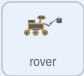

## अधिक स्प्राइट स्क्रॉल करें

<div style="display: flex; flex-wrap: wrap">
<div style="flex-basis: 200px; flex-grow: 1; margin-right: 15px;">
अपने दृश्य में अधिक स्प्राइट जोड़ते समय, इन्हें बाएँ और दाएँ स्क्रॉल करने की भी आवश्यकता होती है।
</div>
<div>
{:width="300px"}
</div>
</div>

अब आप अपने दृश्य में कुछ और वस्तुएँ जोड़ सकते हैं, और उन्हें इसी तरह स्क्रॉल कर सकते हैं।

--- task ---

**tree** स्प्राइट जोड़ें, और फिर इसकी प्रारंभिक स्थिति निर्धारित करें।


```blocks3
when I receive [start v]
go to x:(0) y:(-80)
```

--- /task ---

**tree** स्प्राइट को प्रसारण के साथ-साथ **विपरीत** दिशाओं में भी जाना चाहिए।


चूँकि पेड़ दर्शक के करीब है, इसे हर बार बटन या कुंजी दबाए जाने पर पहाड़ियों की तुलना में अधिक दूरी पर जाना चाहिए।

--- task ---

इस गतिमान प्रभाव को प्राप्त करने के लिए, `x`{:class='block3motion'}मान बदलें कि **tree** स्प्राइट चलता है जब `left`{:class="block3events"} और `right`{:class="block3events"} प्रसारण प्राप्त होते हैं।


```blocks3
when I receive [left v]
change x by (10) //पहाड़ियों की तुलना में अधिक संख्या में प्रयोग करें

when I receive [right v]
change x by (-10) //पहाड़ियों की तुलना में अधिक संख्या में प्रयोग करें
```

--- /task ---

--- task ---

**परीक्षण:** अभी अपने बाएँ और दाएँ बटन जाँचें। हर बार जब आप नियंत्रक पर क्लिक करते हैं तो पेड़ हिलना चाहिए।

**परिक्षण:** क्या होता है यदि आप पेड़ से जितना हो सके उतना दूर जाते हैं?

--- /task ---

क्या आपने देखा है कि जब पेड़ स्क्रीन के बिल्कुल किनारे पर पहुंच जाता है, तो वह हिलना बंद कर देता है? आप पेड़ को स्क्रीन के दूसरी ओर ले जाकर इसे ठीक कर सकते हैं, जब इसका `x`{:class='block3motion'} निर्देशांक बहुत अधिक या बहुत कम हो।

--- task ---

`forever`{:class='block3control'} लूप और `if`{:class='block3control'} ब्लॉक का उपयोग करके, पेड़ के `x`{:class='block3motion'} निर्देशांक को चेक करें और जब `x`{:class='block3motion'} `290` से बड़ा हो या `-290` से कम हो तो इसे स्क्रीन के दूसरी ओर ले जाएँ ह।


```blocks3
when I receive [start v]
go to x:(-90) y:(-80)
+ forever
if <(x position) > (290)> then //पेड़ एकदम दाहिनी ओर है
set x to (-280) //पेड़ को एकदम बाईं ओर ले जाएं
end
if <(x position) < (-290)> then //पेड़ एकदम बाईं ओर है
set x to (280) //पेड़ को एकदम दाईं ओर ले जाएं
end
end
```

--- /task ---

--- task ---

अब अपने **rover** स्प्राइट को स्क्रीन के चारों ओर घुमाएँ। जब पेड़ किनारे पर पहुंचता है, तो उसे स्क्रीन के किनारे से गायब हो जाना चाहिए और दूसरी तरफ फिर से दिखना चाहिए।

--- /task ---

--- task ---

अंत में, **rover** को बाएँ और दाएँ मोड़ें ताकि वह उस दिशाकी ओर मुंह करे जिसमें वह आगे बढ़ रहा है।



```blocks3
when flag clicked
broadcast [start v]
+ set rotation style [left-right v]

when I receive [left v]
point in direction (-90)

when I receive [right v]
point in direction (90)
```

--- /task ---

--- task ---

**परिक्षण**: अपना प्रोजेक्ट चलाएँ और उसका परीक्षण करें। सुनिश्चित करें कि पेड़ स्क्रीन के किनारे से गिरता हुआ प्रतीत होता है और रोवर के हिलने पर दूसरी तरफ दिखाई देता है।

--- /task ---
