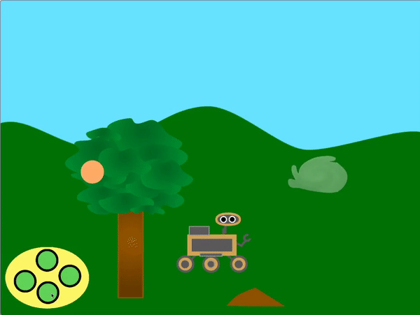

## Create another sample

<div style="display: flex; flex-wrap: wrap">
<div style="flex-basis: 200px; flex-grow: 1; margin-right: 15px;">
Choose what the rover samples next! Does it see a new species of plant, bug, or animal? Does it see some water or mysterious liquid? Does it want to sample some dirt or a rock, or even the air? Or something else?
</div>
<div>
{:width="300px"}
</div>
</div>

--- task ---

**Choose:** Add a new **sample** sprite for the rover to collect. You can add this to your project either by selecting one from the library or drawing your own.

--- /task ---

Get your **sample** sprite to scroll. If it is low down on the screen it should move more (`change x by`{:class='block3motion'} should be higher than `5`), and if it is high up on the screen it should move less (`change x by`{:class='block3motion'} should be lower than `5`).

--- task ---

Add code so that your sprite scrolls.

--- /task ---

**Choose:** Depending on what you want the rover to sample next, you can either use the rover animations that are there already, or create more animation sequences by duplicating and editing the costumes.

--- task ---

Add a `My Blocks`{:class='block3myblocks'} block to your **rover** sprite to animate the rover when it collects the new sample. You can copy and paste the code from one of the other `My Blocks`{:class='block3myblocks'} you have created.

For instance, here is a costume sequence for collecting solar energy:


To animate this series of costumes you could use the following code:

```blocks3
define recharge
switch costume to [inactive v]
wait (0.3) seconds
switch costume to [solar 1 v]
wait (0.3) seconds
switch costume to [solar 2 v]
wait (0.3) seconds
switch costume to [solar 3 v]
wait (0.3) seconds
switch costume to [solar 2 v]
wait (0.3) seconds
switch costume to [solar 1 v]
wait (0.3) seconds
switch costume to [inactive v]
wait (0.3) seconds
```

--- /task ---

--- task ---

Next, `broadcast`{:class='block3events'} a new message in your new `My Block`{:class='block3myblocks'} block that will cause a `costume`{:class='block3looks'} or `graphic effect`{:class='block3looks'} change in the **sample** sprite.

--- /task ---

--- task ---

Use an `if`{:class='block3control'} block to detect if the rover is touching the sprite or touching a colour on the sprite, so that the new `My Block`{:class='block3myblocks'} is only used then.

--- /task ---

--- task ---

If you like, add an animation to the sprite, so that its appearance changes when the rover has collected the sample.

--- /task ---

--- save ---
