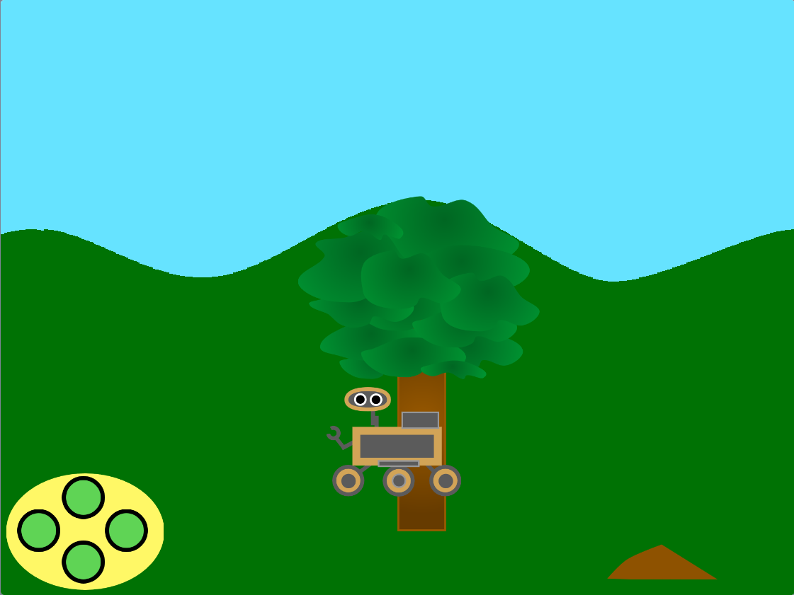

## ಪರಿಚಯ

ಈ ಪ್ರಾಜೆಕ್ಟ್‌ನಲ್ಲಿ, ನೀವು ಪ್ರಕೃತಿ ರೋವರ್‌ ಅನ್ವೇಷಿಸಲು ಕಾಡಿನ ದೃಶ್ಯವನ್ನು ರಚಿಸುತ್ತೀರಿ.

**ರೋವರ್‌ಗಳು** ರೋಬೋಟ್‌ಗಳು. ಮಂಗಳ ಗ್ರಹದಂತಹ ದೂರದ ಸ್ಥಳಗಳಲ್ಲಿ ವಿಜ್ಞಾನದ ಪ್ರಯೋಗಗಳನ್ನು ಕೈಗೊಳ್ಳಲು ಅವುಗಳನ್ನು ಬಳಸಬಹುದು!  ಅವುಗಳು ತಮ್ಮ ಸುತ್ತಮುತ್ತಲಿನ ಪ್ರದೇಶಗಳನ್ನು ಪರೀಕ್ಷಿಸುತ್ತವೆ ಮತ್ತು ಅವುಗಳನ್ನು ಆಸಕ್ತಿದಾಯಕ ವೈಶಿಷ್ಟ್ಯಗಳಿರುವೆಡಗೆ ಕಳುಹಿಸಿ ಮಾದರಿಗಳನ್ನು ತೆಗೆದುಕೊಳ್ಳಲು ನಿರ್ದೇಶಿಸಬಹುದು. ಅವುಗಳು ಸೌರ ಶಕ್ತಿಯನ್ನು ಉಪಯೋಗಿಸುವದಾದರೆ, ಅವುಗಳು ತಮ್ಮ ಬ್ಯಾಟರಿಗಳನ್ನು ರಿಚಾರ್ಜ್‌ ಮಾಡಲು ತಮ್ಮನ್ನು ತಾವು ಬಿಸಿಲಿರುವ ಜಾಗದಲ್ಲಿ ಇರಿಸಿಕೊಳ್ಳಬಹುದು.

ನೀವು:
+ ದೂರದಲ್ಲಿರುವ ಹಾಗೆ ಕಾಣುವಂತೆ ಮಾಡಲು ಯಥಾದೃಷ್ಟಿ ಉಪಯೋಗಿಸಿಕೊಂಡು ಸ್ಪ್ರೈಟ್‌ಗಳನ್ನು ಚಲಿಸುವಿರಿ
+ `my blocks`{:class='block3myblocks'} ಗಳೊಂದಿಗೆ ಉಡುಪಿನ ಬದಲಾವಣೆಗಳನ್ನು ಆಯೋಜಿಸುವಿರಿ
+ ಸ್ಕ್ರಾಲಿಂಗ್‌ ಉಪಯೋಗಿಸಿ ನೈಜ ದೃಶ್ಯಗಳನ್ನು ರಚಿಸುವಿರಿ

**ಸ್ಕ್ರಾಲಿಂಗ್** ಎಂದರೆ ಗ್ರಾಫಿಕ್ಸ್ (ಅಥವಾ ನಿಮ್ಮ ದೃಶ್ಯದಲ್ಲಿರುವ ವಸ್ತುಗಳು) ಕಂಪ್ಯೂಟರ್ ಪರದೆಯ ಮೇಲೆ ಎಡಕ್ಕೆ, ಬಲಕ್ಕೆ, ಮೇಲಕ್ಕೆ ಅಥವಾ ಕೆಳಕ್ಕೆ ಚಲಿಸಿದಾಗ ಅದು ಸ್ಕ್ರಾಲಿಂಗ್. ಸ್ಕ್ರಾಲಿಂಗ್‌ ದೃಶ್ಯಗಳನ್ನು ಹೆಚ್ಚು ನೈಜವಾಗಿ ಕಾಣುವಂತೆ ಮಾಡುತ್ತದೆ.

--- no-print ---

--- task ---

### ಇದನ್ನು ಪ್ರಯತ್ನಿಸಿ

  
ರೋವರ್‌ನ್ನು ಚಲಿಸಲು ನೀವು ಬಟನ್‌ಗಳನ್ನು ಕ್ಲಿಕ್ ಮಾಡಿದಾಗ ಏನಾಗುತ್ತದೆ? ಹಿನ್ನೆಲೆ/ಸ್ಪ್ರೈಟ್ ಸ್ಕ್ರಾಲ್ (ಸುತ್ತಲೂ ಚಲಿಸುವುದು) ಹೇಗೆ ಎಂದು ನೀವು ಹೇಗೆ ವಿವರಿಸುತ್ತೀರಿ?

ಹಣ್ಣು ಅಥವಾ ಮಣ್ಣನ್ನು ಸ್ಪರ್ಶಿಸುವವರೆಗೆ ರೋವರ್‌ನ್ನು ಚಲಿಸುವ ಮೂಲಕ ಮತ್ತು ನಂತರ ರೋವರ್‌ನ್ನು ಕ್ಲಿಕ್ ಮಾಡುವ ಮೂಲಕ ಮಾದರಿಯನ್ನು ಸಂಗ್ರಹಿಸಲು ಪ್ರಯತ್ನಿಸಿ.

  <iframe allowtransparency="true" width="485" height="402" src="https://scratch.mit.edu/projects/embed/551066826/?autostart=false" frameborder="0"></iframe>

--- /task ---
--- /no-print ---

--- print-only ---

--- /print-only ---
