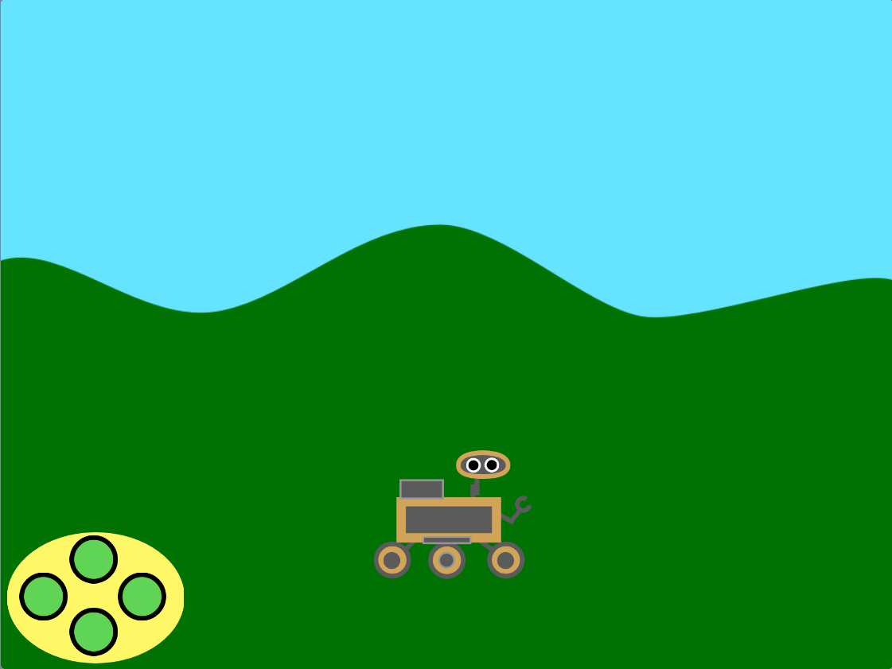

## ರೋವರ್‌ನ್ನು ನಿಯಂತ್ರಿಸಿ

<div style="display: flex; flex-wrap: wrap">
<div style="flex-basis: 200px; flex-grow: 1; margin-right: 15px;">
ಈ ಹಂತದಲ್ಲಿ, ನೀವು ನಿಮ್ಮ ರೋವರ್‌ನ್ನು ಮೇಲೆ ಮತ್ತು ಕೆಳಗೆ ಚಲಿಸಲು ಪರದೆ-ಮೇಲಿನ ನಿಯಂತ್ರಕ ಅಥವಾ ಕೀಬೋರ್ಡ್‌ನ್ನು ಉಪಯೋಗಿಸುತ್ತೀರಿ.
</div>
<div>
{:width="300px"}
</div>
</div>

--- task ---

ಸ್ಟಾರ್ಟರ್ ಪ್ರಾಜೆಕ್ಟ್ ಅನ್ನು ಆನ್‌ಲೈನ್‌ನಲ್ಲಿ [rpf.io/nature-rover-starter](https://rpf.io/nature-rover-starter){:target="_blank"} ನಲ್ಲಿ ತೆರೆಯಿರಿ.

--- collapse ---
---
title: ಆಫ್‌ಲೈನ್‌ನಲ್ಲಿ ಕೆಲಸ ಮಾಡುವುದು
---

ನೀವು ಆಫ್‌ಲೈನ್‌ನಲ್ಲಿ ಕೆಲಸ ಮಾಡುತ್ತಿದ್ದರೆ, ಸ್ಟಾರ್ಟರ್ ಪ್ರಾಜೆಕ್ಟನ್ನು ಇಲ್ಲಿ [rpf.io/p/en/nature-rover-go](https://rpf.io/p/en/nature-rover-go) ಕಾಣಬಹುದು

--- /collapse ---


--- /task ---

ನೀವು ರೋಬೋಟಿಕ್ ರೋವರ್, ಗುಡ್ಡಗಾಡು ಹಿನ್ನೆಲೆ ಮತ್ತು ಕೆಳಗಿನ ಎಡ ಮೂಲೆಯಲ್ಲಿ ನಿಯಂತ್ರಕವನ್ನು ಹೊಂದಿರುವ ದೃಶ್ಯವನ್ನು ನೋಡಬೇಕು.



ರೋವರ್‌ ವೀಕ್ಷಕರ ಕಡೆಗೆ ಅಥವಾ ಅವರಿಂದ ದೂರಕ್ಕೆ ಚಲಿಸುತ್ತಿರುವ ಹಾಗೆ ಕಾಣುವಂತೆ ಮಾಡಲು ನೀವು ನಿಯಂತ್ರಕ ಅಥವಾ ಕೀಬೋರ್ಡ್‌ ನಿಯಂತ್ರಣಗಳನ್ನು ಉಪಯೋಗಿಸುತ್ತೀರಿ.

--- task ---

ಪ್ರತಿಯೊಂದು ಬಟನ್‌ಗಾಗಿ **Code** ಟ್ಯಾಬ್‌ ನೋಡಿ. ಕೋಡ್‌ ಬಹುಶಹ ಈ ರೀತಿ ಕಾಣುತ್ತದೆ:


```blocks3
when this sprite clicked
broadcast (up v)

when I receive [start v]
forever
go to [front v] layer
go to x:(-190) y: (-121)
end
```

ಇದು ಬಟನ್‌ಗಳನ್ನು ಸರಿಯಾದ ಸ್ಥಾನದಲ್ಲಿ ಇಡುತ್ತದೆ ಮತ್ತು ಅವುಗಳನ್ನು ಕ್ಲಿಕ್‌ ಮಾಡಿದಾಗ ಅವುಗಳ ದಿಕ್ಕನ್ನು ಪ್ರಸಾರ ಮಾಡುತ್ತದೆ.

--- /task ---

The **rover** needs to be visible at all times, by making sure it is on the **front** layer.

--- task ---

Add a `go to front layer`{:class='block3looks'} to a `green flag clicked`{:class='block3events'} block.


```blocks3
when flag clicked
+ go to [front v] layer
```

--- /task ---

**rover** ಉಳಿದ ಎಲ್ಲಾ ಸ್ಪ್ರೈಟ್‌ಗಳಿಗೂ ಆಟದ ಪ್ರಾರಂಭವನ್ನು ನಿಯಂತ್ರಿಸುತ್ತದೆ; ಆದುದರಿಂದ, ಹಸಿರು ಬಾವುಟವನ್ನು ಕ್ಲಿಕ್‌ ಮಾಡಿದಾಗ, **rover** ಸ್ಪ್ರೈಟ್‌ `start`{:class='block3events'} ಸಂದೇಶವನ್ನು ಪ್ರಸಾರಮಾಡಬೇಕು.

--- task ---

Add a `broadcast`{:class='block3events'} block.


```blocks3
when flag clicked
go to [front v] layer
+ broadcast [start v]
```

--- /task ---

--- task ---

ನೀವು ಕಂಪ್ಯೂಟರ್‌ನಲ್ಲಿ ಕೆಲಸ ಮಾಡುತ್ತಿರುವಿರಾದರೆ, ಬಟನ್‌ಗಳನ್ನು ಉಪಯೋಗಿಸುವ ಬದಲು ಕೀಬೋರ್ಡ್‌ ನಿಯಂತ್ರಕಗಳನ್ನು ಉಪಯೋಗಿಸುವುದು ಸುಲಭವಾಗಬಹುದು. ಕೀಬೋರ್ಡ್‌ ನಿಯಂತ್ರಕಗಳನ್ನು **rover** ಸ್ಪ್ರೈಟ್‌ಗೆ ಸೇರಿಸಬಹುದು.


```blocks3
when [up arrow v] key pressed
broadcast [up v]

when [down arrow v] key pressed
broadcast [down v]

when [right arrow v] key pressed
broadcast [right v]

when [left arrow v] key pressed
broadcast [left v]
```

ನಿಮಗೆ ನಿಯಂತ್ರಕವನ್ನು ಉಪಯೋಗಿಸುವುದು ಬೇಡವಾದರೆ, ಪ್ರತಿಯೊಂದು **button** ಸ್ಪ್ರೈಟ್‌ಗಳ ಮೇಲೆ ಕ್ಲಿಕ್‌ ಮಾಡಿ ಮತ್ತು `looks`{:class='block3looks'} ಮೆನುನಲ್ಲಿ `hide`{:class='block3looks'} ಮೇಲೆ ಕ್ಲಿಕ್‌ ಮಾಡಿ.

```blocks3
hide
```

--- /task ---

**up** ಬಟನ್‌ನ್ನು ಕ್ಲಿಕ್‌ ಮಾಡಿದಾಗ ಅಥವಾ <kbd>up arrow</kbd> ವನ್ನು ಒತ್ತಿದಾಗ, **rover** ಅದರ `y`{:class="block3motion"} ಸ್ಥಾನವನ್ನು ಸಣ್ಣ ಪ್ರಮಾಣದಲ್ಲಿ ಬದಲಾಯಿಸಬೇಕು. `y`{:class="block3motion"}ನ್ನು ಹೆಚ್ಚಿಸುವುದು **rover** ಮೇಲಕ್ಕೆ ಚಲಿಸುವಂತೆ ಮಾಡುತ್ತದೆ. `y`{:class="block3motion"}ನ್ನು ಕಡಿಮೆ ಮಾಡುವುದು **rover** ಕೆಳಕ್ಕೆ ಚಲಿಸುವಂತೆ ಮಾಡುತ್ತದೆ.

--- task ---

**up** ಬಟನ್ **rover** ಮೇಲಕ್ಕೆ ಚಲಿಸುವಂತೆ ಮಾಡಲು ಕೋಡ್‌ ಸೇರಿಸಿ.


```blocks3
when I receive [up v]
change y by (10)

when I receive [down v]
change y by (-10)
```

--- /task ---

**ನೀವು ಈಗಲೇ ಎಡ ಮತ್ತು ಬಲ ಚಲನೆಯ ಬಗೆಗೆ ಯೋಚಿಸಬೇಕಿಲ್ಲ. ಎಡ ಮತ್ತು ಬಲ ಚಲನೆಯನ್ನು ಪ್ರಾಜೆಕ್ಟ್‌ನ ಮುಂದಿನ ಹಂತದಲ್ಲಿ ಸೇರಿಸಲಾಗುತ್ತದೆ.**

<p style="border-left: solid; border-width:10px; border-color: #0faeb0; background-color: aliceblue; padding: 10px;">
<span style="color: #0faeb0">**ಯಥಾದೃಷ್ಟಿ**</span> ಯನ್ನು ಕಂಪ್ಯೂಟರ್‌ ಗ್ರಾಫಿಕ್ಸ್‌ನಲ್ಲಿ ದೃಶ್ಯವನ್ನು ಹೆಚ್ಚು ನೈಜವಾಗಿಸಲು ಉಪಯೋಗಿಸುತ್ತಾರೆ. ದೂರದಲ್ಲಿರುವ ವಸ್ತುಗಳು ಸಾಮಾನ್ಯವಾಗಿ ಚಿಕ್ಕದಾಗಿ ಮತ್ತು ಪರದೆಯ ಮೇಲೆ ಎತ್ತರದಲ್ಲಿ ಕಂಡುಬರುತ್ತವೆ. ಹತ್ತಿರದಲ್ಲಿರುವ ವಸ್ತುಗಳು ದೊಡ್ಡದಾಗಿ ಕಾಣುತ್ತವೆ ಮತ್ತು ಪರದೆಯ ಕೆಳ ಭಾಗದಲ್ಲಿ ಇರುತ್ತವೆ.
</p>

--- task ---

**ಯಥಾದೃಷ್ಟಿ** ಯನ್ನು ನಿಮ್ಮ **ರೋವರ್‌** ಗೆ ಅದು ಮೇಲ್ಮುಖವಾಗಿ ಚಲಿಸಿದಾಗ ಚಿಕ್ಕದನ್ನಾಗಿ ಮಾಡುವ ಮತ್ತು ಅದು ಕೆಳಮುಖವಾಗಿ ಚಲಿಸುವಾಗ ದೊಡ್ಡದನ್ನಾಗಿ ಮಾಡುವ ಮೂಲಕ ಸೇರಿಸಿ.


```blocks3
when I receive [up v]
change y by (10)
change size by (-1) //Smaller looks further away


when I receive [down v]
change y by (-10)
change size by (1) //Bigger looks closer
```

--- /task ---

--- task ---

ಆಟದ ಪ್ರಾರಂಭದಲ್ಲಿ ನೀವು **rover's** ಗಾತ್ರವನ್ನು ಮರುಹೊಂದಿಸಬೇಕಾಗುತ್ತದೆ.

```blocks3
when I receive [start v]
set size to (50) %
```

--- /task ---


--- task ---

**ಪರೀಕ್ಷೆ:** ನಿಮ್ಮ **rover**ನ ನಿಯಂತ್ರಣವನ್ನು ಪರಿಶೀಲಿಸಲು **up** ಮತ್ತು **down** ಬಟನ್‌ಗಳನ್ನು ಕ್ಲಿಕ್‌ ಮಾಡಿ ಅಥವಾ ಬಾಣದ ಕೀಗಳನ್ನು ಉಪಯೋಗಿಸಿ.

--- /task ---

--- task ---

ಈಗ ಪ್ರತಿಬಾರಿ ಆಟ ಪ್ರಾರಂಭವಾಗುವಾಗ **rover** ನ ಸ್ಥಾನವನ್ನು ಮರುಹೊಂದಿಸಿ.


```blocks3
when I receive [start v]
set size to (50) %
+ go to x: (0) y: (-90)
```

--- /task ---

--- task ---

ಸದ್ಯಕ್ಕೆ, **rover** ಉಳಿದ ಸ್ಪ್ರೈಟ್‌ಗಳ ಮುಂದೆ ಕಾಣಿಸಿಕೊಳ್ಳಬೇಕು. **rover**ನ್ನು ಮುಂಭಾಗದ ಪದರಕ್ಕೆ ಚಲಿಸಿ.


```blocks3
when I receive [start v]
set size to (50) %
go to x: (0) y: (-90)
+ go to [front v] layer
```

--- /task ---

--- task ---

**ಪರೀಕ್ಷೆ**: ನಿಮ್ಮ ಆಟ ಸರಿಯಾಗಿ ಮರುಹೊಂದಿಕೆ ಆಗುತ್ತಿದೆಯೇ ಎಂದು ಪರೀಕ್ಷಿಸಲು ಹಸಿರು ಬಾವುಟ ಕ್ಲಿಕ್‌ ಮಾಡಿ.

--- /task ---

--- save ---
