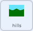

## ಹಿನ್ನೆಲೆಯನ್ನು ಚಲಿಸಿ

<div style="display: flex; flex-wrap: wrap">
<div style="flex-basis: 200px; flex-grow: 1; margin-right: 15px;">
ರೋವರ್‌ ಎಡ ಮತ್ತು ಬಲಕ್ಕೆ ಚಲಿಸುತ್ತಿರುವಂತೆ ಕಾಣಲು, **rover** ಸ್ಪ್ರೈಟ್‌ ಚಲಿಸುವ ಬದಲು, **background** ಸ್ಪ್ರೈಟ್‌ ಚಲಿಸುತ್ತದೆ ಅಥವಾ ಎಡ ಅಥವಾ ಬಲಕ್ಕೆ ಚಲಿಸುತ್ತದೆ.
</div>
<div>
{:width="300px"}
</div>
</div>

--- task ---

**hills** ಸ್ಪ್ರೈಟ್‌ ಆಯ್ಕೆ ಮಾಡಿಕೊಳ್ಳಿ. ಆಟದ ಪ್ರಾರಂಭದಲ್ಲಿ, ನೀವು ಅದು ಸರಿಯಾದ ಸ್ಥಾನದಲ್ಲಿದೆಯೇ ಮತ್ತು ಹಿಂದಿನ ಪದರದಲ್ಲಿದೆ ಎಂಬುವುದನ್ನು ಖಚಿತಪಡಿಸಿಕೊಳ್ಳಬೇಕು.



```blocks3
when I receive [start v]
go to [back v] layer
go to x: (0) y: (0)
```

--- /task ---

<p style="border-left: solid; border-width:10px; border-color: #0faeb0; background-color: aliceblue; padding: 10px;">
<span style="color: #0faeb0">**ಪದರಗಳು**</span> ಎಂದರೆ ನೀವು ಅವುಗಳ ಮೇಲೆ ಚಿತ್ರ ಬಿಡಿಸಬಹುದಾದ ಪೇರಿಸಿಟ್ಟ ಸ್ಪಷ್ಟವಾದ ಪ್ಲಾಸ್ಟಿಕ್‌ ಹಾಳೆಗಳಂತೆ. ಸ್ಟಾಕ್‌ ಮೇಲ್ಭಾಗದಲ್ಲಿರುವ ಚಿತ್ರವು ಅದರ ಕೆಳಗೆ ಇರುವ ಚಿತ್ರವನ್ನು ಆವರಿಸಿದ್ದರೆ, ನೀವು ಕೆಳಗಡೆಯ ಚಿತ್ರವನ್ನು ಸರಿಯಾಗಿ ನೋಡಲು ಸಾಧ್ಯವಾಗುವುದಿಲ್ಲ. ಹಿನ್ನೆಲೆಯ ಚಿತ್ರಗಳು **ಹಿಂದಿನ** ಪದರದ ಹತ್ತಿರ ಇರಬೇಕು. ವೀಕ್ಷಕರಿಗೆ ಹತ್ತಿರವಿರುವ ಚಿತ್ರಗಳು **ಮುಂದಿನ** ಪದರದ ಹತ್ತಿರವಿರಬೇಕು.
</p>

--- task ---

**hills** ಸ್ಪ್ರೈಟ್‌ ತನ್ನದೇ ನಕಲುನ್ನು ಮಾಡಬೇಕು. ಇವುಗಳನ್ನು `clones`{:class='block3control'} ಎಂದು ಕರೆಯುತ್ತಾರೆ. ಆಮೇಲೆ, ಮೂಲ ಸ್ಪ್ರೈಟ್‌ನ್ನು ಪರದೆಯ ಬಲ-ಭಾಗದಲ್ಲಿ ದೂರಕ್ಕೆ ಚಲಿಸಬಹುದು.


```blocks3
when I receive [start v]
go to [back v] layer
go to x: (0) y: (0)
+ create clone of [myself v] //Create a copy of the hills
+ change x by (460) //Move the original hills to the right of the screen
```

--- /task ---

`left`{:class='block3events'} ಮತ್ತು `right`{:class='block3events'} ಪ್ರಸಾರಗಳನ್ನು ಸ್ವೀಕರಿಸಿದಾಗ, **hills** ಸ್ಪ್ರೈಟ್‌ ಚಲಿಸಬೇಕು. ಸರಿಯಾದ ದಿಕ್ಕನಲ್ಲಿ ಚಲಿಸುತ್ತಿರುವ ನೋಟವನ್ನು ಕೊಡಲು, **ರೋವರ್** ಬಲಕ್ಕೆ ಚಲಿಸುತ್ತಿರುವಾಗ ಹಿನ್ನೆಲೆಯು **ಎಡಕ್ಕೆ** ಚಲಿಸುತ್ತದೆ. ಚಲನೆಯ ದಿಕ್ಕು `broadcast`{:class='block3events'} ಕ್ಕೆ **ವಿರುದ್ಧವಾಗಿ** ಇರಬೇಕು.

ಆದುದರಿಂದ, ಪ್ರಸಾರವು `left`{:class="block3events"} ಆಗಿದ್ದರೆ, `x`{:class="block3motion"} ಸ್ಥಾನವು ಹೆಚ್ಚುತ್ತದೆ. ಪ್ರಸಾರವು `right`{:class="block3events"} ಆಗಿದ್ದರೆ, **hills** ನ `x`{:class="block3motion"} ಕಡಿಮೆಯಾಗುತ್ತದೆ.


--- task ---

**hills** ಸ್ಪ್ರೈಟ್‌ ಮತ್ತು ಅದರ ತದ್ರೂಪದ ಚಲನೆಯನ್ನು ನಿಯಂತ್ರಿಸಲು ಬ್ಲಾಕ್‌ಗಳನ್ನು ಸೇರಿಸಿ.


```blocks3
when I receive [left v]
change x by (3)

when I receive [right v]
change x by (-3)
```

--- /task ---

--- task ---

**ಪರೀಕ್ಷೆ**: ಸುತ್ತಲೂ ಚಲಿಸಲು ನಿಯಂತ್ರಕ ಅಥವಾ <kbd>arrow</kbd> ಕೀಗಳನ್ನು ಉಪಯೋಗಿಸಿ. ರೋವರ್ ಎಡ ಮತ್ತು ಬಲಕ್ಕೆ ಚಲಿಸುತ್ತಿರುವಂತೆ ಕಾಣಬೇಕು.

--- /task ---

ಈ ಸಮಯದಲ್ಲಿ, **hills** ಸ್ಪ್ರೈಟ್‌ನ ಎರಡು ನಕಲುಗಳಿವೆ: ಮೂಲ ಮತ್ತು ತದ್ರೂಪ. ನೀವು ಯಾವುದಾದರೊಂದರ ತುದಿಯನ್ನು ತಲುಪಿದಾಗ, ಪರದೆಯು ಬಿಳಿ ಮಾತ್ರ ಆಗುವುದನ್ನು ನೀವು ಗಮನಿಸಬಹುದು.

ಇದನ್ನು ಸರಿಪಡಿಸಲು, ನೀವು ತುಂಬಾ ದೂರ ಹೋದಾಗ ಸ್ಪ್ರೈಟ್‌ ಮತ್ತು ಅದರ ತದ್ರೂಪವನ್ನು ಪರದೆಯ ಇನ್ನೊಂದು ಬದಿಗೆ ಚಲಿಸಬೇಕು.

--- task ---

`scroll`{:class='block3events'} ಎಂದು ಕರೆಯಲ್ಪಡುವ ಹೊಸ ಪ್ರಸಾರವನ್ನು ರಚಿಸಿ ಮತ್ತು ಅದನ್ನು `start`{:class='block3events'} ಬರಹಕ್ಕೆ ಸೇರಿಸಿ.


```blocks3
when I receive [start v]
go to [back v] layer
go to x: (0) y: (0)
create clone of [myself v]
change x by (460) 
+ broadcast [scroll v]
```

--- /task ---

--- task ---

**hills** ಸ್ಪ್ರೈಟ್‌ ಅಥವಾ ಅದರ ತದ್ರೂಪ ಎಡಕ್ಕೆ ಅಥವಾ ಬಲಕ್ಕೆ ತುಂಬಾ ದೂರ ಚಲಿಸಿವೆಯೇ ಎಂದು ಪತ್ತೆ ಮಾಡಲು ಕೋಡ್‌ ಸೇರಿಸಿ ಮತ್ತು ನಂತರ ಅವುಗಳ ಸ್ಥಾನವನ್ನು ಪರದೆಯ ಇನ್ನೊಂದು ಬದಿಗೆ ಮರುಹೊಂದಿಸಿ.


```blocks3
when I receive [scroll v]
forever
if <(x position) > (460)> then //The hills sprite is off the right side of the screen
set x to (-460) //Reset to the left side of the screen
end
if <(x position) < (-460)> then //The hills sprite is off the left side of the screen
set x to (460) //Reset to the right side of the screen
end
```

--- /task ---

--- task ---

**ಪರೀಕ್ಷೆ**: **rover**ನ್ನು ಚಲಿಸಲು ನಿಯಂತ್ರಕ ಅಥವಾ <kbd>arrow</kbd> ಕೀಗಳನ್ನು ಉಪಯೋಗಿಸಿ. ಹಿನ್ನೆಲೆ ಚಲಿಸಬೇಕು, ಮತ್ತು **rover** ಎಂದಿಗೂ ತುದಿಯನ್ನು ತಲುಪಬಾರದು.

--- /task ---

--- save ---
