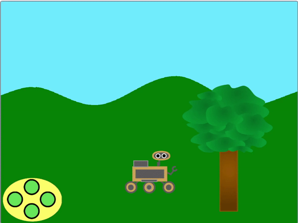

## ಇನ್ನಷ್ಟು ಸ್ಪ್ರೈಟ್‌ಗಳನ್ನು ಚಲಿಸಿ

<div style="display: flex; flex-wrap: wrap">
<div style="flex-basis: 200px; flex-grow: 1; margin-right: 15px;">
ನಿಮ್ಮ ದೃಶ್ಯಕ್ಕೆ ಇನ್ನಷ್ಟು ಸ್ಪ್ರೈಟ್‌ಗಳನ್ನು ಸೇರಿಸುವಾಗ, ಇವುಗಳೂ ಕೂಡ ಎಡ ಮತ್ತು ಬಲಕ್ಕೆ ಚಲಿಸಬೇಕು.
</div>
<div>
{:width="300px"}
</div>
</div>

ಈಗ ನೀವು ನಿಮ್ಮ ದೃಶ್ಯಕ್ಕೆ ಇನ್ನೂ ಕೆಲವು ವಸ್ತುಗಳನ್ನು ಸೇರಿಸಬಹುದು, ಮತ್ತು ಅವುಗಳನ್ನೂ ಸಹ ಇದೇ ರೀತಿಯಲ್ಲಿ ಚಲಿಸುವಂತೆ ಮಾಡಿ.

--- task ---

ನಿಮ್ಮ ಪ್ರಾಜೆಕ್ಟ್‌ಗೆ **tree** ಸ್ಪ್ರೈಟ್‌ ಸೇರಿಸಿ, ಮತ್ತು ನಂತರ ಅದರ ಪ್ರಾರಂಭಿಕ ಸ್ಥಾನವನ್ನು ಹೊಂದಿಸಿ.


```blocks3
when I receive [start v]
go to x:(0) y:(-80)
```

--- /task ---

**tree** ಸ್ಪ್ರೈಟ್‌ ಸಹ ಪ್ರಸಾರಕ್ಕೆ **ವಿರುದ್ಧ** ದಿಕ್ಕಿನಲ್ಲಿ ಚಲಿಸಬೇಕು.



ಮರವು ವೀಕ್ಷಕರಿಗೆ ಹತ್ತಿರವಿರುವುದರಿಂದ, ಪ್ರತಿಯೊಂದು ಬಾರಿ ಬಟನ್‌ ಅಥವಾ ಕೀಯನ್ನು ಒತ್ತಿದಾಗ ಅದು ಬೆಟ್ಟಗಳಿಗಿಂತ ಹೆಚ್ಚಿನ ದೂರದಲ್ಲಿ ಚಲಿಸುತ್ತಿರುವಂತೆ ಗೋಚರಿಸಬೇಕು.

--- task ---

ಚಲಿಸುವ ಈ ಪರಿಣಾಮವನ್ನು ಪಡೆಯಲು, `x`{:class='block3motion'} ಮೌಲ್ಯಗಳನ್ನು ಬದಲಾಯಿಸಿ ಅದರಿಂದ **tree** ಸ್ಪ್ರೈಟ್‌ `left`{:class="block3events"} ಮತ್ತು `right`{:class="block3events"} ಪ್ರಸಾರಗಳನ್ನು ಸ್ವೀಕರಿಸಿದಾಗ ಚಲಿಸುತ್ತದೆ.


```blocks3
when I receive [left v]
change x by (10) //Use a bigger number than for the hills

when I receive [right v]
change x by (-10) //Use a bigger number than for the hills
```

--- /task ---

--- task ---

**Test:** Click the green flag and check your left and right buttons now. ನೀವು ಪ್ರತಿಯೊಂದು ಬಾರಿ ನಿಯಂತ್ರಕವನ್ನು ಕ್ಲಿಕ್‌ ಮಾಡಿದಾಗ ಮರ ಚಲಿಸಬೇಕು.

**ಪರೀಕ್ಷೆ:** ನೀವು ಮರದಿಂದ ಸಾಧ್ಯವಾದಷ್ಟು ದೂರ ಹೋದರೆ ಏನಾಗುತ್ತದೆ?

--- /task ---

ಮರವು ಪರದೆಯ ಬಹಳ ತುದಿಗೆ ತಲುಪಿದಾಗ, ಅದು ಚಲಿಸುವುದನ್ನು ನಿಲ್ಲಿಸುವುದನ್ನು ನೀವು ಗಮನಿಸಿದಿರಾ? ಅದರ `x`{:class='block3motion'} ನಿರ್ದೇಶಾಂಕಗಳು ತುಂಬಾ ಹೆಚ್ಚು ಅಥವಾ ಕಡಿಮೆ ಆದಾಗ, ನೀವು ಮರವನ್ನು ಪರದೆಯ ಇನ್ನೊಂದು ಬದಿಗೆ ಚಲಿಸಿ ಇದನ್ನು ಸರಿಪಡಿಸಬಹುದು.

--- task ---

`forever`{:class='block3control'} ಲೂಪ್‌ ಮತ್ತು `if`{:class='block3control'} ಬ್ಲಾಕ್‌ಗಳನ್ನು ಉಪಯೋಗಿಸಿ, ಮರದ ನಿರ್ದೇಶಾಂಕಗಳನ್ನು `x`{:class='block3motion'} ಪರಿಶೀಲಿಸಿ, ಅದನ್ನು `x`{:class='block3motion'} `290` ಕ್ಕಿಂತ ಹೆಚ್ಚಿರುವಾಗ ಅಥವಾ `-290`.ಕ್ಕಿಂತ ಕಡಿಮೆ ಇರುವಾಗ ಪರದೆಯ ಇನ್ನೊಂದು ಬದಿಗೆ ಚಲಿಸಿ.


```blocks3
when I receive [start v]
go to x:(-90) y:(-80)
+ forever
if <(x position) > (290)> then //The tree is at the far right
set x to (-280) //Move the tree to the far left
end
if <(x position) < (-290)> then //The tree is at the far left
set x to (280) //Move the tree to the far right
end
end
```

--- /task ---

--- task ---

ಈಗ ನಿಮ್ಮ **rover** ಸ್ಪ್ರೈಟ್‌ನ್ನು ಪರದೆಯ ಸುತ್ತ ಚಲಿಸಿ. ಮರವು ಅಂಚನ್ನು ತಲುಪಿದಾಗ, ಅದು ಪರದೆಯ ಅಂಚಿನಿಂದ ಕಣ್ಮರೆಯಾಗಬೇಕು ಮತ್ತು ಇನ್ನೊಂದು ಬದಿಯಲ್ಲಿ ಮತ್ತೆ ಕಾಣಿಸಿಕೊಳ್ಳಬೇಕು.

--- /task ---

--- task ---

Lastly, make the **rover** turn left and right so that it faces the direction it is moving in, and resets at the start.


```blocks3
when flag clicked
go to [front v] layer
broadcast [start v]
+ set rotation style [left-right v]

when I receive [left v]
point in direction (-90)

when I receive [right v]
point in direction (90)

when I receive [start v]
set size to (50) %
go to x: (0) y: (-90)
go to [front v] layer
+ point in direction (90)
```

--- /task ---

--- task ---

**ಪರೀಕ್ಷಿಸಿ:** ನಿಮ್ಮ ಪ್ರಾಜೆಕ್ಟ್‌ನ್ನು ರನ್‌ ಮಾಡಿ ಮತ್ತು ಅದನ್ನು ಪರೀಕ್ಷಿಸಿ. ರೋವರ್‌ ಚಲಿಸಿದಾಗ ಮರವು ಪರದೆಯ ಅಂಚಿನಿಂದ ಬೀಳುವಂತೆ ಕಾಣಿಸುವುದನ್ನು ಮತ್ತು ಇನ್ನೊಂದು ಬದಿಯಲ್ಲಿ ಕಾಣಿಸುಕೊಳ್ಳುವುದನ್ನು ಖಚಿತಪಡಿಸಿಕೊಳ್ಳಿ.

--- /task ---
