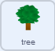

## ಮಾದರಿಯನ್ನು ಸಂಗ್ರಹಿಸಿ

<div style="display: flex; flex-wrap: wrap">
<div style="flex-basis: 200px; flex-grow: 1; margin-right: 15px;">
ಈ ಹಂತದಲ್ಲಿ, ರೋವರ್ ಮಾದರಿಗಳನ್ನು ಸಂಗ್ರಹಿಸುವುದನ್ನು ತೋರಿಸಲು ನೀವು ಸ್ಪ್ರೈಟ್ ಮತ್ತು ರೋವರ್‌ನ ನೋಟವನ್ನು ಬದಲಾಯಿಸುತ್ತೀರಿ.
</div>
<div>
{:width="300px"}
</div>
</div>

--- task ---

**rover** ಸ್ಪ್ರೈಟ್‌ನ ಉಡುಪುಗಳನ್ನು ನೋಡಿ. ಆರು ಅನಿಮೇಶನ್‌ಗಳು ಲಭ್ಯವಿರುತ್ತವೆ. **rover**:
- ಅದರ ತೋಳುಗಳನ್ನು ವಿಸ್ತರಿಸಬಹುದು


- ನೆಲವನ್ನು ಕೊರೆಯಬಹುದು
- ಗಾಳಿಯನ್ನು ಒಳಕ್ಕೆಳೆದುಕೊಳ್ಳಬಹುದು
- ಸೌರ ಫಲಕವನ್ನು ವಿಸ್ತರಿಸಬಹುದು
- ಚಿತ್ರವನ್ನು ತೆಗೆದುಕೊಳ್ಳಬಹುದು
- ಏನನ್ನಾದರೂ ಮೊಗೆದು ತೆಗೆಯಬಹುದು

--- /task ---

ಅನೇಕ ಉಡುಪುಗಳ ಬದಲಾವಣೆಗಳಂತಹ ಬಹಳಷ್ಟು ಕೋಡ್‌ಗಳನ್ನುನೀವು Scratch ನಲ್ಲಿ ಸಂಯೋಜಿಸಲು ಬಯಸಿದಾಗ, `My Blocks`{:class="block3myblocks"} ಉಪಯೋಗಿಸುವುದು ಉಪಯುಕ್ತವಾಗಿರುತ್ತದೆ. ಇದು ನಿಮಗೆ ನಿಮ್ಮದೇ ಆದ ಬ್ಲಾಕ್‌ಗಳನ್ನು ರಚಿಸಲು ಅನುವುಮಾಡಿಕೊಡುತ್ತದೆ.

ನಿಮ್ಮ **rover** ಸ್ಪ್ರೈಟ್‌ ಪ್ರತಿಯೊಂದು ಅನಿಮೇಶನ್‌ಗೆ `My Block`{:class="block3myblocks"} ಹೊಂದಿರುತ್ತದೆ.

--- task ---

`My Blocks`{:class="block3myblocks"} ಮೆನುನಲ್ಲಿ, **Make a Block** ಮೇಲೆ ಕ್ಲಿಕ್‌ ಮಾಡಿ, ಮತ್ತು ನಿಮ್ಮ ಹೊಸ ಬ್ಲಾಕ್‌ನ್ನು `sample fruit`{:class="block3myblocks"} ಎಂದು ಹೆಸರಿಸಿ.

--- /task ---

ನಿಮ್ಮ ಬರಹದಲ್ಲಿ ಹೊಸ ಬ್ಲಾಕ್‌ ಕಾಣಿಸಿಕೊಳ್ಳಬೇಕು. ಅದು ಈ ರೀತಿ ಕಾಣಿಸುತ್ತದೆ:


```blocks3
define sample fruit
```

--- task ---

ಈ ಬ್ಲಾಕ್‌ ಕೆಳಗೆ, ರೋಬೋಟ್‌ನ್ನು ಅನಿಮೇಟ್‌ ಮಾಡಲು ಕೆಲವು `switch costume`{:class="block3looks"} ಬ್ಲಾಕ್‌ಗಳನ್ನು ಮತ್ತು `wait`{:class="block3control"} ಬ್ಲಾಕ್‌ಗಳನ್ನು ಸೇರಿಸಿ.

**ಸಲಹೆ:** ನಿಮ್ಮ ಮೊದಲ `switch costume`{:class='block3looks'} ಬ್ಲಾಕ್‌ ಮತ್ತು `wait`{:class='block3control'} ಬ್ಲಾಕ್‌ ರಚಿಸುವುದು ಬೇಗ ಆಗುತ್ತದೆ, ನಂತರ ಅವುಗಳನ್ನು ನಕಲು ಮಾಡಿ, ಮತ್ತು ಉಪಯೋಗಿಸುತ್ತಿರುವ ಉಡುಪನ್ನು ಬದಲಾಯಿಸಿ.


```blocks3
define sample fruit //Animates the robot to collect fruit
switch costume to (inactive v)
wait (0.3) seconds
switch costume to (arm 1 v)
wait (0.3) seconds
switch costume to (arm 2 v)
wait (0.3) seconds
switch costume to (arm 1 v)
wait (0.3) seconds
switch costume to (inactive v)
```

--- /task ---

--- task ---

Add a block so that the **rover** sprite plays a sound when it collects the fruit sample. You can find the **Collect** sound in the Sound gallery.


```blocks3
define sample fruit //Animates the robot to collect fruit
switch costume to (inactive v)
wait (0.3) seconds
switch costume to (arm 1 v)
wait (0.3) seconds
switch costume to (arm 2 v)
wait (0.3) seconds
+ start sound (Collect v)
switch costume to (arm 1 v)
wait (0.3) seconds
switch costume to (inactive v)
```

--- /task ---


--- task ---

ನೀವು ಅನಿಮೇಶನ್‌ ನೋಡಲು `define sample fruit`{:class="block3myblocks"} ಬ್ಲಾಕ್‌ ಮೇಲೆ ಕ್ಲಿಕ್‌ ಮಾಡಬಹುದು. ನೀವು ಸಣ್ಣ ಪರದೆಯನ್ನು ಉಪಯೋಗಿಸುತ್ತಿದ್ದರೆ, ನೀವು ಹತ್ತಿರದಿಂದ ನೋಡಬೇಕಾಗಬಹುದು.

ನೀವು ನಿಮ್ಮ ಪ್ರಾಜೆಕ್ಟ್‌ನಲ್ಲಿ ಇನ್ನೂ ನಿಮ್ಮ ಹೊಸ `sample fruit block`{:class='block3myblocks'} ಉಪಯೋಗಿಸಿಲ್ಲವಾದುದರಿಂದ ಹಸಿರು ಬಾವುಟದ ಮೇಲೆ ಕ್ಲಿಕ್‌ ಮಾಡಿದಾಗಲೂ ಅನಿಮೇಶನ್‌ ರನ್‌ ಆಗುವುದಿಲ್ಲ.

--- /task ---

--- task ---

ನಿಮ್ಮ ಹೊಸ ಬ್ಲಾಕ್‌ನ್ನು ಉಪಯೋಗಿಸಲು, ನೀವು ಅದನ್ನು `event`{:class="block3events"} ಬ್ಲಾಕ್‌ಗೆ ಸೇರಿಸಬಹುದು. `My Blocks`{:class="block3myblocks"} ಮೆನುನಲ್ಲಿ, ನೀವು ಮಾಡಿದ ಬ್ಲಾಕ್‌ನ್ನು ನೀವು ನೋಡಬೇಕು. ಈ ಕೆಳಗಿನ ಬರಹದಲ್ಲಿ ಅದನ್ನು ಉಪಯೋಗಿಸಿ.


```blocks3
when this sprite clicked
sample fruit ::custom //Run the animation
```

--- /task ---

--- task ---

**rover** ಸ್ಪ್ರೈಟ್‌ ಮೇಲೆ ಕ್ಲಿಕ್‌ ಮಾಡಿ, ಮತ್ತು ನೀವು ಅನಿಮೇಶನ್‌ ನೋಡಬೇಕು.

--- /task ---

ಈಗ ನೀವು ರೋವರ್‌ ನಿಜವಾಗಿ ಮಾದರಿಯನ್ನು ಸಂಗ್ರಹಿಸುವಂತೆ ಮಾಡಬೇಕು. ಈ ಉದಾಹರಣೆಯಲ್ಲಿ, ರೋವರ್‌ ಮರದಿಂದ ಹಣ್ಣೊಂದನ್ನು ಸಂಗ್ರಹಿಸುತ್ತದೆ.

--- task ---

The **tree** sprite needs two costumes, one without fruit on (`tree without fruit`{:class="block3looks"}), and one with fruit (`tree with fruit`{:class="block3looks"}). Add another costume to the **tree**, change the names and draw some fruit on the **with fruit** one.


--- /task ---

--- task ---

On the **tree** sprite, add blocks to set the costume of the **tree** at the start of the project, and the costume it should switch to when it receives a `sample fruit`{:class="block3events"} broadcast.



```blocks3
when I receive [start v]
go to x:(-90) y:(-80)
+ switch costume to (tree with fruit v)
forever
if <(x position) > (290)> then
set x to (-280)
end
if <(x position) < (-290)> then
set x to (280)
end
end

+ when I receive [sample fruit v]
+ switch costume to (tree without fruit v)
```

--- /task ---

--- task ---

On the **rover** sprite, you can use the new `broadcast`{:class="block3events"} to trigger the costume change. Add this new `broadcast`{:class="block3events"} into your `define sample fruit`{:class="block3myblocks"} function.


```blocks3
define sample fruit
switch costume to (inactive v)
wait (0.3) seconds
switch costume to (arm 1 v)
wait (0.3) seconds
switch costume to (arm 2 v)
wait (0.3) seconds
start sound (Collect v)
+ broadcast (sample fruit v)
switch costume to (arm 1 v)
wait (0.3) seconds
switch costume to (inactive v)
```

--- /task ---

--- task ---

**Test:** To check that your code is working, click on the flag, and then click on your **rover** sprite. Its arm should extend, and the **tree** sprite should change costumes.

**Tip:** Switch to full screen mode and you will be able to see the animation more easily.

--- /task ---

The rover should only be able to collect the fruit, if it is touching it.

--- task ---

On the **rover** sprite, change the `when this sprite clicked`{:class="block3events"} set of blocks, so that the `sample fruit`{:class="block3myblocks"} function is only called if the **rover** sprite is touching the colour of your fruit.

**Tip:** Your costume change from testing might mean that the fruit is not visible. Just click on the costumes tab for the **tree** sprite, and switch to the costume with the visible fruit.


```blocks3
when this sprite clicked
if <touching color (#FFA500) ?> then //Colour of fruit
sample fruit ::custom
```

--- /task ---

--- task ---

Now that the **tree** sprite changes when a fruit is sampled, you need to reset the sprite to its first costume when it goes off the screen.


```blocks3
when I receive [start v]
go to x:(-90) y:(-80)
switch costume to (tree with fruit v)
forever
if <(x position) > (290)> then
set x to (-280)
+ switch costume to (tree with fruit v)
end
if <(x position) < (-290)> then
set x to (280)
+ switch costume to (tree with fruit v)
end
end
```

--- /task ---

--- task ---

**Test:** Move the **rover** sprite so that it is touching the fruit, then click on the **rover** sprite and watch it collect the fruit from the tree.

--- /task ---


--- save ---
