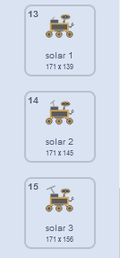

## ಇನ್ನೊಂದು ಮಾದರಿಯನ್ನು ರಚಿಸಿ

<div style="display: flex; flex-wrap: wrap">
<div style="flex-basis: 200px; flex-grow: 1; margin-right: 15px;">
ರೋವರ್‌ ಮುಂದೆ ಯಾವ ಮಾದರಿಯನ್ನು ಸಂಗ್ರಹಿಸಬೇಕು ಎನ್ನುವುದನ್ನು ಆಯ್ಕೆಮಾಡಿ! ಅದು ಹೊಸ ಜಾತಿಯ ಸಸ್ಯ, ಕೀಟ ಅಥವಾ ಪ್ರಾಣಿಯನ್ನು ನೋಡುತ್ತದೆಯೇ? ಅದು ಸ್ವಲ್ಪ ನೀರು ಅಥವಾ ನಿಗೂಢ ದ್ರವವನ್ನು ನೋಡುತ್ತದೆಯೇ? ಅದು ಸ್ವಲ್ಪ ಕೆಸರು ಅಥವಾ ಕಲ್ಲು ಅಥವಾ ಗಾಳಿಯ ಮಾದರಿಯನ್ನೂ ಕೂಡ ಸಂಗ್ರಹಿಸ ಬಯಸುತ್ತದೆಯೇ? ಅಥವಾ ಇನ್ನೇನಾದರೂ?
</div>
<div>
{:width="300px"}
</div>
</div>

--- task ---

**ಆಯ್ಕೆ ಮಾಡಿಕೊಳ್ಳಿ:** ರೋವರ್‌ಗೆ ಸಂಗ್ರಹಿಸಲು ಹೊಸ **sample** ಸ್ಪ್ರೈಟ್‌ ಸೇರಿಸಿ. ನೀವು ಇದನ್ನು ನಿಮ್ಮ ಪ್ರಾಜೆಕ್ಟ್‌ಗೆ ಗ್ರಂಥಾಲಯದಿಂದ ಒಂದನ್ನು ಆಯ್ದುಕೊಂಡು ಅಥವಾ ನಿಮ್ಮದೇ ಸ್ವಂತದೊಂದನ್ನು ಚಿತ್ರಿಸಿ ಕೂಡ ಸೇರಿಸಬಹುದು.

--- /task ---

ನಿಮ್ಮ **sample** ಸ್ಪ್ರೈಟ್‌ ಚಲಿಸುವಂತೆ ಮಾಡಿ. ಅದು ಪರದೆಯ ಮೇಲೆ ಕೆಳಭಾಗದಲ್ಲಿದ್ದರೆ (`change x by`{:class='block3motion'} `5`)ಕ್ಕಿಂತ ಹೆಚ್ಚಿದ್ದಾಗ ಹೆಚ್ಚು ಚಲಿಸಬೇಕು, ಮತ್ತು ಅದು ಪರದೆಯ ಮೇಲೆ ಮೇಲ್ಭಾಗದಲ್ಲಿದ್ದರೆ (`change x by`{:class='block3motion'} `5`) ಕ್ಕಿಂತ ಕಡಿಮೆಯಿದ್ದಾಗ ಕಡಿಮೆ ಚಲಿಸಬೇಕು.

--- task ---

ನಿಮ್ಮ ಸ್ಪ್ರೈಟ್‌ ಚಲಿಸುವಂತೆ ಕೋಡ್‌ ಸೇರಿಸಿ.

--- /task ---

**ಆಯ್ಕೆಮಾಡಿಕೊಳ್ಳಿ:** ನಿಮಗೆ ರೋವರ್‌ ಮುಂದೆ ಯಾವ ಮಾದರಿ ಸಂಗ್ರಹಿಸಬೇಕು ಎನ್ನುವುದನ್ನು ಅವಲಂಬಿಸಿ, ನೀವು ಈಗಾಗಲೇ ಅಸ್ತಿಸತ್ವದಲ್ಲಿರುವ ರೋವರ್‌ ಅನಿಮೇಶನ್‌ಗಳನ್ನು ಉಪಯೋಗಿಸಬಹುದು ಅಥವಾ ಉಡುಪುಗಳನ್ನು ನಕಲು ಮಾಡುವುದು ಮತ್ತು ಎಡಿಟ್‌ ಮಾಡುವ ಮೂಲಕ ಇನ್ನಷ್ಟು ಅನಿಮೇಶನ್‌ ಅನುಕ್ರಮಣಿಕೆಗಳನ್ನು ರಚಿಸಬಹುದು.

--- task ---

ಅದು ಹೊಸ ಮಾದರಿಯನ್ನು ಸಂಗ್ರಹಿಸಿದಾಗ ನಿಮ್ಮ **rover** ಸ್ಪ್ರೈಟ್‌ ಅನಿಮೇಟ್‌ ಮಾಡಲು ಅದಕ್ಕೆ `My Blocks`{:class='block3myblocks'} ಬ್ಲಾಕ್‌ ಸೇರಿಸಿ. ನೀವು ರಚಿಸಿದ ಇತರೆ `My Blocks`{:class='block3myblocks'} ರೊಂದರಿಂದ ನೀವು ಕೋಡ್‌ನ್ನು ಕಾಪಿ ಮತ್ತು ಪೇಸ್ಟ್‌ ಮಾಡಬಹುದು.

ಉದಾಹರಣೆಗೆ, ಸೌರ ಶಕ್ತಿಯನ್ನು ಸಂಗ್ರಹಿಸಲು ಉಡುಪುಗಳ ಅನುಕ್ರಮಣಿಕೆ ಇಲ್ಲಿದೆ:



ಉಡುಪುಗಳ ಈ ಸರಣಿಯನ್ನು ಅನಿಮೇಟ್‌ ಮಾಡಲು ನೀವು ಈ ಕೆಳಗಿನ ಕೋಡ್‌ನ್ನು ಉಪಯೋಗಿಸಬಹುದು:

```blocks3
define recharge
switch costume to [inactive v]
wait (0.3) seconds
switch costume to [solar 1 v]
wait (0.3) seconds
switch costume to [solar 2 v]
wait (0.3) seconds
switch costume to [solar 3 v]
wait (0.3) seconds
switch costume to [solar 2 v]
wait (0.3) seconds
switch costume to [solar 1 v]
wait (0.3) seconds
switch costume to [inactive v]
wait (0.3) seconds
```

--- /task ---

--- task ---

ನಂತರ, ಹೊಸ ಸಂದೇಶವನ್ನು ನಿಮ್ಮ ಹೊಸ `My Block`{:class='block3myblocks'} ಬ್ಲಾಕ್‌ನಲ್ಲಿ `broadcast`{:class='block3events'} ಮಾಡಿ ಅದು `costume`{:class='block3looks'} ಅಥವಾ `graphic effect`{:class='block3looks'} ಬದಲಾವಣೆಯನ್ನು **sample** ಸ್ಪ್ರೈಟ್‌ನಲ್ಲಿ ಉಂಟುಮಾಡುತ್ತದೆ.

--- /task ---

--- task ---

ರೋವರ್‌ ಸ್ಪ್ರೈಟ್‌ನ್ನು ಸ್ಪರ್ಶಿಸುತ್ತಿದೆಯೇ ಅಥವಾ ಸ್ಪ್ರೈಟ್‌ ಮೇಲಿನ ಬಣ್ಣವನ್ನು ಸ್ಪರ್ಶಿಸುತ್ತಿದೆಯೇ ಎಂದು ಪತ್ತೆಮಾಡಲು `if`{:class='block3control'} ಉಪಯೋಗಿಸಿ, ಅದರಿಂದ ಹೊಸ `My Block`{:class='block3myblocks'} ಆಗ ಮಾತ್ರ ಉಪಯೋಗಿಸಲ್ಪಡುತ್ತದೆ.

--- /task ---

--- task ---

ನಿಮಗೆ ಇಷ್ಟವಾದಲ್ಲಿ, ಸ್ಪ್ರೈಟ್‌ಗೆ ಅನಿಮೇಶನ್‌ನ್ನು ಸೇರಿಸಿ, ಅದರಿಂದ ರೋವರ್‌ ಮಾದರಿಯನ್ನು ಸಂಗ್ರಹಿಸಿದಾಗ ಅದರ ನೋಟ ಬದಲಾಗುತ್ತದೆ.

--- /task ---

--- save ---
