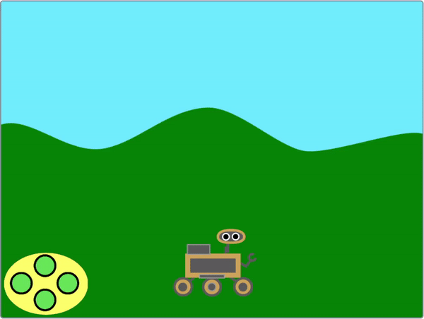
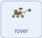

## रोव्हर नियंत्रित करा

<div style="display: flex; flex-wrap: wrap">
<div style="flex-basis: 200px; flex-grow: 1; margin-right: 15px;">
या टप्प्यात, तुम्ही तुमचे रोव्हर वर आणि खाली हलवण्यासाठी ऑन-स्क्रीन कंट्रोलर किंवा कीबोर्ड वापराल.
</div>
<div>
{:width="300px"}
</div>
</div>

--- task ---

स्टार्टर प्रोजेक्ट ऑनलाईन [rpf.io/nature-rover-starter](https://rpf.io/nature-rover-starter){:target="_blank"} येथे उघडा.

--- collapse ---
---
title: ऑफलाईन कार्य करणे
---

तुम्ही ऑफलाईन कार्य करत असल्यास, स्टार्टर प्रोजेक्ट [rpf.io/p/en/nature-rover-go](https://rpf.io/p/en/nature-rover-go) येथे आढळू शकतो

--- /collapse ---


--- /task ---

तुम्ही रोबोटीक रोव्हरसह दृश्य, टेकड्यांचे बॅकग्राऊंड, आणि डाव्या हाताच्या कोपऱ्यात खाली कंट्रोलर बघायला हवे.


रोव्हर व्ह्यूअरच्या दिशेने किंवा त्याच्यापासून दूर जात असल्याचे दिसण्यासाठी तुम्ही कंट्रोलर किंवा कीबोर्ड कंट्रोल्स वापरणार आहात.

--- task ---

प्रत्येक बटनसाठी **Code** टॅब बघा. कोड काही असा दिसला पाहिजे:


```blocks3
when this sprite clicked
broadcast (up v)

when I receive [start v]
forever
go to [front v] layer
go to x:(-190) y: (-121)
end
```

यामुळे बटन योग्य स्थितीत रहातात आणि क्लिक केल्यावर त्यांचे दिशानिर्देश प्रसारित होतात.

--- /task ---

**rover** इतर सर्व स्प्राईटसाठी गेमची सुरूवात नियंत्रीत करत आहे, ज्यामुळे हिरव्या झेंड्यावर क्लिक केल्यावर, **rover** स्प्राईटला `start`{:class='block3events'} मेसेज ब्रॉडकास्ट करण्याची आवश्यकता आहे.

--- task ---

`green flag clicked`{:class='block3events'} ब्लॉकला ब्रॉडकास्ट जोडा.



```blocks3
when flag clicked
broadcast [start v]
```

--- /task ---

--- task ---

तुम्ही कंप्युटरवर कार्य करत असलात तर, बटन वापरण्याऐवजी कीबोर्ड कंट्रोल्स वापरणे सोपे जाते. कीबोर्ड कंट्रोल्स **rover** स्प्राईटला जोडले जाऊ शकते.


```blocks3
when [up arrow v] key pressed
broadcast [up v]

when [down arrow v] key pressed
broadcast [down v]

when [right arrow v] key pressed
broadcast [right v]

when [left arrow v] key pressed
broadcast [left v]
```

तुम्हाला कंट्रोलर वापरायचे नसल्यास, प्रत्येक **button** स्प्राईटवर क्लिक करा आणि `hide`{:class='block3looks'} ब्लॉकवर क्लिक करा `looks`{:class='block3looks'} 
मेनू मधील.

```blocks3
hide
```

--- /task ---

**up** बटनवर क्लिक केल्यावर किंवा <kbd>वरचा ऍरो</kbd> दाबल्यावर, **rover** त्याच्या `y`{:class="block3motion"} पोजिशन मध्ये कमी प्रमाणात बदलायला हवे. वाढते `y`{:class="block3motion"} **rover** ला वर हलवेल. कमी होणारा `y`{:class="block3motion"} **rover** ला खाली हलवेल.

--- task ---

कोड जोडा जेणेकरून **up** बटन **rover** ला हलवतो.


```blocks3
when I receive [up v]
change y by (10)

when I receive [down v]
change y by (-10)
```

--- /task ---

**तुम्हाला अजून डाव्या आणि उजव्या हालचालींबद्दल काळजी करण्याची गरज नाही. प्रोजेक्टच्या पुढील टप्प्यात डाव्या आणि उजव्या हालचाली जोडल्या जातील.**

<p style="border-left: solid; border-width:10px; border-color: #0faeb0; background-color: aliceblue; padding: 10px;">
<span style="color: #0faeb0">**Perspective**</span> चा दृश्य अधिक वास्तवीक बनविण्यासाठी कंप्युटर ग्राफिक्समध्ये वापर केला जातो. दूर असलेल्या वस्तू साधारणपणे लहान आणि वरच्या स्क्रीनवर दिसतात. जवळ असलेल्या वस्तू स्क्रीनच्या खाली मोठ्या आणि खाली दिसतात.
</p>

--- task ---

तुमच्या **रोव्हर** ला **चौकट** वर हलवल्यावर लहान आणि खाली हलवल्यावर मोठे करून जोडा.


```blocks3
when I receive [up v]
change y by (10)
change size by (-1) //Smaller looks further away


when I receive [down v]
change y by (-10)
change size by (1) //Bigger looks closer
```

--- /task ---

--- task ---

तुम्हाला **रोव्हरची** साईज गेमच्या सुरूवातीला रीसेट करण्याची आवश्यकता असेल.

```blocks3
when I receive [start v]
set size to (50) %
```

--- /task ---


--- task ---

**चाचणी:** **वर** आणि **खाली** बटनवर तुमच्या **rover** चे नियंत्रण तपासण्यासाठी क्लिक करा, किंवा ऍरो की चा वापर करा.

--- /task ---

--- task ---

आता गेम चालू झाल्यावर प्रत्येक वेळी **rover** ची पोजिशन रीसेट करा.


```blocks3
when I receive [start v]
set size to (50) %
+ go to x: (0) y: (-90)
```

--- /task ---

--- task ---

आतासाठी, **rover** इतर स्प्राईट्सच्या समोर दिसायला हवे. **rover** समोरील स्तरावर हलवा.


```blocks3
when I receive [start v]
set size to (50) %
go to x: (0) y: (-90)
+ go to [front v] layer
```

--- /task ---

--- task ---

**चाचणी**: तुमचा गेम योग्यपणे रीसेट झाला का ते तपासण्यासाठी हिरव्या झेंड्यावर क्लिक करा.

--- /task ---

--- save ---
