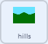

## बॅकग्राऊंड स्क्रोल करा

<div style="display: flex; flex-wrap: wrap">
<div style="flex-basis: 200px; flex-grow: 1; margin-right: 15px;">
रोव्हर डावीकडे आणि उजवीकडे फिरत असल्यासारखे दिसण्यासाठी, **rover** स्प्राइट हलवण्याऐवजी, **background** स्प्राइट डावीकडे किंवा उजवीकडे सरकतो किंवा स्क्रोल करतो.
</div>
<div>
{:width="300px"}
</div>
</div>

--- task ---

**hills** स्प्राईट निवडा. गेमच्या सुरूवातीस, आपण ते योग्य स्थितीत आणि मागील स्तरावर असल्याची खात्री करणे आवश्यक आहे.



```blocks3
when I receive [start v]
go to [back v] layer
go to x: (0) y: (0)
```

--- /task ---

<p style="border-left: solid; border-width:10px; border-color: #0faeb0; background-color: aliceblue; padding: 10px;">
<span style="color: #0faeb0">**लेयर्स**</span> हे स्पष्ट प्लास्टिकच्या स्टॅक केलेल्या शीटसारख्याआहेत ज्याची तुम्ही इमेज काढू शकता. स्टॅकच्या वरच्या भागात असलेली इमेज त्याच्या खालील इमेज ला झाकत असेल, तर तुम्ही खालील इमेज योग्यपणे बघू शकणार नाही. बॅकग्राऊंड इमेज **मागच्या** स्तराच्या जवळ असायला हवी. व्हीवरच्या जवळ असलेली इमेज **समोरील** स्तराजवळ असायला हवी.
</p>

--- task ---

**hills** स्प्राईटने स्वतःची कॉपी तयार करणे आवश्यक आहे. यांना `clones`{:class='block3control'} म्हणतात. त्यानंतर, मूळ स्प्राईट स्क्रीनच्या अगदी उजव्या बाजूला हलविला जाऊ शकतो.


```blocks3
when I receive [start v]
go to [back v] layer
go to x: (0) y: (0)
+ create clone of [myself v] //टेकड्यांची कॉपी तयार करा
+ change x by (460) //मूळ टेकड्या स्क्रीनच्या उजवीकडे हलवा
```

--- /task ---

`left`{:class='block3events'} आणि `right`{:class='block3events'} ब्रॉडकास्ट प्राप्त होतात तेव्हा **hills** स्प्राईट हलायला हवा. हलण्याचा देखावा योग्य दिशेत देण्यासाठी, बॅकग्राऊंड **डावीकडे** हलतो जेव्हा **रोव्हर** उजवीकडे हलतो. वेगाची दिशा `broadcast`{:class='block3events'} च्या **opposite** असायला हवी.

त्यामुळे, जर प्रसारण `बाकी`{:class="block3events"} असेल, तर `x`{:class="block3motion"} स्थिती वाढेल. ब्रॉडकास्ट `right`{:class="block3events"} असल्यावर, **hills** चा `x`{:class="block3motion"} कमी होईल.


--- task ---

**hills** स्प्राईट आणि त्याच्या क्लोनचा वेग नियंत्रीत करण्यासाठी ब्लॉक्स जोडा.


```blocks3
when I receive [left v]
change x by (3)

when I receive [right v]
change x by (-3)
```

--- /task ---

--- task ---

**चाचणी**: सभोवताली हलण्यासाठी कंट्रोलरचा किंवा <kbd>arrow</kbd> की चा वापर करा. रोव्हर डावी आणि उजवी कडे हलत असल्याचे दिसायला हवे.

--- /task ---

याक्षणी, **hills** स्प्राईटच्या दोन कॉपी आहेत: मूळ आणि क्लोन. तुम्ही एकाच्या शेवटी पोहोचलात तर, तुम्हाला स्क्रीन फक्त पांढरी असल्याचे दिसेल.

हे ठीक करण्यासाठी, स्प्राईट आणि त्याच्या क्लोन ला जेव्हा ते फार दूर जातात तेव्हा स्क्रीनच्या दुसऱ्या बाजूला हलणे आवश्यक असते.

--- task ---

नवीन ब्रॉडकास्ट तयार करा ज्याला `scroll`{:class='block3events'} म्हणा आणि तो `start`{:class='block3events'} स्क्रिप्टला जोडा.


```blocks3
when I receive [start v]
go to [back v] layer
go to x: (0) y: (0)
create clone of [myself v]
change x by (460) 
+ broadcast [scroll v]
```

--- /task ---

--- task ---

**hills** स्प्राईट किंवा त्याच्या क्लोन डावीकडे किंवा उजवीकडे फार दूर हलत आहे का ते तपासण्यासाठी कोड जोडा, आणि त्यानंतर स्क्रीनच्या दुसऱ्या बाजूला त्यांची पोजिशन रीसेट करा.


```blocks3
when I receive [scroll v]
forever
if <(x position) > (460)> then //hills स्प्राइट स्क्रीनच्या उजव्या बाजूला आहे
set x to (-460) //स्क्रीनच्या डाव्या बाजूला रीसेट करा
end
if <(x position) < (-460)> then //hills स्प्राइट स्क्रीनच्या डाव्या बाजूला आहे
set x to (460) //स्क्रीनच्या उजव्या बाजूला रीसेट करा
end
```

--- /task ---

--- task ---

**चाचणी**: कंट्रोलर किंवा <kbd>arrow</kbd> की चा वापर करा **rover** हलविण्यासाठी. बॅकग्राऊंड स्क्रोल करायला हवा, आणि **rover** ने कधिही शेवटी पोहोचायला नको.

--- /task ---

--- save ---
