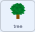

## अधिक स्प्राईट्स स्क्रोल करा

<div style="display: flex; flex-wrap: wrap">
<div style="flex-basis: 200px; flex-grow: 1; margin-right: 15px;">
तुमच्या दृश्यामध्ये अधिक स्प्राइट्स जोडताना, त्यांना डावीकडे आणि उजवीकडे स्क्रोल करणे देखील आवश्यक आहे.
</div>
<div>
{:width="300px"}
</div>
</div>

आता तुम्ही तुमच्या दृश्यामध्ये आणखी काही वस्तू जोडू शकता आणि त्यांना त्याच प्रकारे स्क्रोल करू शकता.

--- task ---

तुमच्या प्रोजेक्टमध्ये **tree** स्प्राईट जोडा, आणि त्यानंतर त्याची सुरूवातीची पोजिशन सेट करा.


```blocks3
when I receive [start v]
go to x:(0) y:(-80)
```

--- /task ---

**tree** स्प्राईट ब्रॉडकास्टच्या देखील **opposite** दिशेत हलायला हवे.


झाड व्हीवरच्या जवळ असल्याने, प्रत्येक वेळी बटन किंवा की दाबल्यावर ते टेकड्यांपेक्षा जास्त अंतरावर जात असल्याचे दिसले पाहिजे.

--- task ---

हा हलण्याचा परिणाम मिळण्यासाठी, `x`{:class='block3motion'}व्हॅल्यू ज्याने **tree** स्प्राईट जेव्हा `left`{:class="block3events"} आणि `right`{:class="block3events"} ब्रॉडकास्ट प्राप्त झाल्यावर हलतो त्या बदला.


```blocks3
when I receive [left v]
change x by (10) //Use a bigger number than for the hills

when I receive [right v]
change x by (-10) //Use a bigger number than for the hills
```

--- /task ---

--- task ---

**Test:** Click the green flag and check your left and right buttons now. तुम्ही प्रत्येक वेळी कंट्रोलरवर क्लिक केल्यावर झाड हलायला हवे.

**चाचणी:** तुम्ही झाडापासून शक्य तेवढे दूर गेल्यावर काय घडते?

--- /task ---

झाड स्क्रीनच्या अगदी कडेला पोहोचल्यावर ते हलणे थांबते हे तुमच्या लक्षात आले का? हे तुम्ही स्क्रीनच्या दुसऱ्या बाजूला झाड हलवून ठीक करू शकता, जेव्हा `x`{:class='block3motion'} कोऑर्डीनेट फार मोठा किंवा फार कमी असल्यावर.

--- task ---

`forever`{:class='block3control'} लूपचा, आणि `if`{:class='block3control'} ब्लॉक्सचा वापर करून, झाडाचे `x`{:class='block3motion'} कोऑर्डीनेट तपासा, आणि ते स्क्रीनच्या दुसऱ्या बाजूला हलवा जेव्हा `x`{:class='block3motion'} हा `290` पेक्षा मोठी किंवा `-290` पेक्षा लहान असतो.


```blocks3
when I receive [start v]
go to x:(-90) y:(-80)
+ forever
if <(x position) > (290)> then //The tree is at the far right
set x to (-280) //Move the tree to the far left
end
if <(x position) < (-290)> then //The tree is at the far left
set x to (280) //Move the tree to the far right
end
end
```

--- /task ---

--- task ---

तुमचा **rover** स्प्राईट आता स्क्रीनच्या भोवती हलवा. झाड कडेला पोहोचल्यावर, तो स्क्रीनच्या कडेवरून नाहीसे होऊन दुसऱ्या बाजूला पुन्हा दिसायला हवे.

--- /task ---

--- task ---

Lastly, make the **rover** turn left and right so that it faces the direction it is moving in, and resets at the start.


```blocks3
when flag clicked
broadcast [start v]
+ set rotation style [left-right v]

when I receive [left v]
point in direction (-90)

when I receive [right v]
point in direction (90)

when I receive [start v]
set size to (50) %
go to x: (0) y: (-90)
go to [front v] layer
+ point in direction (90)
```

--- /task ---

--- task ---

**चाचणी**: तुमचा प्रोजेक्ट रन करा आणि त्याची तपासणी करा. झाड स्क्रीनच्या कडेवरून पडताना दिसत आहे आणि रोव्हर हलते तेव्हा दुसऱ्या बाजूला दिसत असल्याची खात्री करा.

--- /task ---
