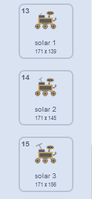

## दुसरा नमूना तयार करा

<div style="display: flex; flex-wrap: wrap">
<div style="flex-basis: 200px; flex-grow: 1; margin-right: 15px;">
रोव्हरचे पुढील नमूने कोणते ते निवडा! त्यात वनस्पती, बग किंवा प्राणी यांची नवीन प्रजाती दिसते का? त्यात काही पाणी किंवा रहस्यमय द्रव दिसतो का? त्याला काही धूळ किंवा खडक किंवा हवेचा नमुना घ्यायचा आहे का? किंवा काहीतरी आणखी?
</div>
<div>
{:width="300px"}
</div>
</div>

--- task ---

**निवडा:** रोव्हरला गोळा करण्यासाठी नवीन **sample** स्प्राईट जोडा. हे तुम्ही तुमच्या प्रोजेक्टला लायब्ररी मधून सिलेक्ट करून किंवा स्वतःचे चित्र काढून जोडू शकता.

--- /task ---

स्क्रोल करण्यासाठी तुमचा **sample** स्प्राईट मिळवा. तो स्क्रीनवर कमी असल्यास तो अधिक (`change x by`{:class='block3motion'} हलायला हवा तो `5`) पेक्षा मोठा असायला हवा, आणि तो स्क्रीनवर मोठा असल्यास तो कमी (`change x by`{:class='block3motion'} हलायला हवा तो `5`) पेक्षा लहान असायला हवा.

--- task ---

तुमचा स्प्राईट स्क्रोल करण्यासाठी कोड जोडा.

--- /task ---

**निवडा:** रोव्हरने पुढे कशाचा नमूना घ्यावा याआधारे, तुम्ही रोव्हर ऍनिमेशनचा वापर करू शकता जे आधीच उपलब्ध आहे, किंवा कॉश्चुम डुप्लीकेट करून आणि एडिट करून अधिक ऍनिमेशन सिक्वेंस तयार करू शकता.

--- task ---

`My Blocks`{:class='block3myblocks'} ब्लॉक तुमच्या **rover** स्प्राईटला जोडा नवीन नमूना गोळा केल्यावर रोव्हर ऍनिमेट करण्यासाठी. तुम्ही तयार केलेल्या एका `My Blocks`{:class='block3myblocks'} मधून कोड कॉपी आणि पेस्ट करू शकता.

उदाहरणार्थ, सोलर एनर्जी गोळा करण्यासाठी येथे कॉश्चुम सिक्वेंस आहे:



कॉश्चुमची ही सीरिज ऍनिमेट करण्यासाठी, तुम्ही खालील कोडचा वापर करू शकता:

```blocks3
define recharge
switch costume to [inactive v]
wait (0.3) seconds
switch costume to [solar 1 v]
wait (0.3) seconds
switch costume to [solar 2 v]
wait (0.3) seconds
switch costume to [solar 3 v]
wait (0.3) seconds
switch costume to [solar 2 v]
wait (0.3) seconds
switch costume to [solar 1 v]
wait (0.3) seconds
switch costume to [inactive v]
wait (0.3) seconds
```

--- /task ---

--- task ---

पुढे, नवीन मेसेज `broadcast`{:class='block3events'} कराल तुमच्या नवीन `My Block`{:class='block3myblocks'} ब्लॉकमध्ये ज्यामुळे `costume`{:class='block3looks'} किंवा `graphic effect`{:class='block3looks'} हा **sample** स्प्राईटमध्ये बदलतो.

--- /task ---

--- task ---

रोव्हर स्प्राईटला स्पर्श करतो आहे का किंवा स्प्राईटच्या रंगाला स्पर्श करतो आहे का हे ओळखण्यासाठी `if`{:class='block3control'} ब्लॉकचा वापर करा, जेणेकरून नवीन `My Block`{:class='block3myblocks'} ब्लॉकचाच त्यानंतर वापर केला जाईल.

--- /task ---

--- task ---

तुम्हाला आवडत असल्यास, स्प्राईटला ऍनिमेशन जोडा, जेणेकरून रोव्हरने नमूना गोळा केल्यावर त्याचे स्वरूप बदलेल.

--- /task ---

--- save ---
