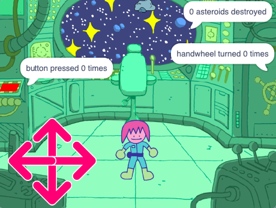

## पुढे काय?

तुम्ही [Further Scratch](https://projects.raspberrypi.org/en/pathways/further-scratch) मार्गाचे अनुसरण करत असलात, तर तुम्ही [Puzzle room](https://projects.raspberrypi.org/en/projects/puzzle-room) प्रोजेक्टवर जाऊ शकता. या प्रोजेक्टमध्ये, तुम्ही कॅरेक्टरसह स्पेस शिप पझल रूम तयार कराल जी कोडे सोडवेल.

--- print-only ---

--- /print-only ---

--- no-print ---

  <iframe allowtransparency="true" width="485" height="402" src="https://scratch.mit.edu/projects/embed/536877672/?autostart=false" frameborder="0"></iframe>

--- /no-print ---

तुम्हाला Scratch एक्स्प्लोर करण्यात आणखी मजा हवी असेल, तर तुम्ही [या प्रोजेक्टपैकी](https://projects.raspberrypi.org/en/projects?software%5B%5D=scratch&curriculum%5B%5D=%201) कशाचाही वापर करू शकता.
