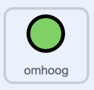

## Bestuur de rover

<div style="display: flex; flex-wrap: wrap">
<div style="flex-basis: 200px; flex-grow: 1; margin-right: 15px;">
In deze stap gebruik je een controller op het scherm of het toetsenbord om je rover omhoog en omlaag te bewegen.
</div>
<div>
{:width="300px"}
</div>
</div>

--- task ---

Open het startersproject online op [scratch.mit.edu/projects/740719456](https://scratch.mit.edu/projects/740719456){:target="_blank"}.

--- collapse ---
---
title: Offline werken
---

Als je offline werkt, kun je het startersproject vinden op [rpf.io/p/nl-NL/nature-rover-go](https://rpf.io/p/nl-NL/nature-rover-go)

--- /collapse ---


--- /task ---

Je zou een scène moeten zien met een robotrover, een heuvelachtige achtergrond en een controller in de linkerbenedenhoek.


Je gaat de controller of het toetsenbord gebruiken zodat het lijkt of de rover naar of weg van de kijker beweegt.

--- task ---

Kijk naar het **Code** tabblad voor elk van de knoppen. De code ziet er ongeveer zo uit:



```blocks3
when this sprite clicked
broadcast (omhoog v)

when I receive [start v]
forever
go to [front v] layer
go to x:(-190) y: (-121)
end
```

Dit houdt de knoppen in de juiste positie en zendt hun richtingen uit wanneer ze worden aangeklikt.

--- /task ---

De **rover** gaat het begin van het spel voor alle andere sprites besturen; dus wanneer op de groene vlag wordt geklikt, moet de **rover** sprite een `start`{:class='block3events'} bericht uitzenden.

--- task ---

Voeg het bericht toe aan een `wanneer op de groene vlag is geklikt`{:class='block3events'} blok.


```blocks3
when flag clicked
broadcast [start v]
```

--- /task ---

--- task ---

Als je op een computer werkt, is het misschien gemakkelijker om de toetsenbordknoppen te gebruiken in plaats van de knoppen te gebruiken. Toetsenbordbesturing kan worden toegevoegd aan de **rover** sprite.


```blocks3
when [up arrow v] key pressed
broadcast [omhoog v]

when [down arrow v] key pressed
broadcast [omlaag v]

when [right arrow v] key pressed
broadcast [rechts v]

when [left arrow v] key pressed
broadcast [links v]
```

Als je de controller niet wilt gebruiken, klik dan op elk van de **knop** sprites en klik op het `verbergen`{:class='block3looks'} blok in het `uiterlijken`{:class='block3looks'}
menu.

```blocks3
hide
```

--- /task ---

Wanneer op de **omhoog** knop wordt geklikt of op de <kbd>pijl-omhoog</kbd> wordt gedrukt, moet de **rover** zijn `y`{:class="block3motion"} positie een klein beetje veranderen. Als `y`{:class="block3motion"} wordt verhoogd, beweegt de **rover** omhoog. Door `y`{:class="block3motion"} te verlagen, beweegt de **rover** omlaag.

--- task ---

Voeg code toe zodat de **omhoog** knop de **rover** omhoog beweegt.


```blocks3
when I receive [omhoog v]
change y by (10)

when I receive [omlaag v]
change y by (-10)
```

--- /task ---

**Je hoeft je nog geen zorgen te maken over de linker- en rechterbeweging. Linker- en rechterbeweging worden toegevoegd in de volgende stap van het project.**

<p style="border-left: solid; border-width:10px; border-color: #0faeb0; background-color: aliceblue; padding: 10px;">
<span style="color: #0faeb0">**Perspectief**</span> wordt gebruikt in computergraphics om een scène realistischer te maken. Objecten die ver weg zijn, verschijnen normaal gesproken kleiner en hoger op het scherm. Objecten die dichtbij zijn, verschijnen groter en lager op het scherm.
</p>

--- task ---

Voeg **perspectief** toe aan je **rover** door hem kleiner te maken wanneer hij naar boven beweegt, en groter wanneer hij naar beneden beweegt.


```blocks3
when I receive [omhoog v]
change y by (10)
change size by (-1) //Kleiner lijkt verder weg


when I receive [omlaag v]
change y by (-10)
change size by (1) //Groter ziet er dichterbij uit
```

--- /task ---

--- task ---

Je moet de grootte van de **rover** aan het begin van het spel resetten.

```blocks3
when I receive [start v]
set size to (50) %
```

--- /task ---


--- task ---

**Test:** Klik op de **omhoog** en **omlaag** knoppen om de besturing van je **rover** te testen, of gebruik de pijltjestoetsen.

--- /task ---

--- task ---

Reset nu de positie van de **rover** telkens wanneer het spel begint.


```blocks3
when I receive [start v]
set size to (50) %
+ go to x: (0) y: (-90)
```

--- /task ---

--- task ---

Voorlopig zou de **rover** voor de andere sprites moeten verschijnen. Verplaats de **rover** naar de voorgrond.


```blocks3
when I receive [start v]
set size to (50) %
go to x: (0) y: (-90)
+ go to [front v] layer
```

--- /task ---

--- task ---

**Test**: Klik op de groene vlag om te testen of je spel correct wordt gereset.

--- /task ---

--- save ---
