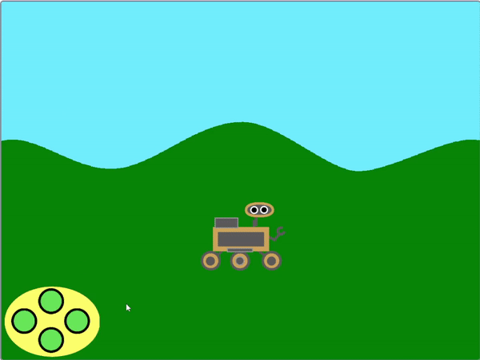
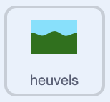
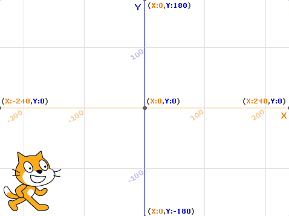

## Laat de achtergrond bewegen

<div style="display: flex; flex-wrap: wrap">
<div style="flex-basis: 200px; flex-grow: 1; margin-right: 15px;">
Om het te laten lijken dat de rover naar links en rechts beweegt, laat je niet de **rover** sprite bewegen, maar de **achtergrond** sprite naar links of rechts bewegen.
</div>
<div>
{:width="300px"}
</div>
</div>

--- task ---

Selecteer de **heuvels** sprite. Aan het begin van het spel moet je ervoor zorgen dat het zich op de juiste positie en op de achterste laag bevindt.



```blocks3
when I receive [start v]
go to [back v] layer
go to x: (0) y: (0)
```

--- /task ---

<p style="border-left: solid; border-width:10px; border-color: #0faeb0; background-color: aliceblue; padding: 10px;">
<span style="color: #0faeb0">**Lagen**</span> zijn als gestapelde vellen helder plastic waarop je afbeeldingen kunt tekenen. Als een afbeelding aan de bovenkant van de stapel de afbeelding eronder bedekt, kun je de onderste afbeelding niet goed zien. Achtergrondafbeeldingen moeten in de buurt van de **achterlaag** zijn. Afbeeldingen die dichter bij de kijker staan, moeten zich in de buurt van de **voorste** laag bevinden.
</p>

--- task ---

De **heuvels** sprite moet een kopie van zichzelf maken. Deze worden `klonen`{:class='block3control'} genoemd. Vervolgens kan de originele sprite naar de rechterkant van het scherm worden verplaatst.


```blocks3
when I receive [start v]
go to [back v] layer
go to x: (0) y: (0)
+ create clone of [myself v] //Maak een kopie van de heuvels
+ change x by (460) //Verplaats de originele heuvels naar de rechterkant van het scherm
```

--- /task ---

Wanneer de `links`{:class='block3events'} en `rechts`{:class='block3events'} berichten worden ontvangen, zou de **heuvels** sprite moeten bewegen. Om het idee van het bewegen in de juiste richting te geven, beweegt de achtergrond **naar links** wanneer de **rover** naar rechts beweegt. De bewegingsrichting moet **tegenovergesteld** zijn aan het `zend signaal`{:class='block3events'}.

Dus als het bericht `links`{:class="block3events"} is, zal de `x`{:class="block3motion"} positie toenemen. Als het bericht `rechts`{:class="block3events"} is, zal de `x`{:class="block3motion"} van de **heuvels** afnemen.



--- task ---

Voeg blokken toe om de beweging van de **heuvels** sprite en de kloon te regelen.


```blocks3
when I receive [links v]
change x by (3)

when I receive [rechts v]
change x by (-3)
```

--- /task ---

--- task ---

**Test**: Gebruik de controller of de <kbd>pijl</kbd> toetsen om te bewegen. Het lijk erop of de de rover naar links en rechts beweegt.

--- /task ---

Op dit moment zijn er twee exemplaren van de **heuvels** sprite: Het origineel en een kloon. Wanneer je aan het einde van een van beide komt, zul je zien dat het scherm gewoon wit is.

Om dit op te lossen moeten de sprite en de kloon naar de andere kant van het scherm worden verplaatst wanneer ze te ver gaan.

--- task ---

Maak een nieuw bericht met de naam `beweeg`{:class='block3events'} en voeg deze toe aan het `start`{:class='block3events'} script.


```blocks3
when I receive [start v]
go to [back v] layer
go to x: (0) y: (0)
create clone of [myself v]
change x by (460) 
+ broadcast [bewegen v]
```

--- /task ---

--- task ---

Voeg code toe om te controleren of de **heuvels** sprite of de kloon te ver naar links of rechts zijn verplaatst, en zet vervolgens de posities terug naar de andere kant van het scherm.


```blocks3
when I receive [bewegen v]
forever
if <(x position) > (460)> then //De heuvels sprite is van de rechterkant van het scherm gevallen
set x to (-460) //Reset naar de linkerkant van het scherm
end
if <(x position) < (-460)> then //De heuvels sprite is van de linkerkant van het scherm gevallen
set x to (460) //Reset naar de rechterkant van het scherm
end
```

--- /task ---

--- task ---

**Test**: Gebruik de controller of <kbd>pijl</kbd> toetsen om de **rover** te verplaatsen. De achtergrond zou moeten schuiven en de **rover** zou nooit het einde moeten bereiken

--- /task ---

--- save ---
