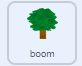
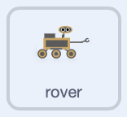

## Laat meer sprites bewegen

<div style="display: flex; flex-wrap: wrap">
<div style="flex-basis: 200px; flex-grow: 1; margin-right: 15px;">
Wanneer je meer sprites aan je scène toevoegt, moeten deze ook naar links en rechts bewegen.
</div>
<div>
{:width="300px"}
</div>
</div>

Nu kun je nog meer objecten aan je scène toevoegen en deze op dezelfde manier laten bewegen.

--- task ---

Voeg een **boom** sprite toe aan je project en stel vervolgens de beginpositie in.


```blocks3
when I receive [start v]
go to x:(0) y:(-80)
```

--- /task ---

De **boom** sprite moet ook in de **tegenovergestelde** richting van het bericht bewegen.


Naarmate de boom dichter bij de kijker staat, zou deze een grotere afstand moeten lijken te verplaatsen dan de heuvels telkens wanneer op de knop of toets wordt gedrukt.

--- task ---

Om dit bewegende effect te krijgen, wijzig je de `x`{:class='block3motion'} waarden die de **boom** sprite beweegt wanneer de `links`{:class="block3events"} en `rechts`{:class="block3events"} berichten worden ontvangen.


```blocks3
when I receive [left v]
change x by (10) //Use a bigger number than for the hills

when I receive [right v]
change x by (-10) //Use a bigger number than for the hills
```

--- /task ---

--- task ---

**Test:** Click the green flag and check your left and right buttons now. De boom moet elke keer bewegen als je op de controller klikt.

**Test:** wat gebeurt er als je zo ver weg van de boom gaat als je kunt?

--- /task ---

Heb je gemerkt dat wanneer de boom de rand van het scherm bereikt, deze stopt met bewegen? Je kunt dit oplossen door de boom naar de andere kant van het scherm te verplaatsen wanneer de `x`{:class='block3motion'} coördinaat te hoog of te laag is.

--- task ---

Gebruik een `herhaal`{:class='block3control'} lus, en `als`{:class='block3control'} blokken, controleer de `x`{:class='block3motion'} coördinaat van de boom en verplaats deze naar de andere kant van het scherm wanneer `x`{:class='block3motion'> hoger is dan `290` of lager is dan `-290`.


```blocks3
when I receive [start v]
go to x:(-90) y:(-80)
+ forever
if <(x position) > (290)> then //The tree is at the far right
set x to (-280) //Move the tree to the far left
end
if <(x position) < (-290)> then //The tree is at the far left
set x to (280) //Move the tree to the far right
end
end
```

--- /task ---

--- task ---

Beweeg nu je **rover** sprite over het scherm. Wanneer de boom de rand bereikt, zou deze van de rand van het scherm moeten verdwijnen en weer aan de andere kant moeten verschijnen.

--- /task ---

--- task ---

Lastly, make the **rover** turn left and right so that it faces the direction it is moving in, and resets at the start.



```blocks3
when flag clicked
go to [front v] layer
broadcast [start v]
+ set rotation style [left-right v]

when I receive [left v]
point in direction (-90)

when I receive [right v]
point in direction (90)

when I receive [start v]
set size to (50) %
go to x: (0) y: (-90)
go to [front v] layer
+ point in direction (90)
```

--- /task ---

--- task ---

**Test**: Voer je project uit en test het. Zorg ervoor dat de boom van de rand van het scherm lijkt te vallen en aan de andere kant verschijnt wanneer de rover beweegt.

--- /task ---
