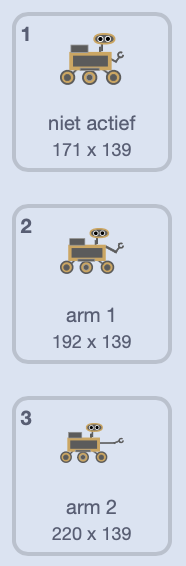

## Neem een monster

<div style="display: flex; flex-wrap: wrap">
<div style="flex-basis: 200px; flex-grow: 1; margin-right: 15px;">
In deze stap verander je het uiterlijk van een sprite en de rover om de rover te laten zien die monsters verzamelt.
</div>
<div>
{:width="300px"}
</div>
</div>

--- task ---

Kijk naar de **rover** sprite's uiterlijken. Er zijn zes animaties beschikbaar. De **rover** kan:
- Zijn arm uitschuiven



- In de grond boren
- Lucht opzuigen
- Een zonnepaneel openen
- Een foto maken
- Iets opscheppen

--- /task ---

Wanneer je veel code in Scratch wilt organiseren, zoals verschillende wijzigingen van uiterlijken, is het handig om `Mijn blokken`{:class="block3myblocks"} te gebruiken. Hiermee kun je je eigen (aangepaste) blokken maken.

Je **rover** sprite heeft een `Mijn blok`{:class="block3myblocks"} voor elke animatie.

--- task ---

Klik in het menu `Mijn blokken`{:class="block3myblocks"} op **Maak een blok** en noem je nieuwe blok `fruitmonster`{:class="block3myblocks"}.

--- /task ---

Er zou een nieuw blok in je script moeten verschijnen. Het ziet er als volgt uit:


```blocks3
define sample fruit
```

--- task ---

Voeg onder dit blok een paar `verander uiterlijk naar`{:class="block3looks"} blokken en `wacht`{:class="block3control"} blokken toe om de robot te animeren.

**Tip:** het is sneller om je eerste `verander uiterlijk`{:class='block3looks'} blok en `wacht`{:class='block3control'} blok te maken, ze vervolgens te dupliceren en het gebruikte uiterlijk te veranderen.


```blocks3
define sample fruit //Animates the robot to collect fruit
switch costume to (inactive v)
wait (0.3) seconds
switch costume to (arm 1 v)
wait (0.3) seconds
switch costume to (arm 2 v)
wait (0.3) seconds
switch costume to (arm 1 v)
wait (0.3) seconds
switch costume to (inactive v)
```

--- /task ---

--- task ---

Voeg een blok toe zodat de **rover** sprite een geluid afspeelt wanneer hij het fruitmonster verzamelt.


```blocks3
define sample fruit //Animates the robot to collect fruit
switch costume to (inactive v)
wait (0.3) seconds
switch costume to (arm 1 v)
wait (0.3) seconds
switch costume to (arm 2 v)
wait (0.3) seconds
+ start sound (Collect v)
switch costume to (arm 1 v)
wait (0.3) seconds
switch costume to (inactive v)
```

--- /task ---


--- task ---

Je kunt op het `definieer fruitmonster`{:class="block3myblocks"} blok klikken om de animatie te bekijken. Als je op een klein scherm werkt, moet je misschien goed kijken.

De animatie wordt echter niet uitgevoerd als je op de groene vlag klikt, omdat je je nieuwe `fruitmonster`{:class='block3myblocks'} nog niet hebt gebruikt in je project.

--- /task ---

--- task ---

Om je nieuwe blok te gebruiken, kun je het koppelen aan een `gebeurtenissen`{:class="block3events"} blok. In het `Mijn blokken`{:class="block3myblocks"} menu zou je het blok moeten zien dat je hebt gemaakt. Gebruik het in het volgende script.


```blocks3
when this sprite clicked
sample fruit ::custom //Run the animation
```

--- /task ---

--- task ---

Klik op de **rover** sprite en je zou de animatie moeten zien.

--- /task ---

Nu moet je ervoor zorgen dat de rover daadwerkelijk een monster verzamelt. In dit voorbeeld zal de rover fruit uit een boom verzamelen.

--- task ---

De **boom** sprite moet worden bewerkt om hem twee verschillende uiterlijken te geven. Een met fruit (`boom met fruit`{:class="block3looks"}), en een zonder fruit (`boom zonder fruit`{:class="block3looks"}). Bewerk een van de uiterlijken, zodat de **boom** twee verschillende uiterlijken heeft.

--- /task ---

--- task ---

Voeg aan de **boom** sprite blokken toe om het uiterlijk van de **boom** aan het begin van het project in te stellen, en het uiterlijk waar het naar moet overschakelen wanneer het een `fruitmonster`{:class="block3events"} bericht ontvangt.


```blocks3
when I receive [start v]
go to x:(-90) y:(-80)
+ switch costume to (tree with fruit v)
forever
if <(x position) > (290)> then
set x to (-280)
end
if <(x position) < (-290)> then
set x to (280)
end
end

+ when I receive [sample fruit v]
+ switch costume to (tree without fruit v)
```

--- /task ---

--- task ---

Aan de **rover** sprite kun je de nieuwe `zend signaal`{:class="block3events"} blokken gebruiken om de verandering van uiterlijk te activeren. Voeg deze nieuwe `zend signaal`{:class="block3events"} blokken toe aan je `definieer fruitmonster`{:class="block3myblocks"} functie.


```blocks3
define sample fruit
switch costume to (inactive v)
wait (0.3) seconds
switch costume to (arm 1 v)
wait (0.3) seconds
switch costume to (arm 2 v)
wait (0.3) seconds
+ broadcast (sample fruit v)
switch costume to (arm 1 v)
wait (0.3) seconds
switch costume to (inactive v)
```

--- /task ---

--- task ---

**Test:** om te controleren of je code werkt, klik je op de vlag en vervolgens op je **rover** sprite. De arm zou moeten uitstrekken, en de **boom** sprite zou van uiterlijk moeten veranderen.

**Tip:** Schakel over naar de modus volledig scherm en je kunt de animatie gemakkelijker zien.

--- /task ---

De rover zou het fruit alleen moeten kunnen verzamelen als hij het raakt.

--- task ---

Wijzig op de **rover** sprite de `wanneer op deze sprite wordt geklikt`{:class="block3events"} reeks blokken, zodat de `fruitmonster`{:class="block3myblocks"} functie alleen wordt aangeroepen als de **rover** sprite de kleur van je vrucht raakt.

**Tip:** Je uiterlijk verandert van het testen en kan betekenen dat het fruit niet zichtbaar is. Klik op het tabblad kostuums voor de **boom** sprite en schakel over naar het kostuum met het zichtbare fruit.


```blocks3
when this sprite clicked
if <touching color (#FFA500) ?> then //Colour of fruit
sample fruit ::custom
```

--- /task ---

--- task ---

Nu de **boom** sprite verandert wanneer een fruit wordt verzamelt, moet je de sprite resetten naar zijn eerste uiterlijk wanneer het van het scherm komt.


```blocks3
when I receive [start v]
go to x:(-90) y:(-80)
switch costume to (tree with fruit v)
forever
if <(x position) > (290)> then
set x to (-280)
+ switch costume to (tree with fruit v)
end
if <(x position) < (-290)> then
set x to (280)
+ switch costume to (tree with fruit v)
end
end
```

--- /task ---

--- task ---

**Test:** Verplaats de **rover** sprite zodat deze het fruit raakt, klik dan op de **rover** sprite en kijk hoe het de vruchten uit de boom verzamelt.

--- /task ---


--- save ---
