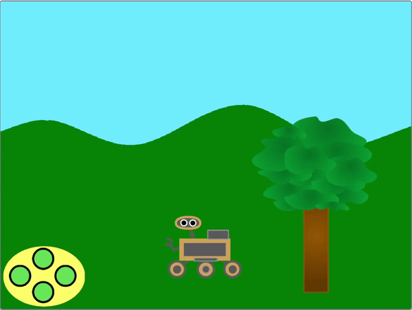
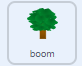

## Neem een monster

<div style="display: flex; flex-wrap: wrap">
<div style="flex-basis: 200px; flex-grow: 1; margin-right: 15px;">
In deze stap verander je het uiterlijk van een sprite en de rover om de rover te laten zien die monsters verzamelt.
</div>
<div>
{:width="300px"}
</div>
</div>

--- task ---

Kijk naar de **rover** sprite's uiterlijken. Er zijn zes animaties beschikbaar. De **rover** kan:
- Zijn arm uitschuiven


- In de grond boren
- Lucht opzuigen
- Een zonnepaneel openen
- Een foto maken
- Iets opscheppen

--- /task ---

Wanneer je veel code in Scratch wilt organiseren, zoals verschillende wijzigingen van uiterlijken, is het handig om `Mijn blokken`{:class="block3myblocks"} te gebruiken. Hiermee kun je je eigen (aangepaste) blokken maken.

Je **rover** sprite heeft een `Mijn blok`{:class="block3myblocks"} voor elke animatie.

--- task ---

Klik in het menu `Mijn blokken`{:class="block3myblocks"} op **Maak een blok** en noem je nieuwe blok `fruitmonster`{:class="block3myblocks"}.

--- /task ---

Er zou een nieuw blok in je script moeten verschijnen. Het ziet er als volgt uit:


```blocks3
define sample fruit
```

--- task ---

Voeg onder dit blok een paar `verander uiterlijk naar`{:class="block3looks"} blokken en `wacht`{:class="block3control"} blokken toe om de robot te animeren.

**Tip:** het is sneller om je eerste `verander uiterlijk`{:class='block3looks'} blok en `wacht`{:class='block3control'} blok te maken, ze vervolgens te dupliceren en het gebruikte uiterlijk te veranderen.


```blocks3
define sample fruit //Animates the robot to collect fruit
switch costume to (inactive v)
wait (0.3) seconds
switch costume to (arm 1 v)
wait (0.3) seconds
switch costume to (arm 2 v)
wait (0.3) seconds
switch costume to (arm 1 v)
wait (0.3) seconds
switch costume to (inactive v)
```

--- /task ---

--- task ---

Add a block so that the **rover** sprite plays a sound when it collects the fruit sample. You can find the **Collect** sound in the Sound gallery.


```blocks3
define sample fruit //Animates the robot to collect fruit
switch costume to (inactive v)
wait (0.3) seconds
switch costume to (arm 1 v)
wait (0.3) seconds
switch costume to (arm 2 v)
wait (0.3) seconds
+ start sound (Collect v)
switch costume to (arm 1 v)
wait (0.3) seconds
switch costume to (inactive v)
```

--- /task ---


--- task ---

Je kunt op het `definieer fruitmonster`{:class="block3myblocks"} blok klikken om de animatie te bekijken. Als je op een klein scherm werkt, moet je misschien goed kijken.

De animatie wordt echter niet uitgevoerd als je op de groene vlag klikt, omdat je je nieuwe `fruitmonster`{:class='block3myblocks'} nog niet hebt gebruikt in je project.

--- /task ---

--- task ---

Om je nieuwe blok te gebruiken, kun je het koppelen aan een `gebeurtenissen`{:class="block3events"} blok. In het `Mijn blokken`{:class="block3myblocks"} menu zou je het blok moeten zien dat je hebt gemaakt. Gebruik het in het volgende script.


```blocks3
when this sprite clicked
sample fruit ::custom //Run the animation
```

--- /task ---

--- task ---

Klik op de **rover** sprite en je zou de animatie moeten zien.

--- /task ---

Nu moet je ervoor zorgen dat de rover daadwerkelijk een monster verzamelt. In dit voorbeeld zal de rover fruit uit een boom verzamelen.

--- task ---

The **tree** sprite needs two costumes, one without fruit on (`tree without fruit`{:class="block3looks"}), and one with fruit (`tree with fruit`{:class="block3looks"}). Add another costume to the **tree**, change the names and draw some fruit on the **with fruit** one.


--- /task ---

--- task ---

On the **tree** sprite, add blocks to set the costume of the **tree** at the start of the project, and the costume it should switch to when it receives a `sample fruit`{:class="block3events"} broadcast.



```blocks3
when I receive [start v]
go to x:(-90) y:(-80)
+ switch costume to (tree with fruit v)
forever
if <(x position) > (290)> then
set x to (-280)
end
if <(x position) < (-290)> then
set x to (280)
end
end

+ when I receive [sample fruit v]
+ switch costume to (tree without fruit v)
```

--- /task ---

--- task ---

On the **rover** sprite, you can use the new `broadcast`{:class="block3events"} to trigger the costume change. Add this new `broadcast`{:class="block3events"} into your `define sample fruit`{:class="block3myblocks"} function.


```blocks3
define sample fruit
switch costume to (inactive v)
wait (0.3) seconds
switch costume to (arm 1 v)
wait (0.3) seconds
switch costume to (arm 2 v)
start sound (Collect v)
wait (0.3) seconds
+ broadcast (sample fruit v)
switch costume to (arm 1 v)
wait (0.3) seconds
switch costume to (inactive v)
```

--- /task ---

--- task ---

**Test:** To check that your code is working, click on the flag, and then click on your **rover** sprite. Its arm should extend, and the **tree** sprite should change costumes.

**Tip:** Switch to full screen mode and you will be able to see the animation more easily.

--- /task ---

The rover should only be able to collect the fruit, if it is touching it.

--- task ---

On the **rover** sprite, change the `when this sprite clicked`{:class="block3events"} set of blocks, so that the `sample fruit`{:class="block3myblocks"} function is only called if the **rover** sprite is touching the colour of your fruit.

**Tip:** Your costume change from testing might mean that the fruit is not visible. Just click on the costumes tab for the **tree** sprite, and switch to the costume with the visible fruit.


```blocks3
when this sprite clicked
if <touching color (#FFA500) ?> then //Colour of fruit
sample fruit ::custom
```

--- /task ---

--- task ---

Now that the **tree** sprite changes when a fruit is sampled, you need to reset the sprite to its first costume when it goes off the screen.


```blocks3
when I receive [start v]
go to x:(-90) y:(-80)
switch costume to (tree with fruit v)
forever
if <(x position) > (290)> then
set x to (-280)
+ switch costume to (tree with fruit v)
end
if <(x position) < (-290)> then
set x to (280)
+ switch costume to (tree with fruit v)
end
end
```

--- /task ---

--- task ---

**Test:** Move the **rover** sprite so that it is touching the fruit, then click on the **rover** sprite and watch it collect the fruit from the tree.

--- /task ---


--- save ---
