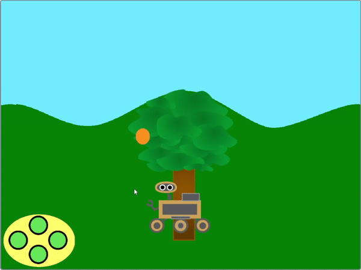
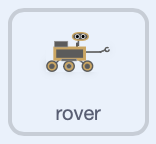

## Neem een luchtmonster

<div style="display: flex; flex-wrap: wrap">
<div style="flex-basis: 200px; flex-grow: 1; margin-right: 15px;">
Een andere manier om de rover monsters te laten verzamelen, is door sommige eigenschappen van een sprite te veranderen in plaats van het uiterlijk.
</div>
<div>
{:width="300px"}
</div>
</div>

<p style="border-left: solid; border-width:10px; border-color: #0faeb0; background-color: aliceblue; padding: 10px;">
<span style="color: #0faeb0">**Parallax beweging**</span> is wanneer achtergrondafbeeldingen langzamer voorbij de camera bewegen dan voorgrondafbeeldingen
</p>

--- task ---

Voeg een wolkensprite toe aan je project uit de bibliotheek met sprites in Scratch, of teken er zelf een, en positioneer en verklein deze onder de lucht zodat de rover hem kan bereiken.


--- /task ---

--- collapse ---
---
title: Voeg grafische effecten toe aan de wolk
---

Verander met behulp van enkele grafische effecten het uiterlijk van de wolkensprite, zodat deze eruit ziet als een wervelende gasbal. Je kunt met verschillende grafische effecten spelen, maar het onderstaande voorbeeld maakt de sprite een beetje transparant en laat hem ronddraaien.


```blocks3
when I receive [start v]
show
go to x: (190) y: (14)
clear graphic effects
set [ghost v] effect to (60)
set size to (50) %
forever
repeat (10)
change [whirl v] effect by (50)
end
repeat (20)
change [whirl v] effect by (-50)
end
repeat (10)
change [whirl v] effect by (50)
```

--- /collapse ---

Om te kunnen bewegen moet de wolk bewegen wanneer deze de `links`{:class='block3events'} en `rechts`{:class='block3events'} berichten ontvangt. Omdat de wolk verder van de kijker verwijderd is dan de boom, zou deze elke keer een kleinere afstand moeten verplaatsen, en nog steeds aan de rand van het scherm moeten verdwijnen en weer aan de andere kant moeten verschijnen.

--- task ---

Voeg code toe om de wolk te laten bewegen. Mogelijk moet je de getallen aanpassen, afhankelijk van de grootte en positie van de sprite. Naarmate de wolk verder naar achteren zou moeten verschijnen, zou deze minder moeten bewegen dan de boom.


```blocks3
when I receive [left v]
change x by (5)

when I receive [right v]
change x by (-5)

when I receive [start v]
+ forever
if <(x position) > (250)> then
set x to (-240)
end
if <(x position) < (-250)> then
set x to (240)
end
end
```

--- /task ---

Laat de rover het luchtmonster nemen.

--- task ---

Stel een animatie-functie in voor de rover sprite, zodat deze het luchtmonster kan verzamelen. Je kunt de code uit de voorbeeldboom functie dupliceren om dit te doen.

--- collapse ---
---

title: Code dupliceren

---

Hier is een eenvoudige manier om de code voor je nieuwe functie te dupliceren.


--- /collapse ---


```blocks3
define sample air
switch costume to (inactive v)
wait (0.3) seconds
switch costume to (air 1 v)
wait (0.3) seconds
switch costume to (air 2 v)
wait (0.3) seconds
switch costume to (air 3 v)
wait (0.3) seconds
switch costume to (air 2 v)
wait (0.3) seconds
switch costume to (air 1 v)
wait (0.3) seconds
switch costume to (inactive v)
```

--- /task ---

Laat de rover een bericht naar de cloud-sprite sturen zodat hij weet wanneer de animatie moet starten.

--- task ---

Maak een nieuw zend signaal bericht met de naam `luchtmonster`{:class='block3events'} en voeg het toe aan je `luchtmonster`{:class='block3custom'} functie.


```blocks3
definieer voorbeeld lucht
verander uiterlijk naar (inactief v)
wacht (0,3) seconden
verander uiterlijk naar (lucht 1 v)
wacht (0.) seconden
verander uiterlijk naar (lucht 2 v)
wacht (0,3) seconden
verander uiterlijk naar (lucht 3 v)
wacht (0.) seconden
+ zend signaal (voorbeeld lucht v)
verander uiterlijk naar (lucht 2 v)
wacht (0.) seconden
verander uiterlijk naar (lucht 1 v)
wacht (0,3) seconden
verander uiterlijk naar (inactief v)
```

--- /task ---

De functie moet alleen worden aangeroepen als de rover de wolkensprite raakt.

--- task ---

Voeg code toe zodat de rover alleen een `luchtmonster`{:class='block3custom'} neemt `als`{:class='block3control'} `raak ik wolk`{:class='block3sensing'} waar is.


```blocks3
when this sprite clicked
if <touching color [Cloud v] ?> then
sample air ::custom
end
```

--- /task ---

Start een animatie voor het luchtmonster wanneer de rover het verzamelt. Je kunt het laten doen wat je wilt, maar in dit voorbeeld verdwijnt het terwijl het wordt opgezogen door de rover.

--- task ---

Voeg een animatie-effect toe aan de wolk die de grootte verandert.


```blocks3
when I receive [sample air v]
repeat (5)
change size by (-10) //shrink the cloud
end
hide
set size to (50) %
```

--- /task ---

--- task ---

**Test** je project door op de groene vlag te klikken en vervolgens je rover te verplaatsen totdat hij de wolk raakt. Klik op de rover en het zou moeten lijken alsof hij de wolk opzuigt.

--- /task ---

--- task ---

Wijzig nu de code van je wolk sprite zodat deze opnieuw wordt ingesteld wanneer hij van het scherm wordt verwijderd.


```blocks3
when I receive [start v]
+ forever
if <(x position) > (250)> then
set x to (-240)
show
end
if <(x position) < (-250)> then
set x to (240)
show
end
end
```

--- /task ---


--- save ---
