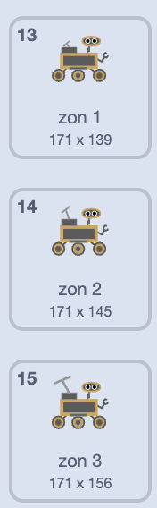

## Neem nog een monster

<div style="display: flex; flex-wrap: wrap">
<div style="flex-basis: 200px; flex-grow: 1; margin-right: 15px;">
Kies welk monster de rover nu gaat nemen! Ziet het een nieuwe soort plant, insect of dier? Ziet het wat water of mysterieuze vloeistof? Wil hij een monster van wat vuil, een steen of zelfs de lucht? Of iets anders?
</div>
<div>
{:width="300px"}
</div>
</div>

--- task ---

**Kies:** Voeg een nieuwe **sample** sprite toe voor de rover om te verzamelen. Je kunt dit aan je project toevoegen door er een te selecteren in de bibliotheek of door er een te tekenen.

--- /task ---

Laat je **monster** sprite bewegen. Als het laag op het scherm staat zou het meer moeten bewegen (`verander x met`{:class='block3motion'} moet hoger zijn dan `5`), en als het hoog op het scherm staat zou het minder moeten bewegen (`verander x met`{:class='block3motion'} moet lager zijn dan `5`).

--- task ---

Voeg code toe zodat je sprite kan schuiven.

--- /task ---

**Kies:** afhankelijk van wat je wil dat de rover als volgend monster neemt, kun je de rover-animaties gebruiken die er al zijn, of meer animatie-reeksen maken door de uiterlijken te dupliceren en te bewerken.

--- task ---

Voeg een `Mijn blokken`{:class='block3myblocks'} blok toe aan je **rover** sprite om de rover te animeren wanneer deze het nieuwe monster verzamelt. Je kunt de code kopiëren en plakken van een van de andere `Mijn blokken`{:class='block3myblocks'} die je hebt gemaakt.

Hier is bijvoorbeeld een uiterlijken reeks gemaakt voor het verzamelen van zonne-energie:



Om deze reeks uiterlijken te animeren zou je de volgende code kunnen gebruiken:

```blocks3
define opladen
switch costume to [niet actief v]
wait (0.3) seconds
switch costume to [zonne-energie 1 v]
wait (0.3) seconds
switch costume to [zonne-energie 2 v]
wait (0.3) seconds
switch costume to [zonne-energie 3 v]
wait (0.3) seconds
switch costume to [zonne-energie 2 v]
wait (0.3) seconds
switch costume to [zonne-energie 1 v]
wait (0.3) seconds
switch costume to [niet actief v]
wait (0.3) seconds
```

--- /task ---

--- task ---

Vervolgens `zend signaal`{:class='block3events'} een nieuw bericht in je nieuwe `Mijn blokken`{:class='block3myblocks'} blok dat een `uiterlijk`{:class='block3looks'} of `grafisch effect`{:class='block3looks'} verandering in het **monster**sprite zal veroorzaken.

--- /task ---

--- task ---

Gebruik een `als`{:class='block3control'} blok om te detecteren of de rover de sprite raakt of een kleur op de sprite raakt, zodat het nieuwe `Mijn blok`{:class='block3myblocks'} alleen dan wordt gebruikt.

--- /task ---

--- task ---

Als je wilt, voeg dan een animatie toe aan de sprite, zodat het uiterlijk verandert wanneer de rover het monster heeft verzameld.

--- /task ---

--- save ---
