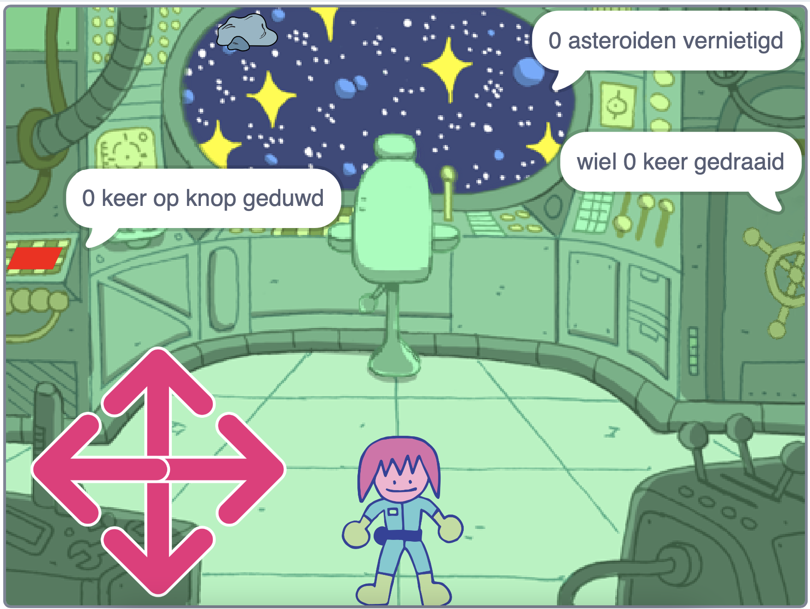

## Wat kun je verder nog doen?

Als je het [Verder met Scratch](https://projects.raspberrypi.org/nl-NL/pathways/further-scratch) pad volgt, kun je naar het [Puzzelkamer](https://projects.raspberrypi.org/nl-NL/projects/puzzle-room) project gaan. In dit project maak je een ruimte schip puzzel kamer met een personage dat de puzzels oplost.

--- print-only ---

--- /print-only ---

--- no-print ---

  <iframe allowtransparency="true" width="485" height="402" src="https://scratch.mit.edu/projects/embed/882480393/?autostart=false" frameborder="0"></iframe>

--- /no-print ---

Wil je nog meer plezier hebben met het het verkennen van Scratch, dan kun je een van [deze projecten](https://projects.raspberrypi.org/nl-NL/projects?software%5B%5D=scratch&curriculum%5B%5D=%201) proberen.

***
Dit project werd vertaald door vrijwilligers:

Iny van Beuningen
Max Schaaper
Arnout Cator

Dankzij vrijwilligers kunnen we mensen over de hele wereld de kans geven om in hun eigen taal te leren. Jij kunt ons helpen meer mensen te bereiken door vrijwillig te starten met vertalen - meer informatie op [rpf.io/translate](https://rpf.io/translate).
