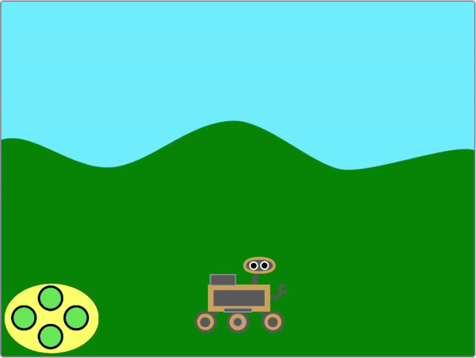
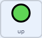

## Controle o rover

<div style="display: flex; flex-wrap: wrap">
<div style="flex-basis: 200px; flex-grow: 1; margin-right: 15px;">
Nesta etapa, você usará um controlador na tela ou o teclado para mover seu rover para cima e para baixo.
</div>
<div>
{:width="300px"}
</div>
</div>

--- task ---

Abra o projeto inicial on-line em [rpf.io/nature-rover-starter](https://rpf.io/nature-rover-starter){:target="_blank"}.

--- collapse ---
---
title: Trabalhando offline
---

Se você estiver trabalhando offline, o projeto inicial pode ser encontrado em [rpf.io/p/en/nature-rover-go](https://rpf.io/p/en/nature-rover-go)

--- /collapse ---


--- /task ---

Você deverá ver uma cena com um rover robótico, um fundo montanhoso e um controle no canto inferior esquerdo.


Você vai usar o controle ou teclado para fazer com que o rover pareça estar se movendo em direção ao observador ou se afastando dele.

--- task ---

Observe a aba **Código** para cada um dos botões. O código deve parecer com isso:



```blocks3
when this sprite clicked
broadcast (up v)

when I receive [start v]
forever
go to [front v] layer
go to x:(-190) y: (-121)
end
```

Isso mantém os botões na posição correta e transmite suas direções quando são clicados.

--- /task ---

O **rover** precisa estar visível o tempo todo, certificando-se de que esteja na camada **frontal**.

--- task ---

Adicione um `vá para a camada frontal`{:class='block3looks'} a um bloco `bandeira verde clicada`{:class='block3events'}.


```blocks3
when flag clicked
+ go to [front v] layer
```

--- /task ---

O **rover** controlará o início do jogo para todos os outros atores; então, quando a bandeira verde for clicada, o ator **rover** precisa transmitir uma mensagem `começar`{:class='block3events'}.

--- task ---

Adicione um bloco `transmita`{:class="block3events"}.


```blocks3
when flag clicked
go to [front v] layer
+ broadcast [start v]
```

--- /task ---

--- task ---

Se você estiver trabalhando em um computador, pode ser mais fácil usar os controles do teclado do que usar os botões. Os controles de teclado podem ser adicionados ao ator **rover**.


```blocks3
when [up arrow v] key pressed
broadcast [up v]

when [down arrow v] key pressed
broadcast [down v]

when [right arrow v] key pressed
broadcast [right v]

when [left arrow v] key pressed
broadcast [left v]
```

Se você não quiser usar o controlador, clique em cada um dos atores **botões** e clique no bloco `esconder`{:class='block3looks'} no menu `aparências`{:class='block3looks'}.

```blocks3
hide
```

--- /task ---

Quando o botão **para cima** é clicado ou a seta <kbd>para cima</kbd> é pressionada, o **rover** deve mudar sua posição `y`{:class="block3motion"} em uma pequena quantidade. Aumentar `y`{:class="block3motion"} fará com que o **rover** se mova para cima. Diminuir `y`{:class="block3motion"} fará com que o **rover** se mova para baixo.

--- task ---

Adicione código para que o botão **para cima** faça o **rover** se mover para cima.


```blocks3
when I receive [up v]
change y by (10)

when I receive [down v]
change y by (-10)
```

--- /task ---

**Você não precisa se preocupar com o movimento para a esquerda e para a direita ainda. O movimento para a esquerda e para a direita será adicionado na próxima etapa do projeto.**

<p style="border-left: solid; border-width:10px; border-color: #0faeb0; background-color: aliceblue; padding: 10px;">
<span style="color: #0faeb0">**Perspectiva**</span> é usada em computação gráfica para tornar uma cena mais realista. Objetos que estão distantes normalmente parecem menores e mais acima na tela. Objetos próximos parecem maiores e mais abaixo na tela.
</p>

--- task ---

Adicione **perspectiva** ao seu **rover** tornando-o menor quando ele se move para cima e maior quando ele se move para baixo.


```blocks3
when I receive [up v]
change y by (10)
change size by (-1) //Smaller looks further away


when I receive [down v]
change y by (-10)
change size by (1) //Bigger looks closer
```

--- /task ---

--- task ---

Você precisará redefinir o tamanho **do rover** no início do jogo.

```blocks3
when I receive [start v]
set size to (50) %
```

--- /task ---


--- task ---

**Teste:** Clique nos botões **para cima** e **para baixo** para verificar o controle do seu **rover** ou use as teclas de seta.

--- /task ---

--- task ---

Agora redefina a posição do **rover** cada vez que o jogo começar.


```blocks3
when I receive [start v]
set size to (50) %
+ go to x: (0) y: (-90)
```

--- /task ---

--- task ---

Por ora, o **rover** deve aparecer na frente dos outros atores. Mova o **rover** para a camada frontal.


```blocks3
when I receive [start v]
set size to (50) %
go to x: (0) y: (-90)
+ go to [front v] layer
```

--- /task ---

--- task ---

**Teste**: Clique na bandeira verde para testar se o seu jogo reinicia corretamente.

--- /task ---

--- save ---
