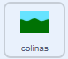

## Mova o cenário

<div style="display: flex; flex-wrap: wrap">
<div style="flex-basis: 200px; flex-grow: 1; margin-right: 15px;">
Para que o rover pareça estar se movendo para a esquerda e para a direita, em vez do ator do **rover** se mover, o ator do **fundo** se move ou rola para a esquerda ou para a direita.
</div>
<div>
{:width="300px"}
</div>
</div>

--- task ---

Selecione o ator **colinas**. No início do jogo, você precisa ter certeza de que ele está na posição correta e na camada traseira.



```blocks3
when I receive [começar v]
go to [da trás v] layer
go to x: (0) y: (0)
```

--- /task ---

<p style="border-left: solid; border-width:10px; border-color: #0faeb0; background-color: aliceblue; padding: 10px;">
<span style="color: #0faeb0">**Camadas**</span> são como folhas empilhadas de plástico transparente nas quais você pode desenhar imagens. Se uma imagem no topo da pilha estiver cobrindo a imagem abaixo dela, você não conseguirá ver a imagem de baixo corretamente. As imagens de fundo devem estar próximas da camada **traseira**. Imagens mais próximas do espectador devem estar perto da camada **frontal**.
</p>

--- task ---

O ator **colinas** precisa fazer uma cópia de si mesmo. Eles são chamados `clones`{:class='block3control'}. Então, o ator original pode ser movido para o lado direito da tela.


```blocks3
when I receive [começar v]
go to [da trás v] layer
go to x: (0) y: (0)
+ create clone of [este ator v] // Cria uma cópia das colinas
+ change x by (460) // Move as colinas originais para a direita da tela
```

--- /task ---

Quando as transmissões `esquerda`{:class='block3events'} e `direita`{:class='block3events'} forem recebidas, o ator **colinas** deve se mover. Para dar a aparência de movimento na direção correta, o fundo se move **para a esquerda** quando o **rover** está se movendo para a direita. A direção do movimento deve ser **oposta** à transmissão ``{:class='block3events'}.

Então, se a transmissão for `esquerda`{:class="block3events"}, então a posição `x`{:class="block3motion"} aumentará. Se a transmissão for `direita`{:class="block3events"}, então o `x`{:class="block3motion"} das **colinas** diminuirá.


--- task ---

Adicione blocos para controlar o movimento do ator **colinas** e seu clone.


```blocks3
when I receive [esquerda v]
change x by (3)

when I receive [direita v]
change x by (-3)
```

--- /task ---

--- task ---

**Teste**: Use o controle ou as teclas de <kbd>seta</kbd> para se movimentar. O rover deve parecer estar se movendo para a esquerda e para a direita.

--- /task ---

No momento, há duas cópias do ator **colinas**: o original e um clone. Quando você chegar ao final de qualquer um deles, notará que a tela estará toda branca.

Para corrigir isso, o ator e seu clone precisam ser movidos para o outro lado da tela quando forem longe demais.

--- task ---

Crie uma nova transmissão chamada `rolar`{:class='block3events'} e adicione-a ao script `começar`{:class='block3events'}.


```blocks3
when I receive [começar v]
go to [da trás v] layer
go to x: (0) y: (0)
create clone of [este ator v]
change x by (460) 
+ broadcast [rolar v]
```

--- /task ---

--- task ---

Adicione código para detectar se o ator **colinas** ou seu clone se moveram muito para a esquerda ou direita e, em seguida, redefina suas posições para o outro lado da tela.


```blocks3
when I receive [rolar v]
forever
if <(x position) > (460)> then // O ator das colinas está fora da tela do lado direito
set x to (-460) // Redefine para o lado esquerdo da tela
end
if <(x position) < (-460)> then // O ator das colinas está fora da tela do lado esquerdo
set x to (460) // Redefine para o lado direito da tela
end
```

--- /task ---

--- task ---

**Teste**: Clique na bandeira verde para redefinir a cena e então use o controle ou as teclas de <kbd>seta</kbd> para mover o **rover**. O fundo deve rolar, e o **rover** nunca deve chegar ao fim.

--- /task ---

--- save ---
