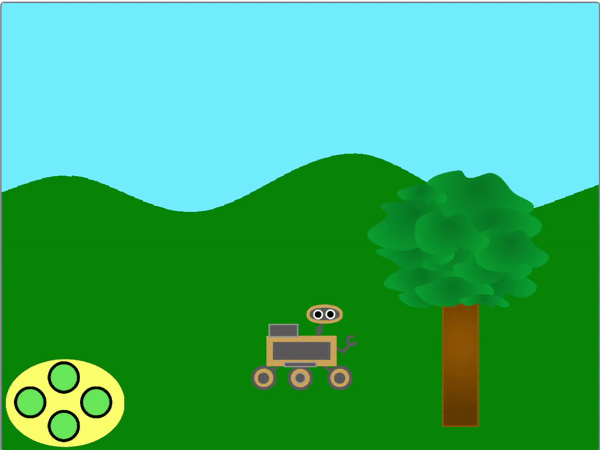

## Mova mais atores

<div style="display: flex; flex-wrap: wrap">
<div style="flex-basis: 200px; flex-grow: 1; margin-right: 15px;">
Ao adicionar mais atores à sua cena, eles também precisam se mover para a esquerda e para a direita.
</div>
<div>
{:width="300px"}
</div>
</div>

Agora você pode adicionar mais alguns objetos à sua cena e movê-los de maneira semelhante.

--- task ---

Adicione um ator **árvore** ao seu projeto e, em seguida, defina sua posição inicial.


```blocks3
when I receive [começar v]
go to x:(0) y:(-80)
```

--- /task ---

O ator da **árvore** também deve se mover na direção **oposta** à transmissão.



Como a árvore está mais perto do espectador, deve parecer se mover uma distância maior do que as colinas cada vez que o botão ou a tecla são pressionados.

--- task ---

Para obter esse efeito de movimento, altere os valores `x`{:class='block3motion'} pelos quais o ator da **árvore** se move quando as transmissões `esquerda`{:class="block3events"} e `direita`{:class="block3events"} são recebidas.


```blocks3
when I receive [esquerda v]
change x by (10) // Usa um número maior do que para as colinas

when I receive [direita v]
change x by (-10) // Usa um número maior do que para as colinas
```

--- /task ---

--- task ---

**Teste:** Clique na bandeira verde e verifique seus botões esquerdo e direito agora. A árvore deve se mover cada vez que você clicar no controle.

**Teste:** O que acontece se você se afastar o máximo possível da árvore?

--- /task ---

Você notou que quando a árvore chega na borda da tela, ela para de se mover? Você pode corrigir isso movendo a árvore para o outro lado da tela, quando sua coordenada `x`{:class='block3motion'} estiver muito alta ou muito baixa.

--- task ---

Usando um loop `sempre`{:class='block3control'}, e blocos `se`{:class='block3control'}, verifique a coordenada `x`{:class='block3motion'} da árvore, e a mova para o outro lado da tela quando `x`{:class='block3motion'} for maior que `290` ou menor que `-290`.


```blocks3
when I receive [começar v]
go to x:(-90) y:(-80)
+ forever
if <(x position) > (290)> then // A árvore está na extrema-direita
set x to (-280) // Move a árvore para a extrema-esquerda
end
if <(x position) < (-290)> then // A árvore está na extrema-esquerda
set x to (280) // Move a árvore para a extrema-direita
end
end
```

--- /task ---

--- task ---

Agora mova seu ator **rover** pela tela. Quando a árvore atingir a borda, ela deverá desaparecer da borda da tela e reaparecer do outro lado.

--- /task ---

--- task ---

Por fim, faça o **rover** virar à esquerda e à direita de modo que fique voltado para a direção em que está se movendo e reinicie no início.


```blocks3
when flag clicked
go to [da frente v] layer
broadcast [começar v]
+ set rotation style [esquerda-direita v]

when I receive [esquerda v]
point in direction (-90)

when I receive [direita v]
point in direction (90)

when I receive [começar v]
set size to (50) %
go to x: (0) y: (-90)
go to [da frente v] layer
+ point in direction (90)
```

--- /task ---

--- task ---

**Teste**: Execute e teste seu projeto. Certifique-se de que a árvore pareça cair da borda da tela e apareça do outro lado quando o rover se move.

--- /task ---
