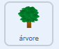

## Colete uma amostra

<div style="display: flex; flex-wrap: wrap">
<div style="flex-basis: 200px; flex-grow: 1; margin-right: 15px;">
Nesta etapa, você mudará a aparência de um ator e do rover para mostrar o rover coletando amostras.
</div>
<div>
{:width="300px"}
</div>
</div>

--- task ---

Olhe para as fantasias do ator **rover**. Há seis animações disponíveis. O **rover** pode:
- Estender o braço


- Perfurar o solo
- Sugar o ar
- Estender um painel solar
- Tirar uma foto
- Pegar alguma coisa

--- /task ---

Quando você quiser organizar muitos códigos no Scratch, como várias mudanças de fantasia, é útil usar `Meus Blocos`{:class="block3myblocks"}. Isso permite que você crie seus próprios blocos personalizados.

Seu ator **rover** terá um `Meu Bloco`{:class="block3myblocks"} para cada animação.

--- task ---

No menu `Meus Blocos`{:class="block3myblocks"}, clique em **Faça um Bloco**, e nomeie o seu novo bloco `amostra de fruta`{:class="block3myblocks"}.

--- /task ---

Um novo bloco deve aparecer no seu script. Ficará assim:


```blocks3
define amostra de fruta
```

--- task ---

Abaixo deste bloco, anexe alguns blocos `mudar a fantasia`{:class="block3looks"} e blocos `espere`{:class="block3control"} para animar o robô.

**Dica:** É mais rápido criar seu primeiro bloco `mudar a fantasia`{:class='block3looks'} e `espere`{:class='block3control'}, depois duplicá-los e alterar a fantasia que está sendo usada.


```blocks3
define amostra de fruta //Animates the robot to collect fruit
switch costume to (inativo v)
wait (0.3) seconds
switch costume to (braço 1 v)
wait (0.3) seconds
switch costume to (braço 2 v)
wait (0.3) seconds
switch costume to (braço 1 v)
wait (0.3) seconds
switch costume to (inativo v)
```

--- /task ---

--- task ---

Adicione um bloco para que o ator **rover** reproduza um som quando coletar a amostra de fruta. Você pode encontrar o som **Collect** na galeria de Sons.


```blocks3
define amostra de fruta // Anima o rover para coletar frutas
switch costume to (inativo v)
wait (0.3) seconds
switch costume to (braço 1 v)
wait (0.3) seconds
switch costume to (braço 2 v)
wait (0.3) seconds
+ start sound (Collect v)
switch costume to (braço 1 v)
wait (0.3) seconds
switch costume to (inativo v)
```

--- /task ---


--- task ---

Você pode clicar no bloco `definir amostra de fruta`{:class="block3myblocks"} para ver a animação. Se você estiver em uma pequena tela, talvez precise olhar de perto.

A animação não será executada quando você clicar na bandeira verde, pois você ainda não usou seu novo `bloco de amostra de fruta`{:class='block3myblocks'} em seu projeto.

--- /task ---

--- task ---

Para usar seu novo bloco, você pode anexá-lo a um bloco `evento`{:class="block3events"}. No menu `Meus Blocos`{:class="block3myblocks"}, você deverá ver o bloco que criou. Use-o no script a seguir.


```blocks3
when this sprite clicked
amostra de fruta ::custom // Executa a animação
```

--- /task ---

--- task ---

Clique no ator **rover** e você deverá ver a animação.

--- /task ---

Agora você precisa fazer o rover realmente coletar uma amostra. Neste exemplo, o rover irá colher uma fruta de uma árvore.

--- task ---

O ator **árvore** precisa de duas fantasias, uma sem frutas (`árvore sem frutas`{:class="block3looks"}) e uma com frutas (`árvore com frutas`{:class="block3looks"}). Adicione outra fantasia à **árvore**, troque os nomes e desenhe algumas frutas na **com a fruta**.


--- /task ---

--- task ---

No ator da **árvore**, adicione blocos para definir o fantasia da **árvore** no início do projeto e a fantasia para o qual ela deve mudar quando receber uma transmissão de `amostra de fruta`{:class="block3events"}.



```blocks3
when I receive [começar v]
go to x:(-90) y:(-80)
+ switch costume to (árvore com frutas v)
forever
if <(x position) > (290)> then
set x to (-280)
end
if <(x position) < (-290)> then
set x to (280)
end
end

+ when I receive [amostra de fruta v]
+ switch costume to (árvore sem frutas v)
```

--- /task ---

--- task ---

No ator **rover**, você pode usar a nova `transmissão`{:class="block3events"} para acionar a mudança de fantasia. Adicione esta nova `transmissão`{:class="block3events"} na sua função `defina amostra de fruta`{:class="block3myblocks"}.


```blocks3
define amostra de fruta
switch costume to (inativo v)
wait (0.3) seconds
switch costume to (braço 1 v)
wait (0.3) seconds
switch costume to (braço 2 v)
wait (0.3) seconds
start sound (Collect v)
+ broadcast (amostra de fruta v)
switch costume to (braço 1 v)
wait (0.3) seconds
switch costume to (inativo v)
```

--- /task ---

--- task ---

**Teste:** Para verificar se seu código está funcionando, clique na bandeira e depois clique no seu ator **rover**. O braço dele deve se estender, e o ator **árvore** deve mudar de fantasia.

**Dica:** Mude para o modo de tela cheia e você poderá ver a animação mais facilmente.

--- /task ---

O rover só deve conseguir coletar a fruta se estiver tocando nela.

--- task ---

No ator **rover**, mude o valor `quando este ator clicar em`{:class="block3events"} dos blocos, para que a função `amostra de fruta`{:class="block3myblocks"} só seja chamada se o ator **rover** estiver tocando a cor da sua fruta.

**Dica:** Sua mudança de fantasia após o teste pode fazer com que a fruta não fique visível. Basta clicar na aba de fantasias do ator **árvore** e mudar para a fantasia com a fruta visível.


```blocks3
when this sprite clicked
if <touching color (#FFA500) ?> then // Cor da fruta
amostra de fruta ::custom
```

--- /task ---

--- task ---

Agora que o ator **árvore** muda quando uma fruta é amostrada, você precisa redefinir o ator para sua primeira fantasia quando ele sai da tela.


```blocks3
when I receive [começar v]
go to x:(-90) y:(-80)
switch costume to (árvore com frutas v)
forever
if <(x position) > (290)> then
set x to (-280)
+ switch costume to (árvore com frutas v)
end
if <(x position) < (-290)> then
set x to (280)
+ switch costume to (árvore com frutas v)
end
end
```

--- /task ---

--- task ---

**Teste:** Mova o ator **rover** de modo que ele toque a fruta, então clique no ator **rover** e observe-o coletar a fruta da árvore.

--- /task ---


--- save ---
