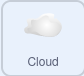
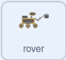

## Colete uma amostra de ar

<div style="display: flex; flex-wrap: wrap">
<div style="flex-basis: 200px; flex-grow: 1; margin-right: 15px;">
Outra forma de fazer o veículo parecer estar coletando amostras é alterando algumas das propriedades de um ator, em vez de sua roupa.
</div>
<div>
{:width="300px"}
</div>
</div>

<p style="border-left: solid; border-width:10px; border-color: #0faeb0; background-color: aliceblue; padding: 10px;">
<span style="color: #0faeb0">**Rolagem com paralaxe**</span> ocorre quando as imagens de fundo se movem pela câmera mais lentamente do que as imagens de primeiro plano
</p>

--- task ---

Adicione um ator de nuvem ao seu projeto a partir da biblioteca de ator do Scratch, ou desenhe um você mesmo, e posicione e redimensione-o abaixo do céu para que o rover possa alcançá-lo.


--- /task ---

--- collapse ---
---
título: Adicionar efeitos gráficos à nuvem
---

Utilizando alguns efeitos gráficos, altere a aparência do sprite da nuvem para que pareça uma bola de gás giratória. Você pode experimentar diferentes efeitos gráficos, mas o exemplo abaixo faz com que o ator pareça um pouco transparente e gire em torno dele.



```blocks3
when I receive [start v]
show
go to x: (190) y: (14)
clear graphic effects
set [ghost v] effect to (60)
set size to (50) %
forever
repeat (10)
change [whirl v] effect by (50)
end
repeat (20)
change [whirl v] effect by (-50)
end
repeat (10)
change [whirl v] effect by (50)
```

--- /collapse ---

Para que a nuvem role, ela precisa se mover quando receber as mensagens `esquerda`{:class='block3events'} e `direita`{:class='block3events'}. Como a nuvem está mais distante do observador do que a árvore, ela deve se mover uma distância menor a cada vez, desaparecendo da borda da tela e reaparecendo do outro lado.

--- task ---

Adicione o código para fazer a nuvem se mover. Você pode precisar ajustar os números, dependendo do tamanho e da posição do ator. Como a nuvem deve aparecer mais ao fundo, ela deve se mover menos que a árvore.


```blocks3
when I receive [left v]
change x by (5)

when I receive [right v]
change x by (-5)

when I receive [start v]
+ forever
if <(x position) > (250)> then
set x to (-240)
end
if <(x position) < (-250)> then
set x to (240)
end
end
```

--- /task ---

Faça com que o veículo explorador colete a amostra de ar.

--- task ---

Configure uma função de animação para o ator do rover, para que ele possa coletar a amostra de ar. Você pode duplicar o código da função de árvore de exemplo para fazer isso.

--- collapse ---
---

título: Duplicando código

---

Aqui está uma maneira fácil de duplicar o código para sua nova função.


--- /collapse ---


```blocks3
define sample air
switch costume to (inactive v)
wait (0.3) seconds
switch costume to (air 1 v)
wait (0.3) seconds
switch costume to (air 2 v)
wait (0.3) seconds
switch costume to (air 3 v)
wait (0.3) seconds
switch costume to (air 2 v)
wait (0.3) seconds
switch costume to (air 1 v)
wait (0.3) seconds
switch costume to (inactive v)
```

--- /task ---

Faça com que o rover transmita uma mensagem para o ator da nuvem para que ele saiba quando animar.

--- task ---

Crie uma nova mensagem de transmissão chamada `sample air`{:class='block3events'} e adicione-a à sua função `sample air`{:class='block3custom'}.


```blocks3
definir amostra de ar
alternar traje para (inativo v)
esperar (0,3) segundos
alternar traje para (ar 1 v)
esperar (0,3) segundos
alternar traje para (ar 2 v)
esperar (0,3) segundos
alternar traje para (ar 3 v)
esperar (0,3) segundos
+ transmitir (amostra de ar v)
alternar traje para (ar 2 v)
esperar (0,3) segundos
alternar traje para (ar 1 v)
aguarde (0,3) segundos
troque de traje para (v inativo)
```

--- /task ---

A função só deve ser chamada se o rover estiver em contato com o ator da nuvem.

--- task ---

Adicione código para que o rover apenas `recolha amostras de ar`{:class='block3custom'} `se`{:class='block3control'} ele estiver `tocando a nuvem`{:class='block3sensing'}.


```blocks3
when this sprite clicked
if <touching color [Cloud v] ?> then
sample air ::custom
end
```

--- /task ---

Faça com que a amostra de ar seja animada quando o rover a coletar. Você pode fazer com que ele faça o que quiser, mas neste exemplo ele desaparece enquanto é sugado pelo veículo explorador.

--- task ---

Adicione um efeito animado à nuvem que altere seu tamanho.


```blocks3
when I receive [sample air v]
repeat (5)
change size by (-10) //shrink the cloud
end
hide
set size to (50) %
```

--- /task ---

--- task ---

**Teste** seu projeto clicando na bandeira verde e movendo seu rover até que ele toque a nuvem. Clique no rover e ele deverá parecer estar sugando a nuvem.

--- /task ---

--- task ---

Agora altere o código do seu ator de nuvem para que ele seja reiniciado quando sair da tela.


```blocks3
when I receive [start v]
+ forever
if <(x position) > (250)> then
set x to (-240)
show
end
if <(x position) < (-250)> then
set x to (240)
show
end
end
```

--- /task ---


--- save ---
