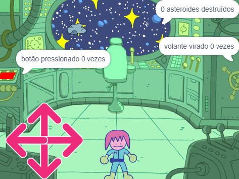

## E agora?

Se você estiver seguindo o caminho [Mais Scratch](https://projects.raspberrypi.org/pt-BR/pathways/further-scratch), você pode seguir para o projeto [Sala de quebra-cabeça](https://projects.raspberrypi.org/pt-BR/projects/puzzle-room). Neste projeto, você criará uma sala de quebra-cabeças de nave espacial com um personagem que resolve os quebra-cabeças.

--- print-only ---

--- /print-only ---

--- no-print ---

  <iframe allowtransparency="true" width="485" height="402" src="https://scratch.mit.edu/projects/embed/536877672/?autostart=false" frameborder="0"></iframe>

--- /no-print ---

Se você quiser se divertir mais explorando os Scratch, então você pode tentar qualquer um [destes projetos](https://projects.raspberrypi.org/pt-BR/projects?software%5B%5D=scratch&curriculum%5B%5D=%201).

***

Este projeto foi traduzido por voluntários:

Melissa Antunes
Flávio Miranda

Graças a voluntários, podemos dar às pessoas de todo o mundo a chance de aprender em seu próprio idioma. Você pode nos ajudar a alcançar mais pessoas oferecendo-se para traduzir - mais informações em [rpf.io/translate](https://rpf.io/translate).
