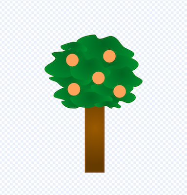

## ఒక నమూనా సేకరించండి

<div style="display: flex; flex-wrap: wrap">
<div style="flex-basis: 200px; flex-grow: 1; margin-right: 15px;">
ఈ దశలో, మీరు నమూనాలను సేకరించే రోవర్‌ను చూపించడానికి sprite మరియు రోవర్ రూపాన్ని మారుస్తారు.
</div>
<div>
{:width="300px"}
</div>
</div>

--- task ---

**rover** sprite యొక్క costume లను చూడండి. ఆరు యానిమేషన్లు అందుబాటులో ఉన్నాయి. **rover** చేయగలిగినవి:
- దాని చేతిని విస్తరించండి


- భూమిలోకి డ్రిల్ చేయండి
- గాలి పీల్చుకోండి
- సోలార్ ప్యానెల్‌ను విస్తరించండి
- ఫోటో తీయ్యండి
- ఏదైనా కొంచెం తవ్వి తీయండి

--- /task ---

మీరు Scratchలో వివిధ costume మార్పుల వంటి అనేక కోడ్‌లను నిర్వహించాలనుకున్నప్పుడు, `My Blocks`{:class="block3myblocks"} ని ఉపయోగించడం ప్రయోజనకరంగా ఉంటుంది. ఇది మీ స్వంత కస్టమ్ బ్లాక్‌లను సృష్టించడానికి మిమ్మల్ని అనుమతిస్తుంది.

మీ **rover** sprite ప్రతి యానిమేషన్ కోసం ఒక `My Block`{:class="block3myblocks"} కలిగి ఉంటుంది.

--- task ---

`My Blocks`{:class="block3myblocks"} మెనులో **Make a Block** పైన క్లిక్ చేయండి, మీ క్రొత్త బ్లాక్ కు `sample fruit`{:class="block3myblocks"} అని పేరు ఇవ్వండి.

--- /task ---

మీ స్క్రిప్ట్‌లో కొత్త బ్లాక్ కనిపించాలి. ఇది ఇలా కనిపిస్తుంది:


```blocks3
define sample fruit
```

--- task ---

ఈ బ్లాక్ కింద, కొన్ని `switch costume`{:class="block3looks"} బ్లాకులు మరియు `wait`{:class="block3control"} బ్లాకులను, రోబోట్ ను యానిమేట్ చేయడం కోసం జోడించండి.

**చిట్కా:** మీ మొదటి `switch costume`{:class='block3looks'} బ్లాక్ మరియు `wait`{:class='block3control'} బ్లాక్‌ని సృష్టించడం త్వరగా జరుగుతుంది, ఆపై వాటిని డూప్లికేట్ చేసి, ఉపయోగించిన costume లను మార్చండి.


```blocks3
define sample fruit //Animates the robot to collect fruit
switch costume to (inactive v)
wait (0.3) seconds
switch costume to (arm 1 v)
wait (0.3) seconds
switch costume to (arm 2 v)
wait (0.3) seconds
switch costume to (arm 1 v)
wait (0.3) seconds
switch costume to (inactive v)
```

--- /task ---

--- task ---

Add a block so that the **rover** sprite plays a sound when it collects the fruit sample. You can find the **Collect** sound in the Sound gallery.


```blocks3
define sample fruit //Animates the robot to collect fruit
switch costume to (inactive v)
wait (0.3) seconds
switch costume to (arm 1 v)
wait (0.3) seconds
switch costume to (arm 2 v)
wait (0.3) seconds
+ start sound (Collect v)
switch costume to (arm 1 v)
wait (0.3) seconds
switch costume to (inactive v)
```

--- /task ---


--- task ---

మీరు యానిమేషన్‌ను చూడటానికి `define sample fruit`{:class="block3myblocks"} బ్లాక్‌పై క్లిక్ చేయవచ్చు. మీరు చిన్న స్క్రీన్‌పై ఉన్నట్లయితే, మీరు దగ్గరగా చూడవలసి ఉంటుంది.

`sample fruit block`{:class='block3myblocks'}ని ఉపయోగించనందున, మీరు ఆకుపచ్చ జెండాను క్లిక్ చేసినప్పుడు యానిమేషన్ అమలు చేయబడదు.

--- /task ---

--- task ---

మీ కొత్త బ్లాక్‌ని ఉపయోగించడానికి, మీరు దానిని `event`{:class="block3events"} బ్లాక్‌కి జోడించవచ్చు. `My Blocks`{:class="block3myblocks"} మెనులో, మీరు చేసిన బ్లాక్‌ని మీరు చూడాలి. కింది స్క్రిప్ట్‌లో దీన్ని ఉపయోగించండి.


```blocks3
when this sprite clicked
sample fruit ::custom //Run the animation
```

--- /task ---

--- task ---

**rover** sprite పై క్లిక్ చేయండి మరియు మీరు యానిమేషన్‌ను చూడాలి.

--- /task ---

ఇప్పుడు మీరు రోవర్ నిజానికి నమూనాను సేకరించేలా చేయాలి. ఈ ఉదాహరణలో, రోవర్ ఒక చెట్టు నుండి పండ్లను సేకరిస్తుంది.

--- task ---

The **tree** sprite needs two costumes, one without fruit on (`tree without fruit`{:class="block3looks"}), and one with fruit (`tree with fruit`{:class="block3looks"}). Add another costume to the **tree**, change the names and draw some fruit on the **with fruit** one.



--- /task ---

--- task ---

On the **tree** sprite, add blocks to set the costume of the **tree** at the start of the project, and the costume it should switch to when it receives a `sample fruit`{:class="block3events"} broadcast.


```blocks3
when I receive [start v]
go to x:(-90) y:(-80)
+ switch costume to (tree with fruit v)
forever
if <(x position) > (290)> then
set x to (-280)
end
if <(x position) < (-290)> then
set x to (280)
end
end

+ when I receive [sample fruit v]
+ switch costume to (tree without fruit v)
```

--- /task ---

--- task ---

On the **rover** sprite, you can use the new `broadcast`{:class="block3events"} to trigger the costume change. Add this new `broadcast`{:class="block3events"} into your `define sample fruit`{:class="block3myblocks"} function.


```blocks3
define sample fruit
switch costume to (inactive v)
wait (0.3) seconds
switch costume to (arm 1 v)
wait (0.3) seconds
switch costume to (arm 2 v)
start sound (Collect v)
wait (0.3) seconds
+ broadcast (sample fruit v)
switch costume to (arm 1 v)
wait (0.3) seconds
switch costume to (inactive v)
```

--- /task ---

--- task ---

**Test:** To check that your code is working, click on the flag, and then click on your **rover** sprite. Its arm should extend, and the **tree** sprite should change costumes.

**Tip:** Switch to full screen mode and you will be able to see the animation more easily.

--- /task ---

The rover should only be able to collect the fruit, if it is touching it.

--- task ---

On the **rover** sprite, change the `when this sprite clicked`{:class="block3events"} set of blocks, so that the `sample fruit`{:class="block3myblocks"} function is only called if the **rover** sprite is touching the colour of your fruit.

**Tip:** Your costume change from testing might mean that the fruit is not visible. Just click on the costumes tab for the **tree** sprite, and switch to the costume with the visible fruit.


```blocks3
when this sprite clicked
if <touching color (#FFA500) ?> then //Colour of fruit
sample fruit ::custom
```

--- /task ---

--- task ---

Now that the **tree** sprite changes when a fruit is sampled, you need to reset the sprite to its first costume when it goes off the screen.


```blocks3
when I receive [start v]
go to x:(-90) y:(-80)
switch costume to (tree with fruit v)
forever
if <(x position) > (290)> then
set x to (-280)
+ switch costume to (tree with fruit v)
end
if <(x position) < (-290)> then
set x to (280)
+ switch costume to (tree with fruit v)
end
end
```

--- /task ---

--- task ---

**Test:** Move the **rover** sprite so that it is touching the fruit, then click on the **rover** sprite and watch it collect the fruit from the tree.

--- /task ---


--- save ---
