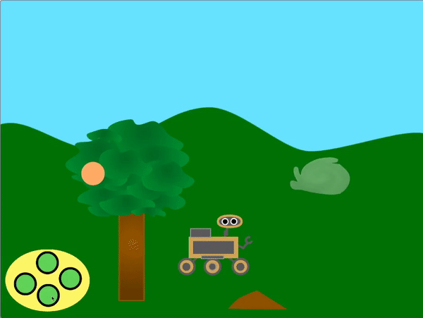

## మరొక నమూనాను సృష్టించండి

<div style="display: flex; flex-wrap: wrap">
<div style="flex-basis: 200px; flex-grow: 1; margin-right: 15px;">
తదుపరి రోవర్ నమూనాలను ఎంచుకోండి! ఇది కొత్త జాతి మొక్క, బగ్ లేదా జంతువును చూస్తుందా? ఇది కొంత నీరు లేదా అంతుచిక్కని ద్రవాన్ని చూస్తుందా? ఇది కొంత ధూళిని లేదా రాయిని లేదా గాలిని కూడా నమూనా చేయాలనుకుంటున్నారా? లేక ఇంకేమైనా?
</div>
<div>
{:width="300px"}
</div>
</div>

--- task ---

**ఎంచుకోండి:** రోవర్ సేకరించడం కోసం కొత్త **sample** sprite ని జోడింఛండి. లైబ్రరీ నుండి ఒకదాన్ని ఎంచుకోవడం ద్వారా లేదా మీ స్వంతంగా గీయడం ద్వారా మీరు దీన్ని మీ ప్రాజెక్ట్‌కి జోడించవచ్చు.

--- /task ---

స్క్రోల్ చేయడానికి మీ **sample** sprite ను పొందండి. ఒకవేళ ఇది స్క్రీన్ దిగువున ఉంటే, ఇది ఎక్కువ కదలాల్సి వస్తుంది (`change x by`{:class='block3motion'} should be higher than `5`), మరియు ఒకవేళ ఇది స్క్రీన్ దఎగువున ఉంటే, ఇది తక్కువ కదలాల్సి వస్తుంది (`change x by`{:class='block3motion'} should be lower than `5`).

--- task ---

మీ sprite స్క్రోల్ అయ్యేలా కోడ్‌ని జోడించండి.

--- /task ---

**ఎంచుకోండి:** మీరు రోవర్ తదుపరి నమూనాను ఎలా కోరుకుంటున్నారో దానిపై ఆధారపడి, మీరు ఇప్పటికే ఉన్న రోవర్ యానిమేషన్‌లను ఉపయోగించవచ్చు లేదా costume లను నకిలీ చేయడం మరియు సవరించడం ద్వారా మరిన్ని యానిమేషన్ సన్నివేశాలను సృష్టించవచ్చు.

--- task ---

`My Blocks`{:class='block3myblocks'} బ్లాకును మీ **rover** sprite నమూనాను సేకరించినపుడు, దానిని యానిమేట్ చేయడానికి ఉపయోగించండి. మీరు సృష్టించిన ఇతర `My Blocks`{:class='block3myblocks'} నుండి కోడ్‌ని కాపీ చేసి పేస్ట్ చేయవచ్చు.

ఉదాహరణకు, సౌర శక్తిని సేకరించడానికి ఇక్కడ ఒక costume సీక్వెన్స్ ఉంది:


ఈ costume శ్రేణిని యానిమేట్ చేయడానికి మీరు క్రింది కోడ్‌ని ఉపయోగించవచ్చు:

```blocks3
define recharge
switch costume to [inactive v]
wait (0.3) seconds
switch costume to [solar 1 v]
wait (0.3) seconds
switch costume to [solar 2 v]
wait (0.3) seconds
switch costume to [solar 3 v]
wait (0.3) seconds
switch costume to [solar 2 v]
wait (0.3) seconds
switch costume to [solar 1 v]
wait (0.3) seconds
switch costume to [inactive v]
wait (0.3) seconds
```

--- /task ---

--- task ---

తరువాత, మీ కొత్త `My Block`{:class='block3myblocks'} బ్లాకులో, ఒక కొత్త సందేశాన్ని, `broadcast`{:class='block3events'} చేయండి తద్వారా అది **sample** sprite లో, `costume`{:class='block3looks'} మార్పు లేదా `graphic effect`{:class='block3looks'} మార్పు iకలగజేస్తుంది.

--- /task ---

--- task ---

రోవర్, sprite ను లేదా sprite పై రంగును తాకుతుందో లేదో గుర్తించడానికి `if`{:class='block3control'} బ్లాక్‌ని ఉపయోగించండి, తద్వారా కొత్త `My Block`{:class='block3myblocks'} అప్పుడు మాత్రమే ఉపయోగించబడుతుంది.

--- /task ---

--- task ---

మీరు కావాలనుకుంటే, spriteకి యానిమేషన్‌ను జోడించండి, తద్వారా రోవర్ నమూనాను సేకరించినప్పుడు దాని రూపాన్ని మార్చండి.

--- /task ---

--- save ---
